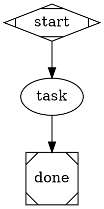

# Attractor

Multi-stage AI pipelines for code. Plan, implement, test, review — orchestrated as
directed graphs.

## Documentation

| Guide | Description |
|-------|-------------|
| [Getting Started](docs/GETTING-STARTED.md) | Installation, first pipeline run, provider selection, common gotchas |
| [DOT Authoring Guide](docs/DOT-AUTHORING-GUIDE.md) | How to design effective pipelines -- patterns, attributes, fidelity, stylesheets |
| [DOT Syntax Reference](docs/DOT-SYNTAX.md) | Quick reference tables and copy-paste patterns |
| [App Integration Guide](docs/APP-INTEGRATION-GUIDE.md) | Using pipelines from Python applications (DirectProvider vs AmplifierSession) |

## Quick Start

**1. Add to your Amplifier config:**

```yaml
# .amplifier/config.yaml (or any bundle that includes this)
includes:
  - bundle: git+https://github.com/microsoft/amplifier-bundle-attractor@main#subdirectory=profiles/attractor-profile-anthropic
```

Pick your provider: `attractor-profile-anthropic`, `attractor-profile-openai`, or `attractor-profile-gemini`.

**2. Run a pipeline from the CLI:**

```bash
amplifier run --agent attractor-profile-anthropic \
    --goal "Add input validation to the login endpoint" \
    --dot-file examples/pipelines/02-plan-implement-test.dot
```

**3. Or just ask conversationally:**

> "Run the plan-implement-test pipeline to add input validation to the login endpoint"

> "Build a test suite for the auth module using a parallel pipeline"

The agent can generate pipelines on-the-fly or use any of the included examples.

## What Can It Do?

**Fix a bug systematically** -- reproduce, diagnose, fix, regression test, verify:
```bash
amplifier run --dot-file examples/pipelines/practical/bug-fix.dot \
    --goal "Fix the NullPointerError in UserService.getProfile()"
```

**Review a PR in parallel** -- analyze diff, then simultaneously check bugs, security,
performance, and style -- then synthesize review comments:
```bash
amplifier run --dot-file examples/pipelines/practical/pr-review.dot \
    --goal "Review PR #142"
```

**Build a feature safely** -- parse spec, parallel implement (core, API, tests),
integration test, human review gate:
```bash
amplifier run --dot-file examples/pipelines/practical/feature-build.dot \
    --goal "Add user avatar upload with S3 storage"
```

## Pipeline Gallery

| Pipeline | Pattern | Use Case |
|----------|---------|----------|
| [Simple Linear](examples/pipelines/01-simple-linear.dot) | `A -> B -> C` | Quick single-task |
| [Plan-Implement-Test](examples/pipelines/02-plan-implement-test.dot) | `plan -> impl -> test` | Standard dev workflow |
| [Conditional Routing](examples/pipelines/03-conditional-routing.dot) | `if/else` branches | Outcome-based flow |
| [Retry with Fallback](examples/pipelines/04-retry-with-fallback.dot) | Retry loop | Resilient execution |
| [Parallel Fan-Out](examples/pipelines/05-parallel-fan-out.dot) | Fork/join | Concurrent work |
| [Model Stylesheet](examples/pipelines/06-model-stylesheet.dot) | CSS-like config | Multi-provider |
| [Fidelity Modes](examples/pipelines/07-fidelity-modes.dot) | Context control | Execution fidelity |
| [Human Gate](examples/pipelines/08-human-gate.dot) | Approval gate | Human-in-the-loop |
| [Manager-Supervisor](examples/pipelines/09-manager-supervisor.dot) | Hierarchical | Agent supervision |
| [Full Attractor](examples/pipelines/10-full-attractor.dot) | All features | Complete pipeline |
| [PR Review](examples/pipelines/practical/pr-review.dot) | Parallel analysis | Code review |
| [Test Generation](examples/pipelines/practical/test-gen.dot) | Retry loop | Test authoring |
| [Bug Fix](examples/pipelines/practical/bug-fix.dot) | Diagnose + verify | Debugging |
| [Feature Build](examples/pipelines/practical/feature-build.dot) | Parallel + gate | Feature development |
| [Refactoring](examples/pipelines/practical/refactor.dot) | Snapshot safety | Code improvement |

## How It Works

The **loop-pipeline** orchestrator walks a Graphviz DOT digraph. Each node is an AI
task (or control node like fork/join/gate), and edges define the flow between them.
For each LLM node, the orchestrator spawns a **loop-agent** sub-session that runs
an agentic tool loop -- call LLM, execute tools, feed results back -- until the
node's task completes. Results flow forward along edges to the next node.

## Provider Profiles

Each profile wires a provider, an agent loop, provider-aligned tools, and a system
prompt. All profiles include `attractor-core` (shared hooks and the
`tool-report-outcome` tool).

| Profile | Provider | Tools | Env Var |
|---------|----------|-------|---------|
| `attractor-profile-anthropic` | Anthropic Claude | `tool-filesystem` (read/write/edit), `tool-bash` (120s timeout), `tool-search` | `ANTHROPIC_API_KEY` |
| `attractor-profile-openai` | OpenAI | `tool-apply-patch` (v4a diffs), `tool-filesystem` (read/write only), `tool-bash` (10s timeout), `tool-search` | `OPENAI_API_KEY` |
| `attractor-profile-gemini` | Gemini | `tool-filesystem`, `tool-bash` (10s timeout), `tool-search`, `tool-web` (search + fetch) | `GEMINI_API_KEY` |

The Anthropic profile mirrors Claude Code conventions (edit_file with old/new strings,
long shell timeouts). The OpenAI profile mirrors codex-rs conventions (apply_patch with
v4a unified diffs, short shell timeouts). The Gemini profile adds web tools for
grounding.

## DOT Syntax

See [docs/DOT-SYNTAX.md](docs/DOT-SYNTAX.md) for the complete reference.

Quick version -- pipelines are Graphviz DOT digraphs where node shapes determine behavior:

| Shape | What it does |
|-------|-------------|
| `Mdiamond` | Start node (entry point) |
| `Msquare` | Exit node (pipeline end) |
| `box` | LLM agent node (default) |
| `component` | Parallel fan-out |
| `tripleoctagon` | Parallel fan-in (collect results) |
| `hexagon` | Human approval gate |
| `parallelogram` | External tool execution |
| `house` | Manager/supervisor loop |

Minimal pipeline:



## Customization

See [DOT Authoring Guide](docs/DOT-AUTHORING-GUIDE.md) for complete patterns and examples.

- **Model stylesheets** -- override provider, model, and reasoning effort per-node via CSS-like selectors:
  ```dot
  graph [model_stylesheet="
      box { llm_provider: anthropic; llm_model: claude-sonnet-4-20250514 }
      .fast { llm_model: claude-haiku-3-5-20241022 }
  "]
  ```
- **Fidelity modes** -- control context carryover between nodes (`full`, `compact`, `truncate`, `summary`)
- **Human gates** -- pause pipelines for human approval at any stage
- **`$param` expansion** -- pass key-value parameters for template reuse:
  ```json
  {
    "goal": "Build a REST API",
    "dot_file": "template.dot",
    "params": {"language": "Python", "framework": "FastAPI"}
  }
  ```

## Programmatic Usage

The pipeline engine works as a library from any Python app built on
`amplifier-core` + `amplifier-foundation`. No CLI dependency required.

See [examples/programmatic_usage.py](examples/programmatic_usage.py) for a
complete, runnable example.

### Option A: Direct LLM calls (no Amplifier session)

Best for analysis/reasoning pipelines where nodes only need to generate text
(no file editing or shell commands).

```python
import asyncio
import tempfile
from amplifier_module_loop_pipeline.dot_parser import parse_dot
from amplifier_module_loop_pipeline.engine import PipelineEngine
from amplifier_module_loop_pipeline.context import PipelineContext
from amplifier_module_loop_pipeline.handlers import HandlerRegistry
from amplifier_module_loop_pipeline.transforms import apply_transforms
from amplifier_module_loop_pipeline.validation import validate_or_raise
from amplifier_module_loop_pipeline import DirectProviderBackend

DOT = """
digraph {
    graph [goal="Explain what a monad is in 3 sentences"]
    start [shape=Mdiamond]
    draft [prompt="Write a first draft: $goal", llm_provider="anthropic"]
    review [prompt="Improve this draft, keep it concise: $context"]
    done [shape=Msquare]
    start -> draft -> review -> done
}
"""

async def main():
    graph = parse_dot(DOT)
    context = PipelineContext()
    apply_transforms(graph, context)
    validate_or_raise(graph)

    # provider=None auto-creates unified_llm.Client from env vars
    backend = DirectProviderBackend(provider=None)
    engine = PipelineEngine(
        graph=graph, context=context,
        handler_registry=HandlerRegistry(backend=backend),
        logs_root=tempfile.mkdtemp(),
    )
    outcome = await engine.run()
    print(f"Status: {outcome.status.value}")
    print(f"Result: {outcome.notes}")

asyncio.run(main())
```

Requirements: install `amplifier-module-loop-pipeline` from the bundle (this pulls in
`unified-llm-client` automatically):

```
pip install "amplifier-module-loop-pipeline @ git+https://github.com/microsoft/amplifier-bundle-attractor@main#subdirectory=modules/loop-pipeline"
```

Plus an API key in environment (`ANTHROPIC_API_KEY`, `OPENAI_API_KEY`, or `GEMINI_API_KEY`).

### Option B: Full Amplifier session with tools

Best for coding pipelines where nodes need to read/write files, run shell commands,
and use the full agent tool loop. Each pipeline node gets its own sub-session with
the complete tool set.

```python
import asyncio
from pathlib import Path
from amplifier_foundation import Bundle, load_bundle

ATTRACTOR_BUNDLE = "git+https://github.com/microsoft/amplifier-bundle-attractor@main#subdirectory=profiles/attractor-profile-anthropic"

DOT = """
digraph {
    graph [goal="Create a Python function that checks if a number is prime"]
    start [shape=Mdiamond]
    implement [prompt="$goal. Write it to prime.py.", goal_gate=true]
    test [prompt="Write tests for prime.py and run them."]
    done [shape=Msquare]
    start -> implement -> test -> done
}
"""

async def main():
    # Load the attractor profile bundle
    bundle = await load_bundle(ATTRACTOR_BUNDLE)

    # Overlay pipeline config with your DOT source
    overlay = Bundle(
        name="my-pipeline",
        session={"orchestrator": {
            "module": "loop-pipeline",
            "config": {"dot_source": DOT},
        }},
    )
    composed = bundle.compose(overlay)

    # Prepare (downloads modules if needed) and create session
    prepared = await composed.prepare()
    session = await prepared.create_session(session_cwd=Path.cwd())

    # Register session.spawn so pipeline nodes get full sub-sessions
    # (See examples/programmatic_usage.py for the spawn capability impl)
    # See examples/programmatic_usage.py for register_spawn_capability implementation
    register_spawn_capability(session, prepared)

    async with session:
        result = await session.execute("Run the pipeline")
        print(result)

asyncio.run(main())
```

The key difference: with `session.spawn` registered, the `AmplifierBackend` kicks
in and each pipeline node gets a full child session with tools (filesystem, bash,
search). Without it, you get `DirectProviderBackend` (LLM-only, no tools).

See [`amplifier-foundation/examples/07_full_workflow.py`](https://github.com/microsoft/amplifier-foundation/blob/main/examples/07_full_workflow.py) for the reference
`register_spawn_capability()` implementation. For a comprehensive guide,
see [App Integration Guide](docs/APP-INTEGRATION-GUIDE.md).

## Attractor Expert Agent

Sessions that compose `attractor-core` have access to the `attractor-expert`
agent -- a context-sink that carries deep knowledge of DOT syntax, pipeline
patterns, programmatic integration, and debugging. Delegate to it for pipeline
design questions, DOT authoring help, or troubleshooting:

```
delegate to attractor:attractor-expert
```

## Architecture

<details>
<summary>Expand architecture details</summary>

### Layers

- **attractor-core** (behavior): Provider-agnostic tools and hooks shared by all profiles. Includes `tool-report-outcome`, `hooks-tool-truncation`, `hooks-pipeline-progress`, and `hooks-pipeline-observability`.
- **Profiles**: Each profile includes `attractor-core` and adds a provider, orchestrator (`loop-agent`), provider-specific tools, and a system prompt.
- **Modules**: Self-contained Amplifier modules in `modules/`, each independently testable with its own `pyproject.toml`.

### Repository Structure

```
amplifier-bundle-attractor/
├── behaviors/
│   └── attractor-core.yaml     # Shared tools + hooks (provider-agnostic)
├── profiles/                    # Provider-specific complete configs
│   ├── attractor-profile-anthropic.yaml
│   ├── attractor-profile-openai.yaml
│   └── attractor-profile-gemini.yaml
├── context/                     # System prompts per provider
│   ├── system-anthropic.md
│   ├── system-openai.md
│   └── system-gemini.md
├── examples/
│   ├── pipelines/               # 10 example + 5 practical DOT pipelines
│   └── programmatic_usage.py    # Using the engine from Python code
├── modules/                     # Amplifier modules
│   ├── loop-agent/              # Agent loop orchestrator
│   ├── loop-pipeline/           # DOT graph-driven pipeline orchestrator
│   ├── tool-apply-patch/        # v4a unified diff tool (OpenAI only)
│   ├── unified-llm-client/      # Multi-provider LLM client library
│   ├── tool-report-outcome/     # Structured outcome reporting tool
│   ├── tool-pipeline-run/       # Runtime pipeline invocation tool
│   ├── hooks-tool-truncation/   # Tool output truncation hook
│   ├── hooks-pipeline-progress/ # Pipeline progress reporting hook
│   ├── hooks-pipeline-observability/ # Pipeline observability hooks (state aggregator, status bar, event persistence)
│   ├── tool-dashboard-query/    # Pipeline status queries and management via HTTP API
│   └── tool-pipeline-status/   # Returns pipeline execution state
└── docs/
    └── DOT-SYNTAX.md            # DOT syntax reference
```

### Module Responsibilities

| Module | Type | Description |
|--------|------|-------------|
| `loop-agent` | orchestrator | Single-turn coding agent loop with steering, loop detection, and context management |
| `loop-pipeline` | orchestrator | Multi-stage DOT graph-driven pipeline with checkpointing, retry, and fidelity control |
| `tool-apply-patch` | tool | v4a unified diff patch application (OpenAI/codex-rs style) |
| `unified-llm-client` | library | Multi-provider LLM client with adapters for Anthropic, OpenAI, Gemini |
| `tool-report-outcome` | tool | Structured result reporting for pipeline integration |
| `tool-pipeline-run` | tool | Runtime pipeline invocation via session.spawn |
| `hooks-tool-truncation` | hook | Truncates large tool outputs to manage context window |
| `hooks-pipeline-progress` | hook | Reports pipeline stage progress |
| `hooks-pipeline-observability` | hook | Pipeline observability hooks — state aggregator, status bar, and event persistence |
| `tool-dashboard-query` | tool | Pipeline status queries and management via HTTP API |
| `tool-pipeline-status` | tool | Returns pipeline execution state |

### Backend Selection

The pipeline orchestrator auto-selects the execution backend:

1. If `session.spawn` capability is registered --> `AmplifierBackend` (full sub-sessions per node, tools included)
2. Else if a provider is available --> `DirectProviderBackend` (direct LLM calls via `unified_llm`, no tools)
3. Otherwise --> simulation mode (for testing)

</details>

## Development

Each module is independently testable:

```bash
cd modules/loop-agent && uv run pytest tests/ -q
cd modules/loop-pipeline && uv run pytest tests/ -q
cd modules/tool-apply-patch && uv run pytest tests/ -q
cd modules/unified-llm-client && uv run pytest tests/ -q
cd modules/tool-report-outcome && uv run pytest tests/ -q
cd modules/tool-pipeline-run && uv run pytest tests/ -q
cd modules/hooks-tool-truncation && uv run pytest tests/ -q
cd modules/hooks-pipeline-progress && uv run pytest tests/ -q
cd modules/hooks-pipeline-observability && uv run pytest tests/ -q
cd modules/tool-dashboard-query && uv run pytest tests/ -q
cd modules/tool-pipeline-status && uv run pytest tests/ -q
```

Run all modules:

```bash
for mod in modules/*/; do
    echo "=== $mod ===" && (cd "$mod" && uv run pytest tests/ -q)
done
```

### Dependencies

- Modules depend on `amplifier-core`. Each `pyproject.toml` uses a relative path for local dev:
  ```toml
  [tool.uv.sources]
  amplifier-core = { path = "../../../amplifier-core", editable = true }
  ```
- `loop-pipeline` and `loop-agent` additionally depend on `unified-llm-client` (bundled at `modules/unified-llm-client/`, resolved via `[tool.uv.sources]` relative paths).
- For programmatic usage with full sessions: `pip install amplifier-foundation`.

### E2E Tests

Manual end-to-end tests against real LLM providers are in `tests/e2e/`. See
[tests/e2e/MANUAL_E2E.md](tests/e2e/MANUAL_E2E.md) for instructions.

## Contributing

> [!NOTE]
> This project is not currently accepting external contributions, but we're actively working toward opening this up. We value community input and look forward to collaborating in the future. For now, feel free to fork and experiment!

Most contributions require you to agree to a
Contributor License Agreement (CLA) declaring that you have the right to, and actually do, grant us
the rights to use your contribution. For details, visit [Contributor License Agreements](https://cla.opensource.microsoft.com).

When you submit a pull request, a CLA bot will automatically determine whether you need to provide
a CLA and decorate the PR appropriately (e.g., status check, comment). Simply follow the instructions
provided by the bot. You will only need to do this once across all repos using our CLA.

This project has adopted the [Microsoft Open Source Code of Conduct](https://opensource.microsoft.com/codeofconduct/).
For more information see the [Code of Conduct FAQ](https://opensource.microsoft.com/codeofconduct/faq/) or
contact [opencode@microsoft.com](mailto:opencode@microsoft.com) with any additional questions or comments.

## Trademarks

This project may contain trademarks or logos for projects, products, or services. Authorized use of Microsoft
trademarks or logos is subject to and must follow
[Microsoft's Trademark & Brand Guidelines](https://www.microsoft.com/legal/intellectualproperty/trademarks/usage/general).
Use of Microsoft trademarks or logos in modified versions of this project must not cause confusion or imply Microsoft sponsorship.
Any use of third-party trademarks or logos are subject to those third-party's policies.