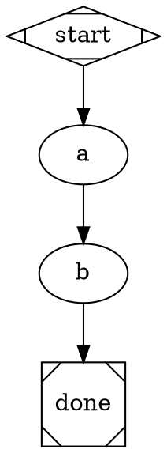
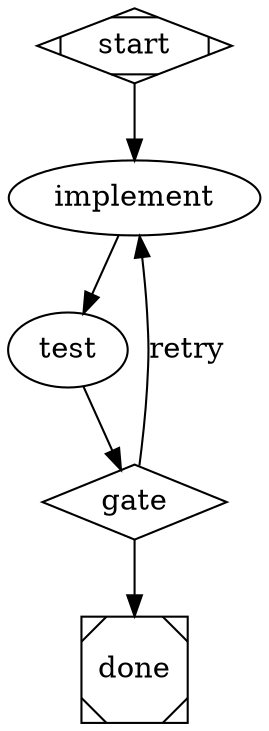
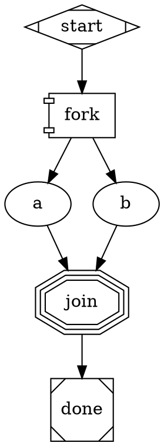

# DOT Pipeline Reference Card

Quick reference for generating Attractor DOT pipelines.

## Node Shapes -> Handlers

| Shape | Handler | Purpose |
|-------|---------|---------|
| `Mdiamond` | start | Entry point -- exactly one per graph |
| `Msquare` | exit | Terminal -- triggers goal-gate check |
| `box` | codergen | Default. LLM agent with tools (code, files, bash) |
| `ellipse` | codergen | Same as box (alias for readability) |
| `diamond` | conditional | Routing node -- no LLM call, evaluates edge conditions |
| `component` | parallel | Fan-out: runs all outgoing edges concurrently |
| `tripleoctagon` | fan_in | Fan-in: collects parallel branch results |
| `hexagon` | human_gate | Pauses for human approval before proceeding |
| `house` | manager_loop | Nested sub-pipeline (advanced) |

**Important:** `diamond` is a pure router -- it does NOT call an LLM. Place your
LLM work in a `box` node *before* the diamond, then use the diamond to branch on
the outcome.

## Essential Node Attributes

```dot
node_id [
    label="Human-readable name",
    prompt="Instructions for the LLM. Use $goal for the pipeline goal.",
    goal_gate=true,              // Must succeed for pipeline to pass
    max_retries=3,               // Retry on failure (default: graph-level)
    retry_target="node_id",      // Where to jump on gate failure
    fidelity="full",             // full|compact|summary:high|summary:low
    llm_provider="anthropic",    // Override provider for this node
    llm_model="claude-sonnet-4-20250514", // Override model
    reasoning_effort="high",     // low|medium|high
    auto_status=true,            // Force success regardless of outcome
    timeout=30s                  // Per-node timeout
]
```

## Edge Attributes

```dot
a -> b [
    condition="outcome=success",         // Simple key=value condition
    label="success",                     // Display label / human gate choice
    weight=10,                           // Higher = preferred (tiebreak)
    fidelity="full",                     // Override fidelity for this transition
    thread_id="shared_thread"            // Share message history across edges
]
```

## Graph Attributes

```dot
digraph MyPipeline {
    graph [
        goal="The overall objective -- replaces $goal in prompts",
        default_fidelity="compact",
        default_max_retry=3,
        retry_target="some_node",          // Global fallback retry target
        max_pipeline_duration=5m,          // Abort if exceeded
        model_stylesheet="box { llm_provider=anthropic; llm_model=claude-sonnet-4-20250514 }
                          .fast { llm_model=claude-haiku-3-5-20241022 }"
    ]
}
```

## Model Stylesheet Syntax

CSS-like rules that apply attributes to nodes by shape or class:

```
shape_or_class { key=value; key=value; }
```

Selectors: `box`, `ellipse`, `diamond`, `.my_class` (via `class="my_class"` on node).
Properties: `llm_provider`, `llm_model`, `reasoning_effort`, `max_retries`, `fidelity`.

## Condition Expression Syntax

Conditions use simple key=value matching (NOT Python expressions):

```
outcome=success              // Last node succeeded
outcome!=success             // Last node did not succeed
outcome=fail                 // Last node failed
preferred_label=approve      // Human gate selected "approve"
outcome=success && context.approved=true   // AND conjunction
```

Available keys: `outcome` (success|fail|partial_success|retry|skipped),
`preferred_label`, plus any `context.<key>` from prior node context updates.

## 3 Patterns

### Linear



### Conditional Loop (retry on failure)



### Parallel Fan-Out



## Decision: Pipeline vs Direct

- **No pipeline**: Single file edit, simple question, < 2 steps.
- **Inline pipeline**: 2-4 ordered steps, clear sequence, no branching.
- **Full pipeline**: Branches, retries, parallel work, quality gates, human review.
