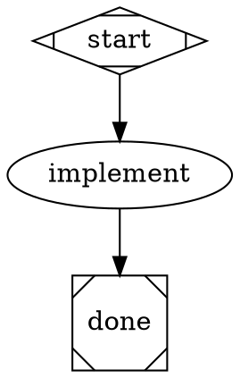
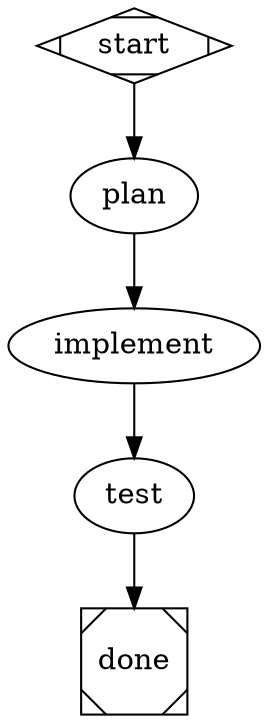
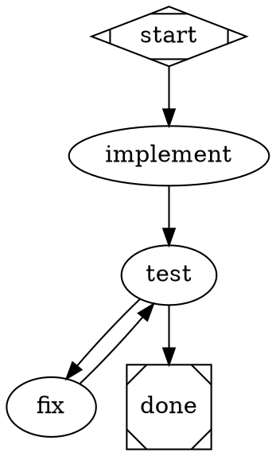
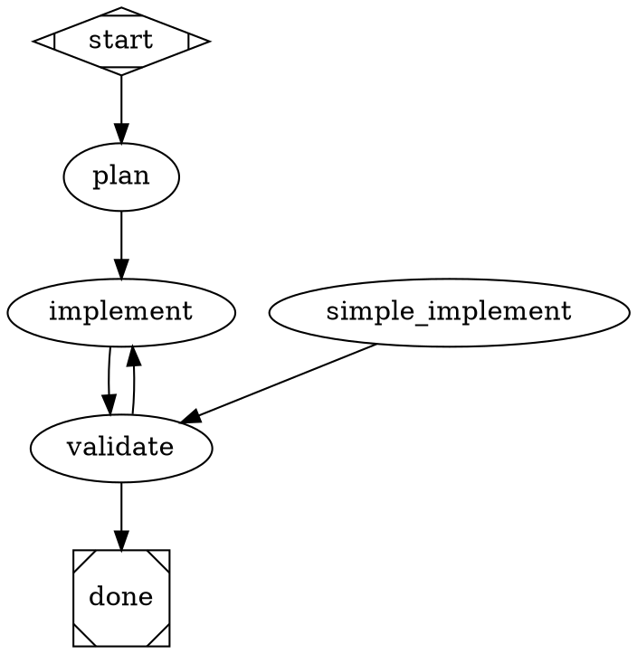
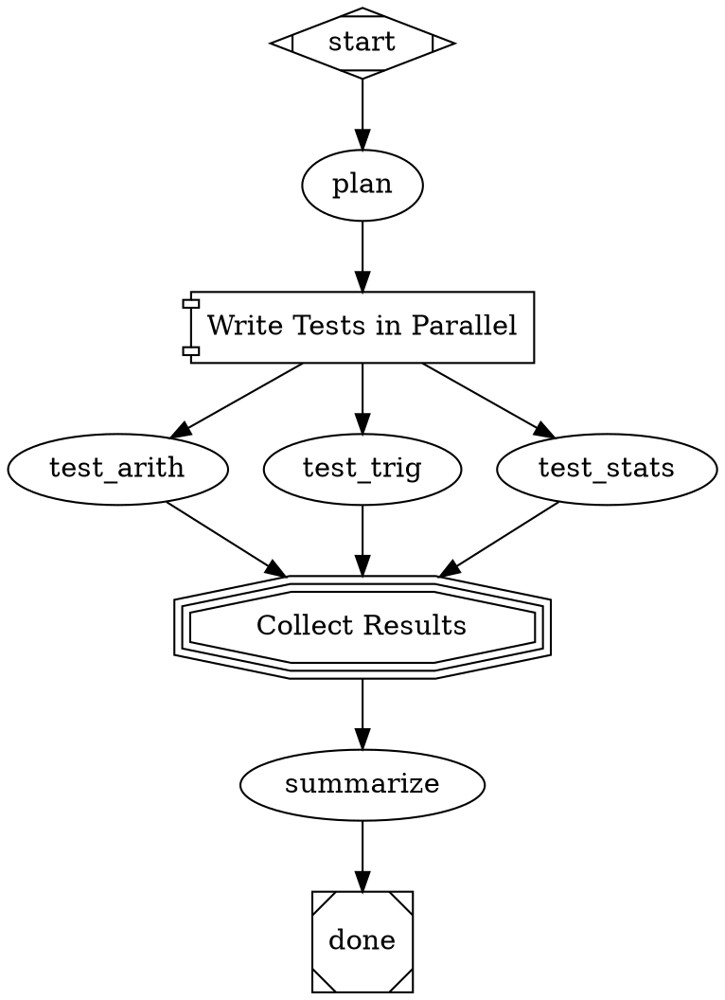
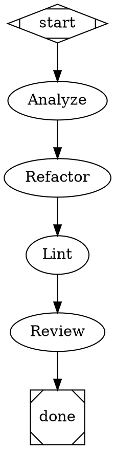
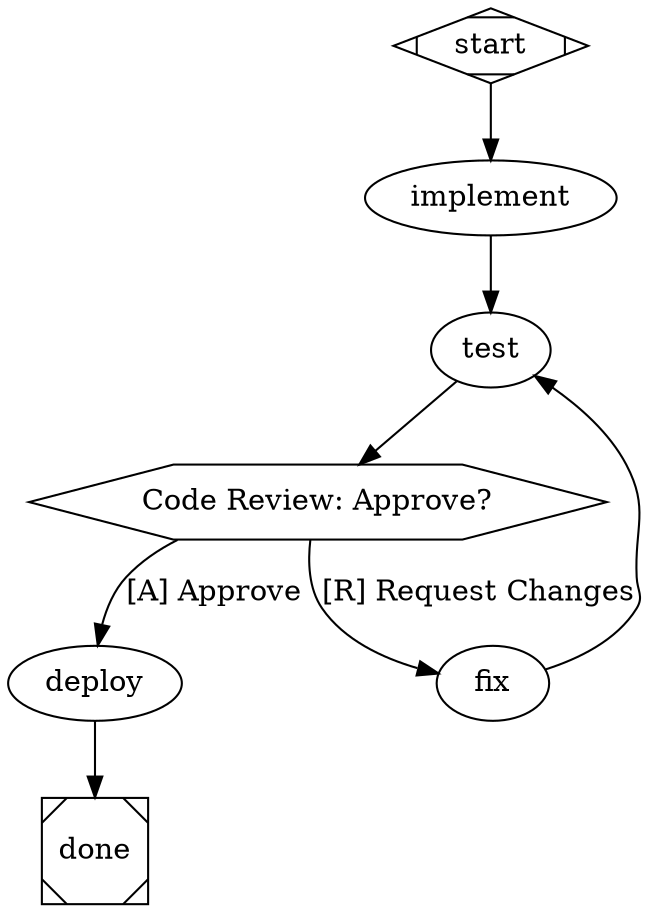
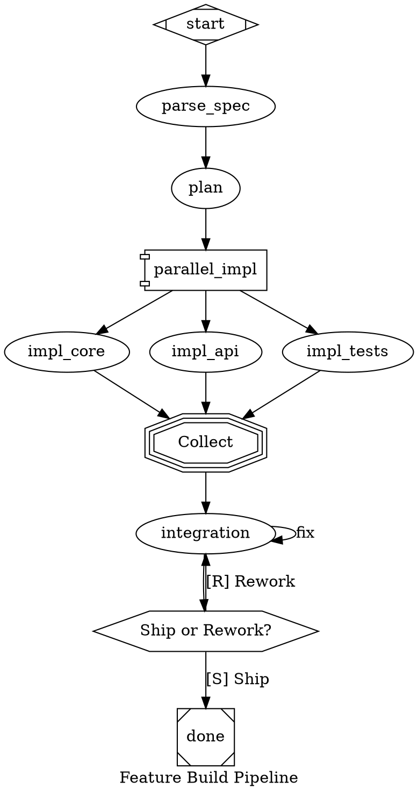

# DOT Pipeline Authoring Guide

How to design effective multi-stage AI pipelines using Graphviz DOT digraphs.

## Philosophy

Attractor pipelines are **declarative workflow definitions**. You describe _what_
should happen at each stage and _how_ stages connect -- the pipeline engine
handles execution, retries, context passing, and backend selection.

A DOT digraph is the workflow. Each node is a task (usually an LLM call). Each
edge defines flow. Node shapes determine handler behavior (LLM call, conditional
gate, parallel fork, human approval, etc.). The engine walks the graph from
`start` to `done`, executing each node and following edges based on outcomes.

**Design principles:**

- Each node should have a single, clear responsibility
- Prompts should be self-contained -- a node should not assume context unless fidelity is `full`
- Use `$goal` to inject the pipeline's overall objective into node prompts
- Prefer fewer, well-prompted nodes over many thin ones
- Use goal gates on nodes whose success is required for the pipeline to pass
- Use conditional routing to handle success/failure paths explicitly

## Pipeline Patterns

### Linear Pipeline

The simplest pattern. Stages execute in sequence.



A more realistic linear pipeline with planning and testing:



### Conditional Routing

Conditional routing is done via `condition=` attributes on edges, which work
from **any node type** (per nlspec Section 3.3). No special shape is needed --
the engine evaluates `condition` attributes on outgoing edges to pick the path.



**How conditions work:** The engine evaluates conditions against the most recent
node's outcome. Supported operators are `=` and `!=`. Combine with `&&`:

```dot
gate -> deploy [condition="outcome=success && context.tests_passed=true"]
```

Keys available in conditions:
- `outcome` -- resolves to `preferred_label` if set by the agent via `report_outcome`, otherwise falls back to the raw status value (`success`, `fail`, etc.)
- `preferred_label` -- the custom routing label set via `report_outcome` (null if not set)
- `context.<key>` -- any value in the pipeline context (set via `context_updates` in `report_outcome`)

**Dynamic routing with `report_outcome`:** Nodes that make routing decisions
(review gates, test runners) should call the `report_outcome` tool with a
`preferred_label` that matches their outgoing edge conditions. For example,
a review node with edges `condition="outcome=pass"` and `condition="outcome=retry"`
should call `report_outcome(status="success", preferred_label="pass")` or
`report_outcome(status="fail", preferred_label="retry")`.

> **Recommended pattern:** Use `condition="outcome!=retry"` instead of
> `condition="outcome=pass"` for forward edges. This is resilient to agents
> that return `status="success"` without setting `preferred_label`.
> See [ROUTING-REFERENCE.md](ROUTING-REFERENCE.md) for the full routing
> system documentation, including edge selection algorithm details and pitfalls.

### Retry with Fallback

Use `max_retries`, `retry_target`, and `fallback_retry_target` for resilient
execution. When a node fails and retries are exhausted, flow jumps to the
retry target. If that also fails, the fallback target catches it.



### Parallel Fan-Out / Fan-In

Use `shape=component` for parallel fan-out and `shape=tripleoctagon` for fan-in.
All outgoing edges from a `component` node become parallel branches.



**Parallel handler attributes:**

| Attribute | Values | Default | Description |
|-----------|--------|---------|-------------|
| `join_policy` | `wait_all`, `k_of_n`, `first_success`, `quorum` | `wait_all` | When to proceed |
| `error_policy` | `fail_fast`, `continue`, `ignore` | `continue` | How to handle branch failures |
| `max_parallel` | Integer | `4` | Max concurrent branches |

### Multi-Provider with Model Stylesheet

Use `model_stylesheet` to route different nodes to different providers using
CSS-like selectors. Nodes get a `class` attribute for targeting.



**Selector specificity** (highest wins):

| Selector | Example | Specificity |
|----------|---------|-------------|
| `#node_id` | `#critical_review` | 2 (highest) |
| `.class` | `.planning` | 1 |
| `*` | `*` | 0 (lowest) |

Explicit node attributes (`llm_model="..."` on the node) always override
stylesheet values.

### Human Approval Gate

Use `shape=hexagon` for human-in-the-loop gates. Choices are derived from
outgoing edge labels. Accelerator keys use `[X]` prefix notation.



When the pipeline reaches a hexagon node, it pauses and presents the edge
labels as choices. The human selects one, and the pipeline follows that edge.

### Sub-Pipeline Composition (Folder)

Use `shape=folder` to invoke a child pipeline defined in a separate DOT file.
The folder node runs the referenced pipeline as a sub-pipeline, passing context
from the parent, and optionally merging declared outputs back on success.

```dot
digraph {
    graph [goal="Build and validate a Python library"]

    start [shape=Mdiamond]
    done  [shape=Msquare]

    implement [prompt="Implement the library for: $goal"]
    test [prompt="Write unit tests for the library."]

    validate [
        shape=folder,
        label="Run Validation Suite",
        dot_file="pipelines/validate.dot",
        context.target="library",
        context.goal="$goal",
        outputs="validation_report,passed"
    ]

    fix [prompt="Fix issues identified in the validation report."]

    start -> implement -> test -> validate
    validate -> done [condition="outcome=success", weight=10]
    validate -> fix  [condition="outcome!=success", weight=5]
    fix -> test
}
```

**Folder node attributes:**

| Attribute | Required | Default | Description |
|-----------|----------|---------|-------------|
| `dot_file` | Yes | — | Path to the child pipeline DOT file |
| `context.<key>` | No | — | Inject named values into the child context (`context.goal="$goal"`) |
| `outputs` | No | `""` | Comma-separated child context keys to merge back into parent on success |

**Context flow:**

1. **Parent → Child (clone + inject):** When the folder node executes, the
   engine clones the parent pipeline context and injects any `context.<key>`
   attributes as named values. The child pipeline runs with this enriched
   context.

2. **Child → Parent (only declared outputs on success):** When the child
   pipeline completes successfully, only the context keys listed in `outputs`
   are merged back into the parent context. Keys not listed in `outputs` are
   discarded.

3. **Isolation (undeclared changes don't affect parent):** Any context
   modifications made inside the child pipeline that are not declared in
   `outputs` do not affect the parent pipeline's context. This isolation
   prevents accidental side-effects from leaking across pipeline boundaries.

**Path resolution for `dot_file`:** Relative paths are resolved relative to
the parent DOT file's directory. Absolute paths are used as-is. For example,
if the parent pipeline is at `pipelines/main.dot` and `dot_file="validate.dot"`,
the engine looks for `pipelines/validate.dot`.

### Manager-Supervisor Pattern

Use `shape=house` for a supervisor that oversees a sub-pipeline through
observe/steer/wait cycles.

```dot
digraph {
    graph [goal="Build a data pipeline for CSV processing"]

    start [shape=Mdiamond]
    done  [shape=Msquare]

    plan [prompt="Create a plan for: $goal"]

    manager [
        shape=house,
        label="Supervise Implementation",
        prompt="Oversee implementation. Steer toward success.",
        manager.max_cycles=5,
        manager.poll_interval="0s",
        manager.stop_condition="outcome=success",
        manager.actions="observe,steer,wait"
    ]

    implement [prompt="Implement the data pipeline. Incorporate steering feedback."]
    test [prompt="Run tests. Report success or failure."]
    report [prompt="Summarize results."]

    start -> plan -> manager
    manager -> implement
    implement -> test
    test -> done [condition="outcome=success"]
    test -> implement [condition="outcome!=success"]
    manager -> report [weight=0]
    report -> done
}
```

## Node Attribute Reference

Every node in a DOT pipeline can have these attributes:

| Attribute | Type | Default | Description |
|-----------|------|---------|-------------|
| `shape` | String | `box` | Determines handler type (see shape table below) |
| `label` | String | node ID | Display name. Used as prompt fallback if `prompt` is empty. |
| `prompt` | String | `""` | Primary instruction for LLM nodes. Supports `$goal` expansion. |
| `type` | String | `""` | Explicit handler type override. Takes precedence over shape. |
| `goal_gate` | Boolean | `false` | Node must succeed before pipeline can exit. |
| `max_retries` | Integer | `0` | Additional attempts beyond the first. `max_retries=3` = 4 total. |
| `retry_target` | String | `""` | Node to jump to when retries exhausted. |
| `fallback_retry_target` | String | `""` | Secondary retry target if primary is missing. |
| `fidelity` | String | inherited | Context mode for this node (see Fidelity Modes below). |
| `thread_id` | String | derived | Thread identifier for session reuse under `full` fidelity. |
| `class` | String | `""` | Comma-separated CSS classes for model stylesheet targeting. |
| `llm_model` | String | inherited | LLM model identifier. Overrides stylesheet. |
| `llm_provider` | String | auto | Provider key (`anthropic`, `openai`, `gemini`). |
| `reasoning_effort` | String | `high` | `low`, `medium`, or `high`. |
| `timeout` | Duration | unset | Max execution time (e.g., `900s`, `15m`). |
| `auto_status` | Boolean | `false` | Auto-generate SUCCESS if handler writes no status. |
| `allow_partial` | Boolean | `false` | Accept PARTIAL_SUCCESS when retries exhausted. |

**Shape-to-handler mapping:**

| Shape | Handler | LLM Call? | Description |
|-------|---------|-----------|-------------|
| `Mdiamond` | `start` | No | Pipeline entry point (required) |
| `Msquare` | `exit` | No | Pipeline exit point (required) |
| `box` | `codergen` | Yes | LLM task node (default for all nodes) |
| `component` | `parallel` | No | Parallel fan-out |
| `tripleoctagon` | `parallel.fan_in` | Optional | Collects parallel branch results |
| `hexagon` | `wait.human` | No | Human approval gate |
| `parallelogram` | `tool` | No | External tool/shell execution |
| `house` | `stack.manager_loop` | Indirect | Supervisor loop over sub-pipeline (experimental — future form TBD); engine classifies as non-LLM for validation, but handler internally delegates to LLM |
| `folder` | `pipeline` | No | Sub-pipeline from external DOT file |

## Edge Attribute Reference

| Attribute | Type | Default | Description |
|-----------|------|---------|-------------|
| `label` | String | `""` | Display caption. Also used for routing and human gate choices. |
| `condition` | String | `""` | Boolean guard: `outcome=success`, `outcome!=fail`, `&&` conjunction. |
| `weight` | Integer | `0` | Priority for edge selection. Higher wins among equally eligible edges. |
| `fidelity` | String | unset | Override fidelity for the target node. Highest precedence. |
| `thread_id` | String | unset | Override thread ID for the target node. |

**Edge selection priority** (the engine picks the first match):
1. Condition-matching edges (condition evaluates to true)
2. Preferred label match (from outcome's suggested label)
3. Highest `weight` among unconditional edges
4. Lexical tiebreak (target node ID, ascending)

## Variable Expansion

The only built-in variable is `$goal`, which resolves to the graph-level `goal`
attribute. It is expanded in node prompts before execution.

```dot
graph [goal="Create a REST API with authentication"]
plan [prompt="Plan the implementation of: $goal"]
// Expands to: "Plan the implementation of: Create a REST API with authentication"
```

The `goal` value is passed at runtime via the `--goal` CLI flag or the `goal`
parameter in `run_pipeline`.

## Fidelity Modes

Fidelity controls how much prior context each node receives from earlier stages.

| Mode | Session | Context Carried | When to Use |
|------|---------|----------------|-------------|
| `full` | Reused | Full conversation history | Nodes that build on prior work (implement after plan) |
| `compact` | Fresh | Structured summary of completed stages | Default. Good balance of context and cost. |
| `truncate` | Fresh | Minimal: only goal and run ID | Independent tasks that need no prior context |
| `summary:low` | Fresh | Brief summary (~600 tokens) | Light context carry |
| `summary:medium` | Fresh | Moderate detail (~1500 tokens) | Review/polish stages |
| `summary:high` | Fresh | Detailed summary (~3000 tokens) | Stages that need substantial prior context |

**Fidelity resolution precedence** (highest wins):
1. Edge `fidelity` attribute
2. Target node `fidelity` attribute
3. Graph `default_fidelity` attribute
4. Default: `compact`

**Thread IDs and session reuse:** Under `full` fidelity, nodes with the same
`thread_id` share a single LLM session. This preserves full conversation
history between those nodes:

```dot
graph [default_fidelity="full"]
implement_auth [thread_id="backend", prompt="Implement auth middleware."]
implement_rate [thread_id="backend", prompt="Add rate limiting middleware."]
// Both share the same LLM session -- rate limiting sees auth context
```

## Model Stylesheet Syntax

```
Selector { property: value; property: value; }
```

**Selectors:**
- `*` -- all nodes
- `.classname` -- nodes with `class="classname"`
- `#node_id` -- specific node by ID

**Properties:**
- `llm_model` -- model identifier
- `llm_provider` -- provider key
- `reasoning_effort` -- `low`, `medium`, `high`

```dot
graph [model_stylesheet="
    * { llm_model: claude-sonnet-4-20250514; llm_provider: anthropic; }
    .code { llm_model: claude-sonnet-4-20250514; }
    .reasoning { llm_model: o3; llm_provider: openai; reasoning_effort: high; }
    #final_check { llm_model: claude-opus-4-20250514; reasoning_effort: high; }
"]
```

## Graph-Level Attributes

Set these on the `graph` element:

| Attribute | Type | Default | Description |
|-----------|------|---------|-------------|
| `goal` | String | `""` | Pipeline objective. Available as `$goal` in prompts. |
| `label` | String | `""` | Display name for the pipeline. |
| `model_stylesheet` | String | `""` | CSS-like model assignment rules. |
| `default_fidelity` | String | `compact` | Default context fidelity for all nodes. |
| `default_max_retry` | Integer | `0` | Global retry ceiling. |
| `retry_target` | String | `""` | Global retry target when exit has unsatisfied goal gates. |
| `fallback_retry_target` | String | `""` | Global fallback retry target. |

## Tips for Effective Node Prompts

1. **Be specific.** "Write pytest tests for calculator.py covering add, subtract,
   multiply, divide including edge cases" is better than "Write some tests."

2. **Include the goal.** Use `$goal` to ground each node in the pipeline objective:
   "Plan the implementation of: $goal"

3. **State the expected output.** "Create the file using write_file" or "Run the
   tests and report pass/fail results" tells the agent what to do concretely.

4. **Reference prior work explicitly under compact/truncate fidelity.** Since the
   node may not see prior conversation, say "Based on the plan from the previous
   stage" rather than assuming context is available.

5. **Keep prompts under ~500 words.** Long prompts eat into the context window
   and reduce the agent's working space.

## Anti-Patterns to Avoid

| Anti-Pattern | Problem | Fix |
|-------------|---------|-----|
| Missing `shape=Mdiamond` start node | Pipeline will not parse | Every digraph needs exactly one `Mdiamond` and one `Msquare` |
| `goal_gate=true` without `retry_target` | Node fails with no recovery path | Add `retry_target` pointing to a node that can fix the issue |
| Wrong condition key | `condition="status=success"` does not match anything | Use `outcome=success` (not `status`) |
| Too many nodes (>10) | Long execution, high cost, context dilution | Combine related steps into fewer, well-prompted nodes |
| Vague prompts | Agent wanders, produces irrelevant output | Be specific about inputs, actions, and expected outputs |
| Missing `weight` on conditional edges | Nondeterministic edge selection | Add `weight` to break ties between equally-matched edges |
| Using `full` fidelity everywhere | High cost, slow execution | Use `full` only where conversation continuity matters |
| Circular dependencies without exit | Infinite loop | Ensure every cycle has a conditional exit path |

## Complete Example: Feature Build Pipeline

This pipeline demonstrates multiple patterns working together:



## Further Reading

- [DOT-SYNTAX.md](DOT-SYNTAX.md) -- Quick reference tables and copy-paste patterns
- [APP-INTEGRATION-GUIDE.md](APP-INTEGRATION-GUIDE.md) -- Using pipelines from Python code
- [GETTING-STARTED.md](GETTING-STARTED.md) -- Installation and first run
- [examples/pipelines/](../examples/pipelines/) -- 10 tutorial + 5 practical pipeline examples
