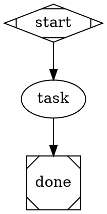
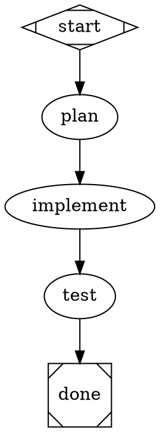
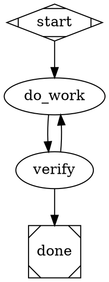
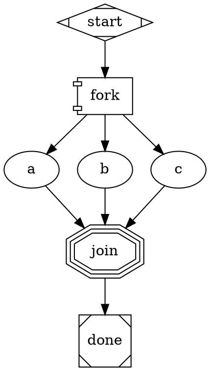
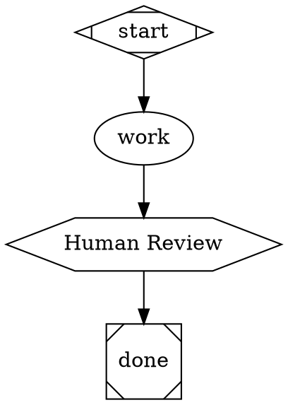
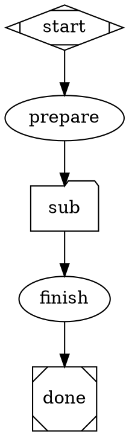
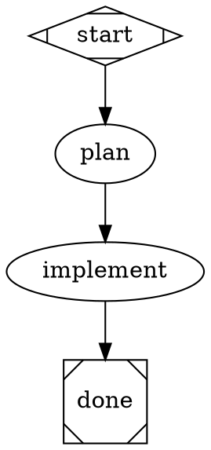

# DOT Syntax Cheat Sheet

One-page reference for writing Attractor pipelines.

## Minimal Valid Pipeline



## Shape -> Handler Mapping

| Shape | Handler | Description | LLM? |
|-------|---------|-------------|------|
| `Mdiamond` | start | Pipeline entry point | No |
| `Msquare` | exit | Pipeline exit, triggers goal gates | No |
| `box` | codergen | LLM agent with full tool access | Yes |
| `ellipse` | codergen | Alias for box | Yes |
| `diamond` | conditional | Routing node — no LLM call, evaluates edge conditions | No |
| `component` | parallel | Runs all outgoing edges concurrently | No |
| `tripleoctagon` | parallel.fan_in | Collects results from parallel branches | No |
| `parallelogram` | tool | Direct tool invocation (no LLM) | No |
| `hexagon` | wait.human | Pauses for human approval before proceeding | No |
| `house` | stack.manager_loop | Nested sub-pipeline (supervisor cycle) | No |
| `folder` | pipeline | Sub-pipeline from external DOT file | No |

## Node Attributes Quick Reference

| Attribute | Type | Default | Description |
|-----------|------|---------|-------------|
| `prompt` | string | -- | Instructions for the LLM. `$goal` and `$param` tokens are expanded. |
| `goal_gate` | bool | false | Must succeed for pipeline to complete |
| `max_retries` | int | graph default | Retry count on failure |
| `retry_target` | string | -- | Node to jump to on gate failure |
| `fidelity` | string | "compact" | Context carryover mode |
| `llm_provider` | string | -- | Override provider (anthropic/openai/gemini) |
| `llm_model` | string | -- | Override model name |
| `reasoning_effort` | string | -- | low/medium/high (provider-dependent) |
| `auto_status` | bool | false | Force SUCCESS regardless of outcome |
| `timeout` | string | -- | Per-node timeout (e.g. "30s", "2m") |
| `class` | string | -- | CSS class for model stylesheet matching |
| `dot_file` | string | -- | Path to child DOT file (folder nodes only) |
| `outputs` | string | -- | Comma-separated child context keys to merge back (folder nodes only) |
| `context.*` | string | -- | Inject named values into child context (folder nodes only) |

## Edge Attributes Quick Reference

| Attribute | Type | Description |
|-----------|------|-------------|
| `condition` | string | Key=value match: `outcome=success` (NOT Python) |
| `label` | string | Matched against node's `preferred_label` |
| `weight` | int | Higher = preferred when multiple edges match |
| `fidelity` | string | Override fidelity for this transition |
| `thread_id` | string | Share message history across edges with same ID |

## Graph Attributes Quick Reference

| Attribute | Type | Description |
|-----------|------|-------------|
| `goal` | string | Pipeline objective. Expands `$goal` in prompts. |
| `default_fidelity` | string | Default fidelity for all nodes |
| `default_max_retry` | int | Default retry count for all nodes |
| `retry_target` | string | Global fallback retry target |
| `max_pipeline_duration` | string | Timeout for entire pipeline (e.g. "10m") |
| `model_stylesheet` | string | CSS-like rules for model/provider config |
| `params` | string | Comma-separated list of `$param` names (documentation) |

## Model Stylesheet

```dot
graph [model_stylesheet="
    box { llm_provider: anthropic; llm_model: claude-sonnet-4-20250514 }
    ellipse { llm_provider: openai; llm_model: o3-mini; reasoning_effort: high }
    .fast { llm_model: claude-haiku-3-5-20241022 }
"]
```

Selectors match node shapes or classes (`.classname`).

## Variable Expansion

| Token | Source | Description |
|-------|--------|-------------|
| `$goal` | `graph.goal` or tool `goal` parameter | The pipeline objective |
| `$param_name` | `params` dict from tool input | Custom key-value parameters |

Example: `params: {"language": "Python"}` expands `$language` in prompts.

## Copy-Paste Patterns

### Linear (3 stages)


### Retry Loop


### Parallel Fan-Out/In


### Human Approval Gate


### Sub-Pipeline (Folder)


### Model Stylesheet Example


## Common Mistakes

| Mistake | Fix |
|---------|-----|
| Forgetting `shape=Mdiamond` on start | Every pipeline needs exactly one Mdiamond |
| Forgetting `shape=Msquare` on exit | Every pipeline needs at least one Msquare |
| Using `goal_gate=true` without `retry_target` | Gate failure with no retry = pipeline fails |
| Condition on wrong context key | Use `outcome` not `status` |
| Missing edge from node | Every non-exit node needs at least one outgoing edge |
| `$goal` not expanding | Ensure graph has `goal="..."` attribute or pass `goal` to the tool |
| Fan-in without fan-out | `tripleoctagon` expects `parallel.results` in context |
| `$param` not expanding | Pass `params` dict to `run_pipeline` tool call |
