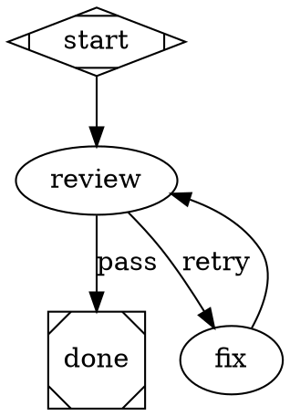
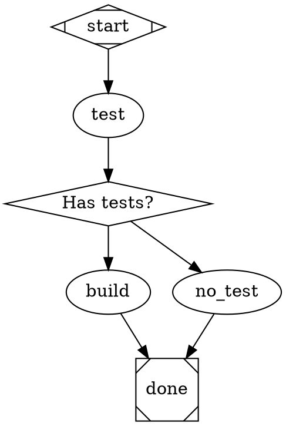

# Routing Reference

Complete reference for the Attractor pipeline engine's routing system.

## Contents

1. [Overview](#1-overview)
2. [The `report_outcome` Tool](#2-the-report_outcome-tool)
3. [Condition Expression Language](#3-condition-expression-language)
4. [Edge Selection Algorithm](#4-edge-selection-algorithm)
5. [`stack.steer` and `stack.observe` Node Types](#5-stacksteer-and-stackobserve-node-types)
6. [Common Patterns and Pitfalls](#6-common-patterns-and-pitfalls)
7. [Data Flow Diagram](#7-data-flow-diagram)

---

## 1. Overview

The routing system determines which node executes next after each node
completes. Three mechanisms work together to produce a routing decision:

**`report_outcome` tool** — The executing agent calls this at the end of a
node's work to signal the outcome. It carries the `status`, an optional
`preferred_label` routing signal, optional `suggested_next_ids`, and optional
`context_updates` that are merged into the pipeline context before edge
selection runs.

**Edge conditions** — Each outgoing edge may carry a `condition` attribute
containing a boolean expression evaluated against the outcome and the current
pipeline context. Conditions are the primary routing mechanism for structured
decision points.

**Five-step edge selection algorithm** — When a node finishes, the engine
runs a deterministic priority-ordered algorithm over the node's outgoing edges
to select the single edge to follow (or all matching edges in multi-match
fan-out scenarios).

Understanding how these three pieces interact is essential for writing
pipelines that route correctly under all outcome combinations, including
failure cases.

---

## 2. The `report_outcome` Tool

The agent calls `report_outcome` at the end of a node's execution to
communicate the outcome back to the pipeline engine. The engine reads
`last_outcome` from the tool after the node handler returns, constructs an
`Outcome` object, and passes it into edge selection.

### Interface

```
report_outcome(
    status:             string,    -- REQUIRED
    preferred_label:    string,    -- optional
    suggested_next_ids: string[],  -- optional
    context_updates:    object,    -- optional
    notes:              string,    -- optional
    failure_reason:     string     -- optional
)
```

### Parameters

| Parameter | Required | Type | Description |
|-----------|----------|------|-------------|
| `status` | Yes | `"success"` \| `"partial_success"` \| `"retry"` \| `"fail"` \| `"skipped"` | The execution status. Must be a valid `StageStatus` enum value. Validated on call; invalid values return an error. |
| `preferred_label` | No | string | Free-form routing signal. Matched against edge `label` attributes and evaluated as the `outcome` key in condition expressions. This is how custom-labeled edges are reached. |
| `suggested_next_ids` | No | string[] | Hint to the engine: prefer edges whose target node ID appears in this list. Lower priority than condition matches and preferred label matches. |
| `context_updates` | No | object | Key-value pairs merged into the pipeline context before edge selection runs. Values are accessible in subsequent conditions via `context.<key>`. |
| `notes` | No | string | Human-readable summary of what the agent did. Appears in logs and pipeline output. Not used for routing. |
| `failure_reason` | No | string | Explanation of why the node failed. Included in logs and output. Not used for routing. |

### Critical distinction: `status` vs. `preferred_label`

**`status` is not the routing signal for conditional edges.** It records
the execution state (`success`, `fail`, etc.) and is used by the engine for
goal gate evaluation and retry logic.

**`preferred_label` is the routing signal.** Condition expressions evaluate
`outcome`, which resolves to `preferred_label` when set, and falls back to
`status.value` only when `preferred_label` is absent.

```python
# The agent wants to route to a "pass" edge
report_outcome(status="success", preferred_label="pass")
#                      ^                    ^
#                      |                    |
#         records SUCCESS state    "outcome" resolves to "pass"
#         for goal gates           edges see: outcome=pass
```

If `preferred_label` is omitted, `outcome` resolves to the `status` value
(`"success"`, `"fail"`, etc.). In this case, edges with
`condition="outcome=success"` will match — but edges with
`condition="outcome=pass"` will not.

---

## 3. Condition Expression Language

Conditions are boolean expressions placed on edges. The engine evaluates each
condition against the most recent node's outcome and the current pipeline
context. An edge whose condition evaluates to `true` is eligible for
selection.

### Operators

| Operator | Syntax | Meaning |
|----------|--------|---------|
| Equality | `key=value` | True when resolved value equals `value` |
| Inequality | `key!=value` | True when resolved value does not equal `value` |
| Conjunction | `clause1 && clause2` | True when all clauses are true |

Values are compared as strings. Whitespace around operators and values is
stripped before comparison.

### Resolution keys

| Key | Resolves to |
|-----|-------------|
| `outcome` | `preferred_label` if set; otherwise `status.value`. This is the primary routing key. |
| `preferred_label` | The raw `preferred_label` field; empty string if not set. |
| `status` | The `StageStatus` enum value (`"success"`, `"fail"`, etc.). Resolves via context lookup; use `outcome` in most cases. |
| `context.<key>` | A pipeline context variable set via `context_updates` in `report_outcome` or by earlier nodes. |

**The `outcome` key is the correct choice for almost all conditions.** Using
`preferred_label` or `status` directly is rarely necessary and can produce
unexpected results when one is set and the other is not.

### Examples

```dot
// Route based on custom outcome labels
// Agent calls: report_outcome(status="success", preferred_label="pass")
A -> B [condition="outcome=pass"];
A -> C [condition="outcome=retry"];

// Inequality routing: catch anything except retry
// Matches "pass", "skip", "success", and any other non-retry value
A -> B [condition="outcome!=retry"];
A -> C [condition="outcome=retry"];

// Compound condition: context variable AND outcome
// Agent calls: report_outcome(status="success", preferred_label="pass",
//                             context_updates={"has_tests": "true"})
A -> B [condition="context.has_tests=true && outcome=pass"];
A -> C [condition="context.has_tests=false"];

// Routing on raw status value (less common)
// Only appropriate when preferred_label is never set by this node
A -> B [condition="status=success"];
```

---

## 4. Edge Selection Algorithm

After a node completes, the engine runs the following five-step
priority-ordered algorithm to select the edge to follow. The algorithm is
implemented in `edge_selection.py`.

### Step 1: Condition match

Evaluate the `condition` attribute on every outgoing edge. All edges whose
condition returns `true` are collected as candidates.

- If exactly one candidate matches, that edge is selected immediately.
- If multiple candidates match, they are passed to the weight + lexical
  tiebreak described in Step 5.
- If no candidates match, proceed to Step 2.

### Step 2: Preferred label match

If `preferred_label` is set in the outcome, scan the outgoing edges for an
edge whose `label` attribute matches it. Matching is case-insensitive.
Accelerator key prefixes are stripped before comparison: `[Y]`, `Y)`, and
`Y -` patterns at the start of a label are removed.

```dot
// These all match preferred_label="approve"
A -> B [label="[A] Approve"];
A -> B [label="A) Approve"];
A -> B [label="approve"];
```

If a match is found, that edge is selected. If no match, proceed to Step 3.

### Step 3: Suggested next IDs

If `suggested_next_ids` is set in the outcome, scan the outgoing edges for an
edge whose target node ID appears in the list. The list is checked in order;
the first matching edge is selected.

If no match, proceed to Step 4.

### Step 4: Unconditional edges

Collect edges that have no `condition` attribute at all. If exactly one exists,
select it. If multiple unconditional edges exist, they are passed to the weight
+ lexical tiebreak in Step 5. If none exist, proceed to Step 5 using all edges.

### Step 5: Weight and lexical tiebreak

When multiple candidate edges remain from an earlier step (or from the
fallback), select the edge with the highest `weight` attribute. If weights are
equal, select the edge with the lexically smallest target node ID (ascending
alphabetical order).

This is the **silent fallback**. When no condition matched and no unconditional
edge was found, the engine picks from all edges by weight then lexical order
with no warning or error. See [Pitfall: Silent Alphabetical Fallback](#pitfall-silent-alphabetical-fallback).

### Algorithm summary

| Step | Trigger | Candidates |
|------|---------|------------|
| 1 | `condition` evaluates to `true` | Condition-matching edges |
| 2 | `preferred_label` is set | Edges with matching `label` |
| 3 | `suggested_next_ids` is set | Edges pointing to listed node IDs |
| 4 | None of the above | Edges with no `condition` |
| 5 | Multiple candidates remain | Highest `weight`; then lexical on target ID |

---

## 5. `stack.steer` and `stack.observe` Node Types

`stack.steer` and `stack.observe` are semantic-only node type aliases used in
pipeline graphs. They are not registered as distinct handler types in the
engine.

Both fall through to the `codergen` handler — the same handler used for
`shape=box` nodes. A `stack.steer` or `stack.observe` node is an LLM task node
in every respect that affects execution.

```dot
// These three nodes behave identically at runtime
observe_node [type="stack.observe", prompt="Gather information about: $goal"]
steer_node   [type="stack.steer",   prompt="Decide next action for: $goal"]
plain_node   [prompt="Do something"]
```

The intended documentation convention:

| Type | Signal to pipeline readers |
|------|---------------------------|
| `stack.steer` | This node makes a routing decision. It calls `report_outcome` with a `preferred_label` that drives the next edge. |
| `stack.observe` | This node gathers information. It typically updates pipeline context via `context_updates` for later nodes to use. |

The pipeline validator emits a WARNING for unrecognized `type` values,
including `stack.steer` and `stack.observe`. This warning is expected and does
not affect execution.

```
WARNING: Node "decide" has unrecognized type "stack.steer" -- defaulting to codergen
```

---

## 6. Common Patterns and Pitfalls

### Pattern: Pass/retry routing

The most common two-path routing structure. The node either passes or signals
that it needs another attempt.



The agent calls:
```
report_outcome(status="success", preferred_label="pass")   // to proceed
report_outcome(status="fail",    preferred_label="retry")  // to loop back
```

### Pattern: Defensive routing (recommended)

Use `!=` on the forward path so that the node can proceed even if the agent
calls `report_outcome` with `status="success"` and no `preferred_label`.

```dot
review -> done [condition="outcome!=retry", label="pass",  weight=10]
review -> fix  [condition="outcome=retry",  label="retry", weight=5]
```

**Why this matters:** If the agent completes successfully but forgets to set
`preferred_label`, `outcome` resolves to `"success"` (the status value).

- `"success" != "retry"` is `true` — the forward edge matches, pipeline
  continues correctly.
- `"success" = "pass"` is `false` — with the non-defensive pattern,
  neither edge matches, and the engine falls through to Step 5 (silent
  alphabetical fallback).

Use `condition="outcome=pass"` only when you can guarantee the agent will
always set `preferred_label="pass"` explicitly and you want an explicit
failure if it does not.

### Pattern: Context-driven branching

Use `context_updates` to carry a decision through several nodes before it
affects routing.



The agent on `test` calls:
```
report_outcome(
    status="success",
    context_updates={"has_tests": "true"}
)
```

The `gate` node is `shape=diamond` (the `conditional` handler), which runs no
LLM call and proceeds immediately to edge selection using the current outcome
and context.

---

### Pitfall: Silent alphabetical fallback

If no condition matches and no unconditional edge exists, the engine selects
an edge by lexical order of the target node ID. No warning is logged.

**Production example:** A review loop with two outgoing edges:

```dot
ReviewConsensus -> Fix  [condition="outcome=retry"]
ReviewConsensus -> Test [condition="outcome=pass"]
```

The agent on `ReviewConsensus` called `report_outcome(status="success")`
without setting `preferred_label`. `outcome` resolved to `"success"`.

- `"success" = "retry"` is false — first edge eliminated.
- `"success" = "pass"` is false — second edge eliminated.
- No unconditional edges exist.
- Step 5 fallback: pick by lexical order. `"Fix"` < `"Test"` alphabetically.
- Engine routed to `Fix` silently, causing an infinite loop.

**Fix:** Use defensive inequality routing or ensure the agent always sets
`preferred_label` explicitly.

```dot
// Defensive: catches "success", "pass", and anything other than "retry"
ReviewConsensus -> Test [condition="outcome!=retry", weight=10]
ReviewConsensus -> Fix  [condition="outcome=retry",  weight=5]
```

---

### Pitfall: Failure without `report_outcome`

If a node fails (crash, timeout, unhandled exception) without calling
`report_outcome`, the engine constructs a synthetic outcome:

- `status = "fail"`
- `preferred_label = null`
- `outcome` resolves to `"fail"`

With defensive `!=` routing:

```dot
A -> B [condition="outcome!=retry"]
A -> C [condition="outcome=retry"]
```

`"fail" != "retry"` is `true` — the pipeline takes the forward path (`B`)
despite the failure. The forward node receives no useful context about what
failed.

**Mitigations:**

1. Add an explicit failure condition with a higher weight:
   ```dot
   A -> B [condition="outcome!=retry && outcome!=fail", weight=10]
   A -> C [condition="outcome=retry",                   weight=5]
   A -> error_handler [condition="outcome=fail",         weight=8]
   ```

2. Set `fallback_retry_target` at the graph level to catch unhandled failures:
   ```dot
   graph [fallback_retry_target="error_handler"]
   ```

3. Use `goal_gate=true` on critical nodes — the engine will not exit the
   pipeline successfully if a goal gate node never reached `SUCCESS`.

---

## 7. Data Flow Diagram

The complete path from an agent decision to an edge selection:

```
Agent calls report_outcome(status="success", preferred_label="pass")
    |
    v
ReportOutcomeTool validates status, stores outcome in last_outcome:
    {
        "status": "success",
        "preferred_label": "pass"
    }
    |
    v
Node handler returns; backend reads last_outcome.
Constructs: Outcome(status=SUCCESS, preferred_label="pass")
    |
    v
context_updates (if any) are merged into PipelineContext.
    |
    v
Edge selection runs over outgoing edges of the completed node:
    |
    |-- Step 1: Evaluate conditions
    |       condition="outcome=pass"
    |           _resolve_key("outcome") -> "pass"   (preferred_label is set)
    |           "pass" == "pass"  ->  TRUE  -> candidate
    |
    |       condition="outcome=retry"
    |           _resolve_key("outcome") -> "pass"
    |           "pass" == "retry" ->  FALSE -> eliminated
    |
    |-- Exactly one candidate -> selected immediately.
    |
    v
Engine follows the selected edge to the target node.
Target node executes with the updated pipeline context.
```

---

### Resolution key reference (quick lookup)

| Condition key | When `preferred_label="pass"` | When `preferred_label` omitted, `status="success"` |
|---------------|-------------------------------|-----------------------------------------------------|
| `outcome` | `"pass"` | `"success"` |
| `preferred_label` | `"pass"` | `""` (empty) |
| `status` | `"success"` | `"success"` |
| `context.my_key` | value from context | value from context |

---

## Further Reading

- [DOT-AUTHORING-GUIDE.md](DOT-AUTHORING-GUIDE.md) — Pipeline patterns,
  node attributes, and authoring best practices
- [DOT-SYNTAX.md](DOT-SYNTAX.md) — Quick reference tables and copy-paste
  patterns
- [APP-INTEGRATION-GUIDE.md](APP-INTEGRATION-GUIDE.md) — Using pipelines
  from Python code
- [GETTING-STARTED.md](GETTING-STARTED.md) — Installation and first run
