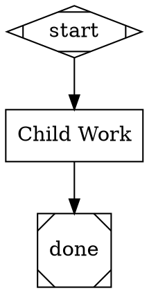
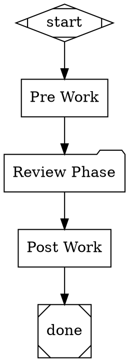
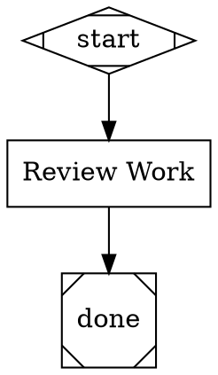

# Subgraph Runner — Nested Pipeline Execution Implementation Plan

> **Execution:** Use the subagent-driven-development workflow to implement this plan.

**Goal:** Enable pipeline nodes to execute external DOT files as nested sub-pipelines, with full observability into child pipeline state.

**Architecture:** Two-layer design — a new `pipeline` handler as the primitive (any node can invoke an external DOT file via `shape=folder`), plus enhancement of the existing `stack.manager_loop` handler to use the primitive when `stack.child_dotfile` is set. The parent engine delegates to a child engine with its own graph, cloned context, cloned backend, and logs subdirectory, but cooperative cancellation propagates from parent to child.

**Tech Stack:** Python 3.12+, pytest, asyncio. All code lives in `modules/loop-pipeline/amplifier_module_loop_pipeline/`.

**Design document:** `docs/plans/2026-02-26-subgraph-runner-design.md`

**Baseline:** 890 tests passing. All must continue to pass after every task.

**Test command:** `cd modules/loop-pipeline && .venv/bin/pytest tests/ -q`

---

## Phase 1 — Foundations (no new handler yet)

Tasks 1–3 are independent of each other. They can be done in any order or in parallel.

---

### Task 1: Add `source_dir` field to `Graph` dataclass

**Files:**
- Modify: `amplifier_module_loop_pipeline/graph.py` (line ~290, in the `Graph` dataclass)
- Test: `tests/test_graph_model.py`

**Step 1: Write the failing test**

Open `tests/test_graph_model.py` and add at the bottom:

```python
# --- source_dir for subgraph resolution ---


def test_graph_source_dir_defaults_to_empty():
    """Graph.source_dir should default to empty string."""
    graph = Graph(name="test", nodes={}, edges=[])
    assert graph.source_dir == ""


def test_graph_source_dir_set():
    """Graph.source_dir should be settable via constructor."""
    graph = Graph(name="test", nodes={}, edges=[], source_dir="/some/path")
    assert graph.source_dir == "/some/path"
```

**Step 2: Run test to verify it fails**

```bash
cd modules/loop-pipeline && .venv/bin/pytest tests/test_graph_model.py::test_graph_source_dir_defaults_to_empty -v
```

Expected: FAIL — `TypeError: Graph.__init__() got an unexpected keyword argument 'source_dir'`

**Step 3: Write minimal implementation**

In `amplifier_module_loop_pipeline/graph.py`, add `source_dir` to the `Graph` dataclass. Insert it right after the `model_stylesheet` field (around line 293), before `graph_attrs`:

```python
    model_stylesheet: str = ""
    source_dir: str = ""  # Directory of the DOT file that produced this graph
    graph_attrs: dict[str, str] = field(default_factory=dict)
```

**Step 4: Run test to verify it passes**

```bash
cd modules/loop-pipeline && .venv/bin/pytest tests/test_graph_model.py::test_graph_source_dir_defaults_to_empty tests/test_graph_model.py::test_graph_source_dir_set -v
```

Expected: 2 PASSED

**Step 5: Run full test suite to confirm no regressions**

```bash
cd modules/loop-pipeline && .venv/bin/pytest tests/ -q
```

Expected: 892 passed (890 baseline + 2 new)

**Step 6: Commit**

```
git add modules/loop-pipeline/amplifier_module_loop_pipeline/graph.py modules/loop-pipeline/tests/test_graph_model.py
git commit -m "feat: add source_dir field to Graph dataclass for subgraph path resolution"
```

---

### Task 2: Add `folder` → `pipeline` to `SHAPE_TO_HANDLER`

**Files:**
- Modify: `amplifier_module_loop_pipeline/validation.py` (line 24–35)
- Test: `tests/test_validation.py`

**Step 1: Write the failing test**

Open `tests/test_validation.py` and add at the bottom:

```python
# --- folder shape maps to pipeline handler ---


def test_folder_shape_maps_to_pipeline():
    """SHAPE_TO_HANDLER should map 'folder' to 'pipeline'."""
    from amplifier_module_loop_pipeline.validation import SHAPE_TO_HANDLER

    assert SHAPE_TO_HANDLER["folder"] == "pipeline"


def test_folder_node_type_known():
    """A node with shape=folder should not trigger the type_known warning."""
    g = _graph(
        nodes={
            "start": _mdiamond(),
            "sub": Node(id="sub", shape="folder", label="Sub Pipeline"),
            "exit": _msquare(),
        },
        edges=[
            Edge(from_node="start", to_node="sub"),
            Edge(from_node="sub", to_node="exit"),
        ],
    )
    diags = validate(g)
    type_warnings = [d for d in diags if d.rule == "type_known" and d.node_id == "sub"]
    assert len(type_warnings) == 0
```

**Step 2: Run test to verify it fails**

```bash
cd modules/loop-pipeline && .venv/bin/pytest tests/test_validation.py::test_folder_shape_maps_to_pipeline -v
```

Expected: FAIL — `KeyError: 'folder'`

**Step 3: Write minimal implementation**

In `amplifier_module_loop_pipeline/validation.py`, add `"folder": "pipeline"` to the `SHAPE_TO_HANDLER` dict (line ~35):

```python
SHAPE_TO_HANDLER: dict[str, str] = {
    "Mdiamond": "start",
    "Msquare": "exit",
    "box": "codergen",
    "ellipse": "codergen",
    "hexagon": "wait.human",
    "diamond": "conditional",
    "component": "parallel",
    "tripleoctagon": "parallel.fan_in",
    "parallelogram": "tool",
    "house": "stack.manager_loop",
    "folder": "pipeline",
}
```

**Step 4: Run tests to verify they pass**

```bash
cd modules/loop-pipeline && .venv/bin/pytest tests/test_validation.py::test_folder_shape_maps_to_pipeline tests/test_validation.py::test_folder_node_type_known -v
```

Expected: 2 PASSED

**Step 5: Run full test suite**

```bash
cd modules/loop-pipeline && .venv/bin/pytest tests/ -q
```

Expected: 894 passed (892 + 2 new)

**Step 6: Commit**

```
git add modules/loop-pipeline/amplifier_module_loop_pipeline/validation.py modules/loop-pipeline/tests/test_validation.py
git commit -m "feat: add folder shape to SHAPE_TO_HANDLER mapping for pipeline nodes"
```

---

### Task 3: Add `SUBGRAPH_START` and `SUBGRAPH_COMPLETE` event types

**Files:**
- Modify: `amplifier_module_loop_pipeline/pipeline_events.py` (add after line 70)
- Test: `tests/test_pipeline_events.py`

**Step 1: Write the failing test**

Open `tests/test_pipeline_events.py` and add at the bottom:

```python
# --- Subgraph event types ---


def test_subgraph_start_event_exists():
    """PIPELINE_SUBGRAPH_START event type should be defined."""
    from amplifier_module_loop_pipeline.pipeline_events import PIPELINE_SUBGRAPH_START

    assert PIPELINE_SUBGRAPH_START == "pipeline:subgraph_start"


def test_subgraph_complete_event_exists():
    """PIPELINE_SUBGRAPH_COMPLETE event type should be defined."""
    from amplifier_module_loop_pipeline.pipeline_events import PIPELINE_SUBGRAPH_COMPLETE

    assert PIPELINE_SUBGRAPH_COMPLETE == "pipeline:subgraph_complete"
```

**Step 2: Run test to verify it fails**

```bash
cd modules/loop-pipeline && .venv/bin/pytest tests/test_pipeline_events.py::test_subgraph_start_event_exists -v
```

Expected: FAIL — `ImportError: cannot import name 'PIPELINE_SUBGRAPH_START'`

**Step 3: Write minimal implementation**

In `amplifier_module_loop_pipeline/pipeline_events.py`, add after the "Provider-level events" section (after line 70):

```python
# ---------------------------------------------------------------------------
# Subgraph execution (nested pipeline nodes)
# ---------------------------------------------------------------------------
PIPELINE_SUBGRAPH_START: str = "pipeline:subgraph_start"
PIPELINE_SUBGRAPH_COMPLETE: str = "pipeline:subgraph_complete"
```

**Step 4: Run tests to verify they pass**

```bash
cd modules/loop-pipeline && .venv/bin/pytest tests/test_pipeline_events.py::test_subgraph_start_event_exists tests/test_pipeline_events.py::test_subgraph_complete_event_exists -v
```

Expected: 2 PASSED

**Step 5: Run full test suite**

```bash
cd modules/loop-pipeline && .venv/bin/pytest tests/ -q
```

Expected: 896 passed (894 + 2 new)

**Step 6: Commit**

```
git add modules/loop-pipeline/amplifier_module_loop_pipeline/pipeline_events.py modules/loop-pipeline/tests/test_pipeline_events.py
git commit -m "feat: add SUBGRAPH_START and SUBGRAPH_COMPLETE pipeline event types"
```

---

## Phase 2 — The `PipelineHandler` (the core primitive)

Tasks 4 → 5 → 6 → 7 are sequential. Each builds on the previous.

---

### Task 4: Create `handlers/pipeline.py` — DOT file resolution

This task creates the file and implements only the path resolution logic. No handler `execute()` method yet.

**Files:**
- Create: `amplifier_module_loop_pipeline/handlers/pipeline.py`
- Create: `tests/test_pipeline_handler.py`

**Step 1: Write the failing tests**

Create `tests/test_pipeline_handler.py`:

```python
"""Tests for the PipelineHandler — nested pipeline execution.

The pipeline handler (shape=folder) resolves a DOT file path, parses it
into a child graph, creates a child PipelineEngine, runs it, and returns
the child's outcome to the parent.
"""

from __future__ import annotations

import os

import pytest

from amplifier_module_loop_pipeline.context import PipelineContext
from amplifier_module_loop_pipeline.handlers.pipeline import resolve_dot_path


# ---------------------------------------------------------------------------
# DOT file path resolution
# ---------------------------------------------------------------------------


class TestResolveDotPath:
    """resolve_dot_path resolves absolute, relative, and $variable paths."""

    def test_absolute_path_unchanged(self):
        """Absolute paths are returned as-is."""
        result = resolve_dot_path("/abs/child.dot", source_dir="/parent", context=PipelineContext())
        assert result == "/abs/child.dot"

    def test_relative_to_source_dir(self):
        """Relative paths resolve against the parent DOT file's directory."""
        result = resolve_dot_path("child.dot", source_dir="/parent/pipelines", context=PipelineContext())
        assert result == "/parent/pipelines/child.dot"

    def test_relative_subdirectory(self):
        """Relative paths with subdirectories resolve correctly."""
        result = resolve_dot_path("sub/child.dot", source_dir="/parent", context=PipelineContext())
        assert result == "/parent/sub/child.dot"

    def test_variable_expansion(self):
        """$variable tokens in the path are expanded from context."""
        ctx = PipelineContext()
        ctx.set("language", "python")
        result = resolve_dot_path(
            "pipelines/$language-review.dot",
            source_dir="/root",
            context=ctx,
        )
        assert result == "/root/pipelines/python-review.dot"

    def test_variable_expansion_then_absolute(self):
        """If variable expansion produces an absolute path, use it as-is."""
        ctx = PipelineContext()
        ctx.set("pipeline_path", "/abs/child.dot")
        result = resolve_dot_path(
            "$pipeline_path",
            source_dir="/parent",
            context=ctx,
        )
        assert result == "/abs/child.dot"

    def test_empty_source_dir_uses_cwd(self):
        """When source_dir is empty, relative paths resolve against cwd."""
        result = resolve_dot_path("child.dot", source_dir="", context=PipelineContext())
        expected = os.path.join(os.getcwd(), "child.dot")
        assert result == expected

    def test_no_variable_in_path(self):
        """Paths without $ tokens are not modified by context."""
        ctx = PipelineContext()
        ctx.set("language", "python")
        result = resolve_dot_path("child.dot", source_dir="/parent", context=ctx)
        assert result == "/parent/child.dot"
```

**Step 2: Run tests to verify they fail**

```bash
cd modules/loop-pipeline && .venv/bin/pytest tests/test_pipeline_handler.py::TestResolveDotPath::test_absolute_path_unchanged -v
```

Expected: FAIL — `ModuleNotFoundError: No module named 'amplifier_module_loop_pipeline.handlers.pipeline'`

**Step 3: Write minimal implementation**

Create `amplifier_module_loop_pipeline/handlers/pipeline.py`:

```python
"""Pipeline handler — executes an external DOT file as a nested sub-pipeline.

The pipeline handler (shape=folder) resolves a dot_file path, parses the
child DOT source, creates a child PipelineEngine, runs it, and returns
the child's outcome to the parent.

Spec coverage: design doc Section 1 (PipelineHandler), Section 4 (DOT resolution).
"""

from __future__ import annotations

import os
import re

from ..context import PipelineContext


def resolve_dot_path(
    dot_file: str,
    source_dir: str,
    context: PipelineContext,
) -> str:
    """Resolve a dot_file path with variable expansion and relative resolution.

    Resolution order:
    1. Expand $variable tokens from context values.
    2. If path is absolute (starts with /), return as-is.
    3. Otherwise, resolve relative to source_dir (parent DOT file's directory).
    4. If source_dir is empty, resolve relative to cwd.

    Args:
        dot_file: The raw dot_file attribute from the node.
        source_dir: Directory of the parent DOT file (Graph.source_dir).
        context: Pipeline context for $variable expansion.

    Returns:
        Fully resolved absolute path to the child DOT file.
    """
    # Step 1: Expand $variable tokens from context
    path = _expand_path_variables(dot_file, context)

    # Step 2: Absolute paths are returned as-is
    if os.path.isabs(path):
        return path

    # Step 3: Resolve relative to source_dir (or cwd if empty)
    base = source_dir if source_dir else os.getcwd()
    return os.path.join(base, path)


def _expand_path_variables(path: str, context: PipelineContext) -> str:
    """Replace $variable tokens in a path string with context values.

    Only replaces tokens where the variable name exists in context.
    Unknown $tokens are left unchanged.
    """
    if "$" not in path:
        return path

    def replacer(match: re.Match) -> str:
        var_name = match.group(1)
        value = context.get(var_name)
        if value is not None:
            return str(value)
        return match.group(0)  # Leave unknown variables unchanged

    return re.sub(r"\$(\w+)", replacer, path)
```

**Step 4: Run tests to verify they pass**

```bash
cd modules/loop-pipeline && .venv/bin/pytest tests/test_pipeline_handler.py::TestResolveDotPath -v
```

Expected: 7 PASSED

**Step 5: Run full test suite**

```bash
cd modules/loop-pipeline && .venv/bin/pytest tests/ -q
```

Expected: 903 passed (896 + 7 new)

**Step 6: Commit**

```
git add modules/loop-pipeline/amplifier_module_loop_pipeline/handlers/pipeline.py modules/loop-pipeline/tests/test_pipeline_handler.py
git commit -m "feat: add DOT file path resolution for pipeline handler"
```

---

### Task 5: `PipelineHandler.execute()` — parse child DOT, create child engine, run, capture outcome

**Files:**
- Modify: `amplifier_module_loop_pipeline/handlers/pipeline.py`
- Modify: `tests/test_pipeline_handler.py`

**Step 1: Write the failing tests**

Add to `tests/test_pipeline_handler.py`:

```python
from unittest.mock import AsyncMock

from amplifier_module_loop_pipeline.graph import Edge, Graph, Node
from amplifier_module_loop_pipeline.handlers.pipeline import PipelineHandler
from amplifier_module_loop_pipeline.outcome import Outcome, StageStatus


# ---------------------------------------------------------------------------
# Helpers
# ---------------------------------------------------------------------------

CHILD_DOT = """\
digraph child_pipeline {
    graph [goal="Child goal"]
    start [shape=Mdiamond]
    work [shape=box, label="Do child work", prompt="Do the work"]
    done [shape=Msquare]
    start -> work -> done
}
"""


def _write_child_dot(tmp_path, filename="child.dot", content=CHILD_DOT):
    """Write a child DOT file and return its path."""
    dot_path = tmp_path / filename
    dot_path.write_text(content)
    return str(dot_path)


def _make_parent_graph(tmp_path, *, dot_file_attr: str = "child.dot") -> Graph:
    """Build a parent graph with a pipeline node pointing to a child DOT file."""
    return Graph(
        name="parent",
        nodes={
            "start": Node(id="start", shape="Mdiamond"),
            "sub": Node(
                id="sub",
                shape="folder",
                label="Sub Pipeline",
                attrs={"dot_file": dot_file_attr},
            ),
            "exit": Node(id="exit", shape="Msquare"),
        },
        edges=[
            Edge(from_node="start", to_node="sub"),
            Edge(from_node="sub", to_node="exit"),
        ],
        source_dir=str(tmp_path),
    )


# ---------------------------------------------------------------------------
# PipelineHandler.execute() tests
# ---------------------------------------------------------------------------


class TestPipelineHandlerExecute:
    """PipelineHandler parses child DOT, runs child engine, returns outcome."""

    @pytest.mark.asyncio
    async def test_executes_child_pipeline_and_returns_success(self, tmp_path):
        """A valid child DOT file executes and returns SUCCESS."""
        _write_child_dot(tmp_path)
        graph = _make_parent_graph(tmp_path)
        node = graph.nodes["sub"]
        ctx = PipelineContext()

        handler = PipelineHandler()
        result = await handler.execute(node, ctx, graph, str(tmp_path / "logs"))

        assert result.status == StageStatus.SUCCESS

    @pytest.mark.asyncio
    async def test_missing_dot_file_returns_fail(self, tmp_path):
        """When the DOT file doesn't exist, returns FAIL with descriptive reason."""
        graph = _make_parent_graph(tmp_path, dot_file_attr="nonexistent.dot")
        node = graph.nodes["sub"]
        ctx = PipelineContext()

        handler = PipelineHandler()
        result = await handler.execute(node, ctx, graph, str(tmp_path / "logs"))

        assert result.status == StageStatus.FAIL
        assert "not found" in (result.failure_reason or "").lower()

    @pytest.mark.asyncio
    async def test_invalid_dot_source_returns_fail(self, tmp_path):
        """When the DOT file has invalid syntax, returns FAIL."""
        _write_child_dot(tmp_path, content="this is not valid DOT syntax {{{")
        graph = _make_parent_graph(tmp_path)
        node = graph.nodes["sub"]
        ctx = PipelineContext()

        handler = PipelineHandler()
        result = await handler.execute(node, ctx, graph, str(tmp_path / "logs"))

        assert result.status == StageStatus.FAIL
        assert "parse" in (result.failure_reason or "").lower()

    @pytest.mark.asyncio
    async def test_missing_dot_file_attr_returns_fail(self, tmp_path):
        """When the node has no dot_file attribute, returns FAIL."""
        graph = Graph(
            name="parent",
            nodes={
                "start": Node(id="start", shape="Mdiamond"),
                "sub": Node(id="sub", shape="folder", label="Sub Pipeline"),
                "exit": Node(id="exit", shape="Msquare"),
            },
            edges=[
                Edge(from_node="start", to_node="sub"),
                Edge(from_node="sub", to_node="exit"),
            ],
        )
        node = graph.nodes["sub"]
        ctx = PipelineContext()

        handler = PipelineHandler()
        result = await handler.execute(node, ctx, graph, str(tmp_path / "logs"))

        assert result.status == StageStatus.FAIL
        assert "dot_file" in (result.failure_reason or "").lower()

    @pytest.mark.asyncio
    async def test_child_logs_written_to_subdirectory(self, tmp_path):
        """Child pipeline logs are written under {parent_logs}/subgraph_{node_id}/."""
        _write_child_dot(tmp_path)
        graph = _make_parent_graph(tmp_path)
        node = graph.nodes["sub"]
        ctx = PipelineContext()
        logs_root = str(tmp_path / "logs")

        handler = PipelineHandler()
        await handler.execute(node, ctx, graph, logs_root)

        child_logs = os.path.join(logs_root, "subgraph_sub")
        assert os.path.isdir(child_logs)
        # Child should have written a manifest.json
        assert os.path.isfile(os.path.join(child_logs, "manifest.json"))

    @pytest.mark.asyncio
    async def test_child_context_is_cloned(self, tmp_path):
        """Child pipeline gets a cloned context — parent is not polluted."""
        _write_child_dot(tmp_path)
        graph = _make_parent_graph(tmp_path)
        node = graph.nodes["sub"]
        ctx = PipelineContext()
        ctx.set("parent_key", "parent_value")

        handler = PipelineHandler()
        await handler.execute(node, ctx, graph, str(tmp_path / "logs"))

        # Parent context should still have parent_key
        assert ctx.get("parent_key") == "parent_value"
```

**Step 2: Run tests to verify they fail**

```bash
cd modules/loop-pipeline && .venv/bin/pytest tests/test_pipeline_handler.py::TestPipelineHandlerExecute::test_executes_child_pipeline_and_returns_success -v
```

Expected: FAIL — `ImportError: cannot import name 'PipelineHandler'`

**Step 3: Write minimal implementation**

Add the `PipelineHandler` class to `amplifier_module_loop_pipeline/handlers/pipeline.py`:

```python
import logging
import time
from typing import Any

from ..dot_parser import parse_dot
from ..graph import Graph, Node
from ..outcome import Outcome, StageStatus

logger = logging.getLogger(__name__)


class PipelineHandler:
    """Handler for pipeline nodes (shape=folder).

    Executes an external DOT file as a nested sub-pipeline by:
    1. Resolving the dot_file path (expand $variables, resolve relative paths)
    2. Reading and parsing the child DOT source
    3. Creating a child PipelineEngine with cloned context and fresh registry
    4. Running the child engine
    5. Returning the child's Outcome to the parent
    """

    def __init__(
        self,
        handler_registry_factory: Any | None = None,
        cancel_event: Any | None = None,
        hooks: Any | None = None,
    ) -> None:
        self._registry_factory = handler_registry_factory
        self._cancel_event = cancel_event
        self._hooks = hooks

    async def execute(
        self,
        node: Node,
        context: PipelineContext,
        graph: Graph,
        logs_root: str,
    ) -> Outcome:
        """Execute a pipeline node by running an external DOT file.

        The node must have a ``dot_file`` attribute pointing to the child
        DOT file. The path is resolved relative to the parent graph's
        source_dir with $variable expansion from context.
        """
        from ..engine import PipelineEngine
        from ..handlers import HandlerRegistry

        # 1. Get the dot_file attribute
        dot_file_raw = node.attrs.get("dot_file", "")
        if not dot_file_raw:
            return Outcome(
                status=StageStatus.FAIL,
                failure_reason=f"Pipeline node '{node.id}' has no dot_file attribute",
            )

        # 2. Resolve the path
        resolved_path = resolve_dot_path(
            dot_file_raw,
            source_dir=graph.source_dir,
            context=context,
        )

        # 3. Read the DOT file
        try:
            with open(resolved_path) as f:
                dot_source = f.read()
        except FileNotFoundError:
            return Outcome(
                status=StageStatus.FAIL,
                failure_reason=f"Child DOT file not found: {resolved_path}",
            )
        except OSError as exc:
            return Outcome(
                status=StageStatus.FAIL,
                failure_reason=f"Failed to read child DOT file: {exc}",
            )

        # 4. Parse the child DOT source
        try:
            child_graph = parse_dot(dot_source)
        except (ValueError, Exception) as exc:
            return Outcome(
                status=StageStatus.FAIL,
                failure_reason=f"Failed to parse child DOT: {exc}",
            )

        # Set source_dir on child graph for nested resolution
        child_graph.source_dir = os.path.dirname(resolved_path)

        # 5. Create child engine with cloned context and isolated logs
        child_context = context.clone()
        child_logs = os.path.join(logs_root, f"subgraph_{node.id}")

        # Create a fresh handler registry for the child
        # If a factory is provided, use it; otherwise create a minimal one
        if self._registry_factory is not None:
            child_registry = self._registry_factory()
        else:
            child_registry = HandlerRegistry()

        child_engine = PipelineEngine(
            graph=child_graph,
            context=child_context,
            handler_registry=child_registry,
            logs_root=child_logs,
            hooks=self._hooks,
            cancel_event=self._cancel_event,
        )

        # 6. Determine goal for child pipeline
        child_goal = child_graph.goal or context.get("graph.goal") or ""

        # 7. Run the child pipeline
        child_start = time.monotonic()
        try:
            outcome = await child_engine.run(goal=child_goal)
        except Exception as exc:
            return Outcome(
                status=StageStatus.FAIL,
                failure_reason=f"Child pipeline execution failed: {exc}",
            )
        child_duration_ms = (time.monotonic() - child_start) * 1000

        logger.info(
            "Pipeline node '%s': child '%s' completed in %.1fms with status=%s",
            node.id,
            child_graph.name,
            child_duration_ms,
            outcome.status.value,
        )

        return outcome
```

Make sure the imports at the top of the file include:

```python
from __future__ import annotations

import logging
import os
import re
import time
from typing import Any

from ..context import PipelineContext
from ..dot_parser import parse_dot
from ..graph import Graph, Node
from ..outcome import Outcome, StageStatus
```

And remove the duplicate imports from the initial stub (keep only one set of imports at the top).

**Step 4: Run tests to verify they pass**

```bash
cd modules/loop-pipeline && .venv/bin/pytest tests/test_pipeline_handler.py::TestPipelineHandlerExecute -v
```

Expected: 6 PASSED

**Step 5: Run full test suite**

```bash
cd modules/loop-pipeline && .venv/bin/pytest tests/ -q
```

Expected: 909 passed (903 + 6 new)

**Step 6: Commit**

```
git add modules/loop-pipeline/amplifier_module_loop_pipeline/handlers/pipeline.py modules/loop-pipeline/tests/test_pipeline_handler.py
git commit -m "feat: implement PipelineHandler.execute() for nested pipeline execution"
```

---

### Task 6: Subgraph observability — populate `subgraph_runs`, emit prefixed events

**Files:**
- Modify: `amplifier_module_loop_pipeline/handlers/pipeline.py`
- Modify: `tests/test_pipeline_handler.py`

**Step 1: Write the failing tests**

Add to `tests/test_pipeline_handler.py`:

```python
# ---------------------------------------------------------------------------
# Observability tests
# ---------------------------------------------------------------------------


class TestPipelineHandlerObservability:
    """PipelineHandler populates subgraph_runs and emits events."""

    @pytest.mark.asyncio
    async def test_populates_subgraph_runs(self, tmp_path):
        """After execution, subgraph_runs dict contains child state."""
        _write_child_dot(tmp_path)
        graph = _make_parent_graph(tmp_path)
        node = graph.nodes["sub"]
        ctx = PipelineContext()
        logs_root = str(tmp_path / "logs")

        handler = PipelineHandler()
        subgraph_runs: dict = {}
        handler._subgraph_runs = subgraph_runs

        await handler.execute(node, ctx, graph, logs_root)

        assert "sub" in subgraph_runs
        run_data = subgraph_runs["sub"]
        assert run_data["status"] == "success"
        assert "dot_file" in run_data
        assert "pipeline_id" in run_data
        assert "nodes_completed" in run_data
        assert "nodes_total" in run_data
        assert "total_elapsed_ms" in run_data
        assert run_data["nodes_total"] > 0

    @pytest.mark.asyncio
    async def test_emits_subgraph_start_event(self, tmp_path):
        """Handler emits PIPELINE_SUBGRAPH_START before running child."""
        _write_child_dot(tmp_path)
        graph = _make_parent_graph(tmp_path)
        node = graph.nodes["sub"]
        ctx = PipelineContext()

        hooks = AsyncMock()
        handler = PipelineHandler(hooks=hooks)

        await handler.execute(node, ctx, graph, str(tmp_path / "logs"))

        # Find the subgraph_start call
        start_calls = [
            c for c in hooks.emit.call_args_list
            if c[0][0] == "pipeline:subgraph_start"
        ]
        assert len(start_calls) == 1
        assert start_calls[0][0][1]["node_id"] == "sub"

    @pytest.mark.asyncio
    async def test_emits_subgraph_complete_event(self, tmp_path):
        """Handler emits PIPELINE_SUBGRAPH_COMPLETE after child finishes."""
        _write_child_dot(tmp_path)
        graph = _make_parent_graph(tmp_path)
        node = graph.nodes["sub"]
        ctx = PipelineContext()

        hooks = AsyncMock()
        handler = PipelineHandler(hooks=hooks)

        await handler.execute(node, ctx, graph, str(tmp_path / "logs"))

        complete_calls = [
            c for c in hooks.emit.call_args_list
            if c[0][0] == "pipeline:subgraph_complete"
        ]
        assert len(complete_calls) == 1
        data = complete_calls[0][0][1]
        assert data["node_id"] == "sub"
        assert data["status"] == "success"
        assert "duration_ms" in data
```

**Step 2: Run tests to verify they fail**

```bash
cd modules/loop-pipeline && .venv/bin/pytest tests/test_pipeline_handler.py::TestPipelineHandlerObservability::test_populates_subgraph_runs -v
```

Expected: FAIL — `AttributeError` or assertion error (subgraph_runs not populated)

**Step 3: Enhance the implementation**

In `amplifier_module_loop_pipeline/handlers/pipeline.py`, update the `PipelineHandler` class:

1. Add `_subgraph_runs` attribute to `__init__`:

```python
    def __init__(
        self,
        handler_registry_factory: Any | None = None,
        cancel_event: Any | None = None,
        hooks: Any | None = None,
    ) -> None:
        self._registry_factory = handler_registry_factory
        self._cancel_event = cancel_event
        self._hooks = hooks
        self._subgraph_runs: dict[str, Any] = {}
```

2. Add event emission helper:

```python
    async def _emit(self, event_name: str, data: dict[str, Any]) -> None:
        """Emit an event via hooks, if provided."""
        if self._hooks is not None:
            await self._hooks.emit(event_name, data)
```

3. In the `execute()` method, add event emission and subgraph_runs capture. Insert **before** step 7 ("Run the child pipeline"):

```python
        # Emit subgraph start event
        await self._emit(
            "pipeline:subgraph_start",
            {
                "node_id": node.id,
                "dot_file": resolved_path,
                "pipeline_id": child_graph.name,
                "goal": child_goal,
            },
        )
```

And **after** step 7 (after `child_duration_ms` is computed, before the `logger.info` call), replace the tail of execute with:

```python
        # 8. Capture child state in subgraph_runs
        self._subgraph_runs[node.id] = {
            "dot_file": resolved_path,
            "dot_source": child_graph.dot_source,
            "pipeline_id": child_graph.name,
            "goal": child_goal,
            "status": outcome.status.value,
            "execution_path": list(child_engine.completed_nodes),
            "node_outcomes": {
                nid: {
                    "status": o.status.value,
                    "notes": o.notes,
                    "failure_reason": o.failure_reason,
                }
                for nid, o in child_engine.node_outcomes.items()
            },
            "total_elapsed_ms": child_duration_ms,
            "nodes_completed": len(child_engine.completed_nodes),
            "nodes_total": len(child_graph.nodes),
        }

        # 9. Emit subgraph complete event
        await self._emit(
            "pipeline:subgraph_complete",
            {
                "node_id": node.id,
                "pipeline_id": child_graph.name,
                "status": outcome.status.value,
                "duration_ms": child_duration_ms,
                "nodes_completed": len(child_engine.completed_nodes),
                "nodes_total": len(child_graph.nodes),
            },
        )

        logger.info(
            "Pipeline node '%s': child '%s' completed in %.1fms with status=%s",
            node.id,
            child_graph.name,
            child_duration_ms,
            outcome.status.value,
        )

        return outcome
```

**Step 4: Run tests to verify they pass**

```bash
cd modules/loop-pipeline && .venv/bin/pytest tests/test_pipeline_handler.py::TestPipelineHandlerObservability -v
```

Expected: 3 PASSED

**Step 5: Run full test suite**

```bash
cd modules/loop-pipeline && .venv/bin/pytest tests/ -q
```

Expected: 912 passed (909 + 3 new)

**Step 6: Commit**

```
git add modules/loop-pipeline/amplifier_module_loop_pipeline/handlers/pipeline.py modules/loop-pipeline/tests/test_pipeline_handler.py
git commit -m "feat: add subgraph observability — subgraph_runs capture and event emission"
```

---

### Task 7: Register `pipeline` handler in `HandlerRegistry`

**Files:**
- Modify: `amplifier_module_loop_pipeline/handlers/__init__.py`
- Modify: `tests/test_pipeline_handler.py`

**Step 1: Write the failing test**

Add to `tests/test_pipeline_handler.py`:

```python
# ---------------------------------------------------------------------------
# Handler registration tests
# ---------------------------------------------------------------------------


class TestPipelineHandlerRegistration:
    """HandlerRegistry resolves folder shape to PipelineHandler."""

    def test_registry_resolves_pipeline_handler(self):
        """A node with shape=folder should resolve to PipelineHandler."""
        from amplifier_module_loop_pipeline.handlers import HandlerRegistry

        registry = HandlerRegistry()
        node = Node(id="sub", shape="folder")
        handler = registry.get(node)
        assert isinstance(handler, PipelineHandler)

    def test_registry_resolves_explicit_type(self):
        """A node with type='pipeline' should resolve to PipelineHandler."""
        from amplifier_module_loop_pipeline.handlers import HandlerRegistry

        registry = HandlerRegistry()
        node = Node(id="sub", shape="box", type="pipeline")
        handler = registry.get(node)
        assert isinstance(handler, PipelineHandler)
```

**Step 2: Run tests to verify they fail**

```bash
cd modules/loop-pipeline && .venv/bin/pytest tests/test_pipeline_handler.py::TestPipelineHandlerRegistration::test_registry_resolves_pipeline_handler -v
```

Expected: FAIL — `assert isinstance(handler, PipelineHandler)` fails (returns CodergenHandler because `pipeline` type isn't registered)

**Step 3: Write minimal implementation**

In `amplifier_module_loop_pipeline/handlers/__init__.py`, add the PipelineHandler import and registration.

Add to the imports inside `__init__` (around line 49):

```python
        from .pipeline import PipelineHandler
```

Add to the `_handlers` dict (after the `"parallel.fan_in"` entry, around line 79):

```python
            "pipeline": PipelineHandler(
                hooks=self._hooks,
                cancel_event=kwargs.get("cancel_event"),
            ),
```

Also update `clone_for_branch` to handle the pipeline handler. After the codergen clone block (around line 123), add:

```python
        # Replace pipeline handler with fresh hooks reference
        from .pipeline import PipelineHandler

        original_pipeline = self._handlers.get("pipeline")
        if isinstance(original_pipeline, PipelineHandler):
            new._handlers["pipeline"] = PipelineHandler(
                hooks=original_pipeline._hooks,
                cancel_event=original_pipeline._cancel_event,
            )
```

**Step 4: Run tests to verify they pass**

```bash
cd modules/loop-pipeline && .venv/bin/pytest tests/test_pipeline_handler.py::TestPipelineHandlerRegistration -v
```

Expected: 2 PASSED

**Step 5: Run full test suite**

```bash
cd modules/loop-pipeline && .venv/bin/pytest tests/ -q
```

Expected: 914 passed (912 + 2 new)

**Step 6: Commit**

```
git add modules/loop-pipeline/amplifier_module_loop_pipeline/handlers/__init__.py modules/loop-pipeline/tests/test_pipeline_handler.py
git commit -m "feat: register PipelineHandler in HandlerRegistry for folder/pipeline nodes"
```

---

## Phase 3 — Manager loop enhancement

Tasks 8–9 depend on Task 7 (the PipelineHandler must be registered).

---

### Task 8: Enhance `ManagerLoopHandler` to detect `stack.child_dotfile`

When `stack.child_dotfile` is set (on the node attrs or graph_attrs), the manager uses `PipelineHandler`-style child engine execution per cycle instead of `_run_from`.

**Files:**
- Modify: `amplifier_module_loop_pipeline/handlers/manager_loop.py`
- Modify: `tests/test_manager_loop.py`

**Step 1: Write the failing tests**

Add to `tests/test_manager_loop.py`:

```python
import os


# ---------------------------------------------------------------------------
# stack.child_dotfile tests
# ---------------------------------------------------------------------------

CHILD_DOT_SOURCE = """\
digraph child {
    graph [goal="Child review"]
    start [shape=Mdiamond]
    review [shape=box, label="Review", prompt="Review the code"]
    done [shape=Msquare]
    start -> review -> done
}
"""


class TestManagerChildDotfile:
    """Manager loop with stack.child_dotfile runs external DOT per cycle."""

    @pytest.mark.asyncio
    async def test_child_dotfile_on_node_attrs(self, tmp_path):
        """When node has stack.child_dotfile, manager runs child DOT per cycle."""
        # Write child DOT file
        child_path = tmp_path / "child.dot"
        child_path.write_text(CHILD_DOT_SOURCE)

        nodes = {
            "start": Node(id="start", shape="Mdiamond"),
            "manager": Node(
                id="manager",
                shape="house",
                label="Sprint Manager",
                attrs={
                    "manager.max_cycles": "1",
                    "manager.poll_interval": "0s",
                    "stack.child_dotfile": "child.dot",
                },
            ),
            "child_task": Node(id="child_task", shape="box", label="Inline child"),
            "exit": Node(id="exit", shape="Msquare"),
        }
        edges = [
            Edge(from_node="start", to_node="manager"),
            Edge(from_node="manager", to_node="child_task"),
            Edge(from_node="child_task", to_node="exit"),
        ]
        graph = Graph(
            name="test_manager_dotfile",
            nodes=nodes,
            edges=edges,
            source_dir=str(tmp_path),
        )

        # The subgraph_runner should NOT be called when child_dotfile is used
        runner = AsyncMock()
        handler = ManagerLoopHandler(subgraph_runner=runner)

        ctx = PipelineContext()
        result = await handler.execute(
            graph.nodes["manager"], ctx, graph, str(tmp_path / "logs")
        )

        assert result.status == StageStatus.SUCCESS
        # The inline runner should NOT have been called
        assert runner.call_count == 0

    @pytest.mark.asyncio
    async def test_child_dotfile_on_graph_attrs(self, tmp_path):
        """When graph has stack.child_dotfile, manager uses it."""
        child_path = tmp_path / "child.dot"
        child_path.write_text(CHILD_DOT_SOURCE)

        nodes = {
            "start": Node(id="start", shape="Mdiamond"),
            "manager": Node(
                id="manager",
                shape="house",
                label="Sprint Manager",
                attrs={
                    "manager.max_cycles": "1",
                    "manager.poll_interval": "0s",
                },
            ),
            "child_task": Node(id="child_task", shape="box"),
            "exit": Node(id="exit", shape="Msquare"),
        }
        edges = [
            Edge(from_node="start", to_node="manager"),
            Edge(from_node="manager", to_node="child_task"),
            Edge(from_node="child_task", to_node="exit"),
        ]
        graph = Graph(
            name="test_manager_dotfile",
            nodes=nodes,
            edges=edges,
            source_dir=str(tmp_path),
            graph_attrs={"stack.child_dotfile": "child.dot"},
        )

        runner = AsyncMock()
        handler = ManagerLoopHandler(subgraph_runner=runner)

        ctx = PipelineContext()
        result = await handler.execute(
            graph.nodes["manager"], ctx, graph, str(tmp_path / "logs")
        )

        assert result.status == StageStatus.SUCCESS
        assert runner.call_count == 0

    @pytest.mark.asyncio
    async def test_no_child_dotfile_uses_inline_runner(self):
        """Without stack.child_dotfile, manager uses inline subgraph_runner."""
        runner = _make_runner(
            [Outcome(status=StageStatus.SUCCESS, notes="inline child")]
        )
        handler = ManagerLoopHandler(subgraph_runner=runner)
        graph = _make_graph(manager_attrs={"manager.max_cycles": "1"})
        ctx = PipelineContext()

        result = await handler.execute(graph.nodes["manager"], ctx, graph, "/tmp")

        assert result.status == StageStatus.SUCCESS
        assert runner.call_count == 1  # Used the inline runner

    @pytest.mark.asyncio
    async def test_node_attrs_override_graph_attrs(self, tmp_path):
        """Node-level stack.child_dotfile takes priority over graph-level."""
        child_a = tmp_path / "child_a.dot"
        child_a.write_text(CHILD_DOT_SOURCE)
        child_b = tmp_path / "child_b.dot"
        child_b.write_text(CHILD_DOT_SOURCE.replace("child", "child_b"))

        nodes = {
            "start": Node(id="start", shape="Mdiamond"),
            "manager": Node(
                id="manager",
                shape="house",
                attrs={
                    "manager.max_cycles": "1",
                    "stack.child_dotfile": "child_a.dot",  # node-level
                },
            ),
            "child_task": Node(id="child_task", shape="box"),
            "exit": Node(id="exit", shape="Msquare"),
        }
        edges = [
            Edge(from_node="start", to_node="manager"),
            Edge(from_node="manager", to_node="child_task"),
            Edge(from_node="child_task", to_node="exit"),
        ]
        graph = Graph(
            name="test",
            nodes=nodes,
            edges=edges,
            source_dir=str(tmp_path),
            graph_attrs={"stack.child_dotfile": "child_b.dot"},  # graph-level
        )

        handler = ManagerLoopHandler(subgraph_runner=AsyncMock())
        ctx = PipelineContext()
        result = await handler.execute(
            graph.nodes["manager"], ctx, graph, str(tmp_path / "logs")
        )

        # Should succeed — node-level takes priority but both files exist
        assert result.status == StageStatus.SUCCESS
```

**Step 2: Run tests to verify they fail**

```bash
cd modules/loop-pipeline && .venv/bin/pytest tests/test_manager_loop.py::TestManagerChildDotfile::test_child_dotfile_on_node_attrs -v
```

Expected: FAIL — `assert runner.call_count == 0` fails (manager still calls the inline runner)

**Step 3: Enhance the implementation**

In `amplifier_module_loop_pipeline/handlers/manager_loop.py`, modify the `ManagerLoopHandler.execute()` method.

First, add imports at the top of the file (after existing imports):

```python
import os

from ..dot_parser import parse_dot
```

Then, in the `execute` method, after the `child_start_id` assignment (line ~141) and before the `logger.info` call (line ~143), add child_dotfile resolution:

```python
        # Check for stack.child_dotfile (node-level first, then graph-level)
        child_dotfile = (
            node.attrs.get("stack.child_dotfile")
            or graph.graph_attrs.get("stack.child_dotfile")
            or ""
        )
```

Then, inside the observation loop, replace the child execution block. The current code (lines ~156–180) runs the inline `self._runner`. We need to branch:

Replace the entire block from `# 1. OBSERVE` through the `last_outcome = child_outcome` line with:

```python
            # 1. OBSERVE — build child context and run child subgraph
            child_context = context.clone()
            if "steer" in actions and last_outcome is not None:
                # M-15: Structured steering with full cycle context
                steering = _build_steering_message(
                    prev_cycle=cycle - 1,
                    max_cycles=max_cycles,
                    outcome=last_outcome,
                )
                child_context.set("manager.steering", steering)

            if child_dotfile:
                # Run external child DOT file
                child_outcome = await self._run_child_dotfile(
                    child_dotfile, child_context, graph, logs_root, node.id, cycle
                )
            else:
                # Existing behavior: run inline via subgraph_runner
                try:
                    child_outcome = await self._runner(
                        child_start_id, child_context, graph, logs_root
                    )
                except Exception as exc:
                    logger.warning(
                        "Manager '%s' cycle %d: child raised %s",
                        node.id,
                        cycle,
                        exc,
                    )
                    child_outcome = Outcome(
                        status=StageStatus.FAIL,
                        failure_reason=str(exc),
                    )

            last_outcome = child_outcome
```

Also update the prerequisites check — when `child_dotfile` is set, we don't need `self._runner` or outgoing edges:

Replace the current prerequisites block (lines ~128–141):

```python
        # -- Validate prerequisites ---------------------------------------------
        child_edges = graph.outgoing_edges(node.id)
        if not child_dotfile and not child_edges:
            return Outcome(
                status=StageStatus.FAIL,
                failure_reason="Manager loop has no child to supervise",
            )

        if not child_dotfile and self._runner is None:
            return Outcome(
                status=StageStatus.FAIL,
                failure_reason="Manager loop requires a subgraph_runner",
            )

        child_start_id = child_edges[0].to_node if child_edges else ""
```

Finally, add the `_run_child_dotfile` helper method to `ManagerLoopHandler`:

```python
    async def _run_child_dotfile(
        self,
        dotfile_path: str,
        child_context: PipelineContext,
        graph: Graph,
        logs_root: str,
        manager_node_id: str,
        cycle: int,
    ) -> Outcome:
        """Run an external DOT file as a child pipeline for one manager cycle.

        Uses the same pattern as PipelineHandler: resolve path, parse DOT,
        create child engine, run, return outcome.
        """
        from ..engine import PipelineEngine
        from ..handlers import HandlerRegistry
        from .pipeline import resolve_dot_path

        resolved = resolve_dot_path(dotfile_path, graph.source_dir, child_context)

        try:
            with open(resolved) as f:
                dot_source = f.read()
        except FileNotFoundError:
            return Outcome(
                status=StageStatus.FAIL,
                failure_reason=f"Child DOT file not found: {resolved}",
            )

        try:
            child_graph = parse_dot(dot_source)
        except (ValueError, Exception) as exc:
            return Outcome(
                status=StageStatus.FAIL,
                failure_reason=f"Failed to parse child DOT: {exc}",
            )

        child_graph.source_dir = os.path.dirname(resolved)
        child_logs = os.path.join(
            logs_root, f"subgraph_{manager_node_id}_cycle_{cycle}"
        )

        child_registry = HandlerRegistry()
        child_engine = PipelineEngine(
            graph=child_graph,
            context=child_context,
            handler_registry=child_registry,
            logs_root=child_logs,
        )

        child_goal = child_graph.goal or child_context.get("graph.goal") or ""
        try:
            return await child_engine.run(goal=child_goal)
        except Exception as exc:
            return Outcome(
                status=StageStatus.FAIL,
                failure_reason=f"Child pipeline execution failed: {exc}",
            )
```

**Step 4: Run tests to verify they pass**

```bash
cd modules/loop-pipeline && .venv/bin/pytest tests/test_manager_loop.py::TestManagerChildDotfile -v
```

Expected: 4 PASSED

**Step 5: Run full test suite (critical — existing manager tests must still pass)**

```bash
cd modules/loop-pipeline && .venv/bin/pytest tests/ -q
```

Expected: 918 passed (914 + 4 new). **All existing manager_loop tests must still pass.**

**Step 6: Commit**

```
git add modules/loop-pipeline/amplifier_module_loop_pipeline/handlers/manager_loop.py modules/loop-pipeline/tests/test_manager_loop.py
git commit -m "feat: enhance ManagerLoopHandler to use external DOT file via stack.child_dotfile"
```

---

### Task 9: Cycle-indexed observability for manager loop

**Files:**
- Modify: `amplifier_module_loop_pipeline/handlers/manager_loop.py`
- Modify: `tests/test_manager_loop.py`

**Step 1: Write the failing test**

Add to `tests/test_manager_loop.py`:

```python
class TestManagerChildDotfileObservability:
    """Manager with child_dotfile captures cycle-indexed subgraph_runs."""

    @pytest.mark.asyncio
    async def test_cycle_indexed_subgraph_runs(self, tmp_path):
        """Each cycle's child run is captured as subgraph_runs[node_cycle_N]."""
        child_dot = tmp_path / "child.dot"
        # Child that always succeeds
        child_dot.write_text(CHILD_DOT_SOURCE)

        nodes = {
            "start": Node(id="start", shape="Mdiamond"),
            "manager": Node(
                id="manager",
                shape="house",
                attrs={
                    "manager.max_cycles": "2",
                    "manager.poll_interval": "0s",
                    "manager.stop_condition": "outcome=success",
                    "stack.child_dotfile": "child.dot",
                },
            ),
            "child_task": Node(id="child_task", shape="box"),
            "exit": Node(id="exit", shape="Msquare"),
        }
        edges = [
            Edge(from_node="start", to_node="manager"),
            Edge(from_node="manager", to_node="child_task"),
            Edge(from_node="child_task", to_node="exit"),
        ]
        graph = Graph(
            name="test", nodes=nodes, edges=edges, source_dir=str(tmp_path)
        )

        handler = ManagerLoopHandler(subgraph_runner=AsyncMock())
        ctx = PipelineContext()
        result = await handler.execute(
            graph.nodes["manager"], ctx, graph, str(tmp_path / "logs")
        )

        assert result.status == StageStatus.SUCCESS
        # Cycle 1's child run should be captured
        assert hasattr(handler, "_subgraph_runs")
        assert "manager_cycle_1" in handler._subgraph_runs
        run_data = handler._subgraph_runs["manager_cycle_1"]
        assert run_data["status"] == "success"
        assert "nodes_completed" in run_data
```

**Step 2: Run test to verify it fails**

```bash
cd modules/loop-pipeline && .venv/bin/pytest tests/test_manager_loop.py::TestManagerChildDotfileObservability::test_cycle_indexed_subgraph_runs -v
```

Expected: FAIL — `AttributeError: 'ManagerLoopHandler' object has no attribute '_subgraph_runs'`

**Step 3: Enhance the implementation**

In `amplifier_module_loop_pipeline/handlers/manager_loop.py`:

1. Add `_subgraph_runs` to `__init__`:

```python
    def __init__(self, subgraph_runner: SubgraphRunner | None = None) -> None:
        self._runner = subgraph_runner
        self._subgraph_runs: dict[str, Any] = {}
```

Add `Any` to the `typing` import at the top:

```python
from typing import Any, Callable, Coroutine
```

2. In `_run_child_dotfile`, after the `child_engine.run()` call returns the outcome, capture state before returning:

Replace the `try/except` block at the end of `_run_child_dotfile` with:

```python
        child_start_time = time.monotonic()
        try:
            outcome = await child_engine.run(goal=child_goal)
        except Exception as exc:
            return Outcome(
                status=StageStatus.FAIL,
                failure_reason=f"Child pipeline execution failed: {exc}",
            )
        child_duration_ms = (time.monotonic() - child_start_time) * 1000

        # Capture cycle-indexed observability
        run_key = f"{manager_node_id}_cycle_{cycle}"
        self._subgraph_runs[run_key] = {
            "dot_file": resolved,
            "pipeline_id": child_graph.name,
            "goal": child_goal,
            "status": outcome.status.value,
            "execution_path": list(child_engine.completed_nodes),
            "node_outcomes": {
                nid: {
                    "status": o.status.value,
                    "notes": o.notes,
                    "failure_reason": o.failure_reason,
                }
                for nid, o in child_engine.node_outcomes.items()
            },
            "total_elapsed_ms": child_duration_ms,
            "nodes_completed": len(child_engine.completed_nodes),
            "nodes_total": len(child_graph.nodes),
        }

        return outcome
```

Add `import time` to the imports at the top of the file.

**Step 4: Run test to verify it passes**

```bash
cd modules/loop-pipeline && .venv/bin/pytest tests/test_manager_loop.py::TestManagerChildDotfileObservability -v
```

Expected: 1 PASSED

**Step 5: Run full test suite**

```bash
cd modules/loop-pipeline && .venv/bin/pytest tests/ -q
```

Expected: 919 passed (918 + 1 new)

**Step 6: Commit**

```
git add modules/loop-pipeline/amplifier_module_loop_pipeline/handlers/manager_loop.py modules/loop-pipeline/tests/test_manager_loop.py
git commit -m "feat: add cycle-indexed subgraph_runs observability to manager loop"
```

---

## Phase 4 — Integration

Tasks 10–12 depend on Task 7 (the pipeline handler must be registered and working).

---

### Task 10: End-to-end test with parent DOT referencing child DOT

**Files:**
- Create: `tests/fixtures/parent_with_child.dot`
- Create: `tests/fixtures/child_pipeline.dot`
- Modify: `tests/test_pipeline_handler.py`

**Step 1: Create the fixture DOT files**

Create `tests/fixtures/child_pipeline.dot`:



Create `tests/fixtures/parent_with_child.dot`:



**Step 2: Write the failing test**

Add to `tests/test_pipeline_handler.py`:

```python
# ---------------------------------------------------------------------------
# End-to-end integration tests
# ---------------------------------------------------------------------------


class TestPipelineHandlerE2E:
    """End-to-end: parent DOT file references child DOT file."""

    @pytest.mark.asyncio
    async def test_full_pipeline_with_child_dot(self, tmp_path):
        """A parent pipeline with a folder node executes the child DOT file."""
        from amplifier_module_loop_pipeline.dot_parser import parse_dot as dp
        from amplifier_module_loop_pipeline.engine import PipelineEngine
        from amplifier_module_loop_pipeline.handlers import HandlerRegistry

        # Read fixture files
        fixtures_dir = os.path.join(os.path.dirname(__file__), "fixtures")
        parent_dot_path = os.path.join(fixtures_dir, "parent_with_child.dot")
        with open(parent_dot_path) as f:
            parent_source = f.read()

        parent_graph = dp(parent_source)
        parent_graph.source_dir = fixtures_dir  # So child.dot resolves

        ctx = PipelineContext()
        logs_root = str(tmp_path / "logs")
        registry = HandlerRegistry()

        engine = PipelineEngine(
            graph=parent_graph,
            context=ctx,
            handler_registry=registry,
            logs_root=logs_root,
        )

        outcome = await engine.run(goal="Test parent-child pipeline")

        assert outcome.status == StageStatus.SUCCESS

    @pytest.mark.asyncio
    async def test_child_creates_log_subdirectory(self, tmp_path):
        """The child pipeline's logs are under subgraph_{node_id}/."""
        from amplifier_module_loop_pipeline.dot_parser import parse_dot as dp
        from amplifier_module_loop_pipeline.engine import PipelineEngine
        from amplifier_module_loop_pipeline.handlers import HandlerRegistry

        fixtures_dir = os.path.join(os.path.dirname(__file__), "fixtures")
        parent_dot_path = os.path.join(fixtures_dir, "parent_with_child.dot")
        with open(parent_dot_path) as f:
            parent_source = f.read()

        parent_graph = dp(parent_source)
        parent_graph.source_dir = fixtures_dir

        ctx = PipelineContext()
        logs_root = str(tmp_path / "logs")
        registry = HandlerRegistry()

        engine = PipelineEngine(
            graph=parent_graph,
            context=ctx,
            handler_registry=registry,
            logs_root=logs_root,
        )

        await engine.run(goal="Test")

        # Child logs should exist
        child_logs = os.path.join(logs_root, "subgraph_review")
        assert os.path.isdir(child_logs)
        assert os.path.isfile(os.path.join(child_logs, "manifest.json"))
```

**Step 3: Run tests to verify they fail**

```bash
cd modules/loop-pipeline && .venv/bin/pytest tests/test_pipeline_handler.py::TestPipelineHandlerE2E::test_full_pipeline_with_child_dot -v
```

Expected: FAIL — either `FileNotFoundError` (fixtures don't exist yet) or the test doesn't pass yet.

**Step 4: Create the fixture files**

Write the two DOT files listed in Step 1 to the `tests/fixtures/` directory.

**Step 5: Run tests to verify they pass**

```bash
cd modules/loop-pipeline && .venv/bin/pytest tests/test_pipeline_handler.py::TestPipelineHandlerE2E -v
```

Expected: 2 PASSED

**Step 6: Run full test suite**

```bash
cd modules/loop-pipeline && .venv/bin/pytest tests/ -q
```

Expected: 921 passed (919 + 2 new)

**Step 7: Commit**

```
git add modules/loop-pipeline/tests/fixtures/child_pipeline.dot modules/loop-pipeline/tests/fixtures/parent_with_child.dot modules/loop-pipeline/tests/test_pipeline_handler.py
git commit -m "test: end-to-end integration test for parent DOT referencing child DOT"
```

---

### Task 11: Context variable expansion in `dot_file` paths

**Files:**
- Create: `tests/fixtures/review_pipeline.dot` (same content as child_pipeline.dot)
- Modify: `tests/test_pipeline_handler.py`

**Step 1: Create the fixture**

Create `tests/fixtures/review_pipeline.dot` (copy of `child_pipeline.dot`):



**Step 2: Write the failing test**

Add to `tests/test_pipeline_handler.py`:

```python
class TestPipelineHandlerVariableExpansion:
    """dot_file paths with $variables are expanded from context."""

    @pytest.mark.asyncio
    async def test_variable_in_dot_file_path(self, tmp_path):
        """dot_file='$phase_pipeline.dot' with context phase=review resolves."""
        from amplifier_module_loop_pipeline.engine import PipelineEngine
        from amplifier_module_loop_pipeline.handlers import HandlerRegistry

        # Write the child DOT file with the expected resolved name
        child_path = tmp_path / "review_pipeline.dot"
        child_path.write_text(CHILD_DOT)

        graph = Graph(
            name="parent",
            nodes={
                "start": Node(id="start", shape="Mdiamond"),
                "sub": Node(
                    id="sub",
                    shape="folder",
                    label="Dynamic Sub",
                    attrs={"dot_file": "${phase}_pipeline.dot"},
                ),
                "exit": Node(id="exit", shape="Msquare"),
            },
            edges=[
                Edge(from_node="start", to_node="sub"),
                Edge(from_node="sub", to_node="exit"),
            ],
            source_dir=str(tmp_path),
        )

        ctx = PipelineContext()
        ctx.set("phase", "review")

        handler = PipelineHandler()
        result = await handler.execute(node=graph.nodes["sub"], context=ctx, graph=graph, logs_root=str(tmp_path / "logs"))

        assert result.status == StageStatus.SUCCESS

    @pytest.mark.asyncio
    async def test_e2e_variable_expansion(self, tmp_path):
        """Full engine run: folder node with $variable in dot_file path."""
        from amplifier_module_loop_pipeline.dot_parser import parse_dot as dp
        from amplifier_module_loop_pipeline.engine import PipelineEngine
        from amplifier_module_loop_pipeline.handlers import HandlerRegistry

        fixtures_dir = os.path.join(os.path.dirname(__file__), "fixtures")

        # Build a parent graph with $phase variable in dot_file
        parent_graph = Graph(
            name="parent",
            nodes={
                "start": Node(id="start", shape="Mdiamond"),
                "sub": Node(
                    id="sub",
                    shape="folder",
                    label="Dynamic",
                    attrs={"dot_file": "${phase}_pipeline.dot"},
                ),
                "exit": Node(id="exit", shape="Msquare"),
            },
            edges=[
                Edge(from_node="start", to_node="sub"),
                Edge(from_node="sub", to_node="exit"),
            ],
            source_dir=fixtures_dir,
        )

        ctx = PipelineContext()
        ctx.set("phase", "review")

        registry = HandlerRegistry()
        engine = PipelineEngine(
            graph=parent_graph,
            context=ctx,
            handler_registry=registry,
            logs_root=str(tmp_path / "logs"),
        )

        outcome = await engine.run(goal="Test variable expansion")

        assert outcome.status == StageStatus.SUCCESS
```

**Step 3: Run tests to verify they pass**

Note: The variable expansion is already implemented in Task 4's `resolve_dot_path`. However, we need to make sure the regex handles `${var}` syntax (with braces) in addition to `$var`. Check if it works:

```bash
cd modules/loop-pipeline && .venv/bin/pytest tests/test_pipeline_handler.py::TestPipelineHandlerVariableExpansion::test_variable_in_dot_file_path -v
```

If it fails because `${phase}` isn't matched by the regex `\$(\w+)`, update `_expand_path_variables` in `handlers/pipeline.py` to also match the braced form:

```python
    return re.sub(r"\$\{?(\w+)\}?", replacer, path)
```

**Step 4: Run tests to verify they pass**

```bash
cd modules/loop-pipeline && .venv/bin/pytest tests/test_pipeline_handler.py::TestPipelineHandlerVariableExpansion -v
```

Expected: 2 PASSED

**Step 5: Run full test suite**

```bash
cd modules/loop-pipeline && .venv/bin/pytest tests/ -q
```

Expected: 923 passed (921 + 2 new)

**Step 6: Commit**

```
git add modules/loop-pipeline/amplifier_module_loop_pipeline/handlers/pipeline.py modules/loop-pipeline/tests/test_pipeline_handler.py modules/loop-pipeline/tests/fixtures/review_pipeline.dot
git commit -m "feat: support $variable and ${variable} expansion in dot_file paths"
```

---

### Task 12: Cancellation propagation test

**Files:**
- Modify: `tests/test_pipeline_handler.py`

**Step 1: Write the failing test**

Add to `tests/test_pipeline_handler.py`:

```python
import threading


# ---------------------------------------------------------------------------
# Cancellation propagation tests
# ---------------------------------------------------------------------------


class TestPipelineHandlerCancellation:
    """Parent cancellation propagates to child engine."""

    @pytest.mark.asyncio
    async def test_cancel_event_propagates_to_child(self, tmp_path):
        """When parent cancel_event is set, child pipeline stops."""
        # Write a child DOT that would take multiple steps
        child_dot = """\
digraph child {
    graph [goal="Cancellable child"]
    start [shape=Mdiamond]
    step1 [shape=box, label="Step 1", prompt="First step"]
    step2 [shape=box, label="Step 2", prompt="Second step"]
    step3 [shape=box, label="Step 3", prompt="Third step"]
    done [shape=Msquare]
    start -> step1 -> step2 -> step3 -> done
}
"""
        _write_child_dot(tmp_path, content=child_dot)
        graph = _make_parent_graph(tmp_path)
        node = graph.nodes["sub"]
        ctx = PipelineContext()

        # Create a cancel event and set it immediately
        cancel_event = threading.Event()
        cancel_event.set()  # Pre-cancelled

        handler = PipelineHandler(cancel_event=cancel_event)
        result = await handler.execute(node, ctx, graph, str(tmp_path / "logs"))

        # Child should have been cancelled
        assert result.status == StageStatus.FAIL
        assert "cancel" in (result.failure_reason or "").lower() or "cancel" in (result.notes or "").lower()

    @pytest.mark.asyncio
    async def test_normal_execution_without_cancel(self, tmp_path):
        """Without cancel_event, child pipeline runs to completion."""
        _write_child_dot(tmp_path)
        graph = _make_parent_graph(tmp_path)
        node = graph.nodes["sub"]
        ctx = PipelineContext()

        cancel_event = threading.Event()  # NOT set
        handler = PipelineHandler(cancel_event=cancel_event)
        result = await handler.execute(node, ctx, graph, str(tmp_path / "logs"))

        assert result.status == StageStatus.SUCCESS
```

**Step 2: Run tests to verify they pass**

The cancel_event is already passed through to the child engine in Task 5's implementation. Verify:

```bash
cd modules/loop-pipeline && .venv/bin/pytest tests/test_pipeline_handler.py::TestPipelineHandlerCancellation -v
```

Expected: 2 PASSED (the implementation from Task 5 already passes `cancel_event` to the child engine)

If the cancellation test fails because the child engine doesn't check cancel_event early enough, that's expected behavior — the engine checks at the top of each loop iteration. The pre-set cancel_event should cause the child to return FAIL with "cancelled" before executing any work nodes.

**Step 3: Run full test suite**

```bash
cd modules/loop-pipeline && .venv/bin/pytest tests/ -q
```

Expected: 925 passed (923 + 2 new)

**Step 4: Commit**

```
git add modules/loop-pipeline/tests/test_pipeline_handler.py
git commit -m "test: cancellation propagation from parent to child pipeline"
```

---

## Summary

| Task | Phase | Description | New Tests | Cumulative |
|------|-------|-------------|-----------|------------|
| 1 | Foundation | `Graph.source_dir` field | 2 | 892 |
| 2 | Foundation | `folder` → `pipeline` in SHAPE_TO_HANDLER | 2 | 894 |
| 3 | Foundation | SUBGRAPH_START/COMPLETE event types | 2 | 896 |
| 4 | Handler | DOT file path resolution | 7 | 903 |
| 5 | Handler | PipelineHandler.execute() | 6 | 909 |
| 6 | Handler | Subgraph observability | 3 | 912 |
| 7 | Handler | Register in HandlerRegistry | 2 | 914 |
| 8 | Manager | stack.child_dotfile enhancement | 4 | 918 |
| 9 | Manager | Cycle-indexed observability | 1 | 919 |
| 10 | Integration | E2E parent→child DOT test | 2 | 921 |
| 11 | Integration | $variable expansion in paths | 2 | 923 |
| 12 | Integration | Cancellation propagation | 2 | 925 |

**Total: 12 tasks, 35 new tests, 12 commits**

## What We Defer

- **Dashboard UI** for drilling into nested pipelines (data layer only for now)
- **Child graph caching** (re-parse every execution — simplicity first)
- **Model stylesheet `@import`** (separate feature)
- **Circular/recursive pipeline detection** (relies on step limit safety bound)
