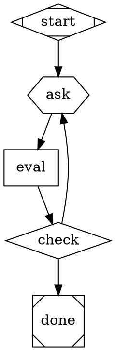
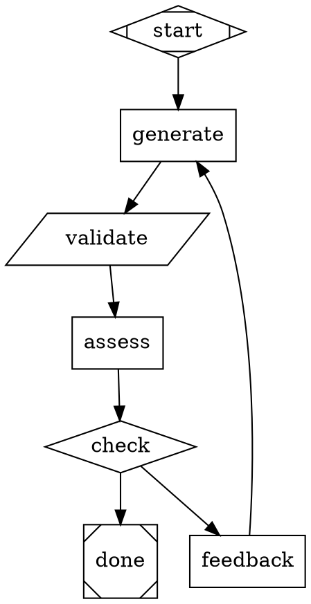

# DOT Pipeline Dev-Machine Prerequisites Design

## Goal

Identify and build all prerequisite capabilities in the Attractor pipeline engine before constructing the full DOT-based dev-machine foundry and runtime pipelines.

## Background

The dev-machine foundry — currently a 3-mode Amplifier bundle with 7 recipe templates — will be re-expressed as pure DOT pipelines for Attractor. A DOT pipeline foundry produces bespoke DOT runtime pipelines. The foundry DOT graph handles admissions, design, and generation. The generated runtime DOT graphs handle build, iteration, health-check, and QA loops.

A systematic audit of the current Attractor engine against what the full dev-machine pipeline requires revealed 4 prerequisites — gaps that must be filled before the dev-machine DOT pipeline can be designed and implemented. Additionally, 8 capabilities were verified as already working and needing no changes.

## Approach

Build 4 targeted prerequisites in dependency order, each with a toy-example verification before declaring done. Two are engine fixes (P1, P7), two are reusable pattern files (P2, P6). After all 4 are verified, proceed to designing the full foundry and runtime DOT pipelines.

## Architecture

```
Foundry DOT Pipeline (admissions → design → generate)
  │
  ├── Uses: conversational-gate.dot (P2) — for iterative human Q&A gates
  ├── Uses: convergence-factory.dot (P6) — for generate-validate-refine loops
  ├── Depends on: nested subgraph backend wiring (P1) — so child nodes make real LLM calls
  └── Depends on: context variable injection (P7) — so subgraphs are parameterized and reusable
  │
  ▼ (produces bespoke DOT files)
  │
Runtime DOT Pipelines (build.dot, iteration.dot, health-check.dot, fix-iteration.dot, qa.dot)
  │
  ├── Uses: convergence-factory.dot (P6) — for fix-and-verify cycles
  ├── Uses: truncate fidelity — for antagonistic review (already works)
  └── Uses: manager_loop (house) — for while-loops (already works)
```

## Prerequisites

### P1: Fix Nested Subgraph Backend Wiring

**The bug:** Both `PipelineHandler.execute()` (`handlers/pipeline.py`) and `ManagerLoopHandler._run_child_dotfile()` (`handlers/manager_loop.py`) create bare `HandlerRegistry()` instances for child pipelines without passing the backend, hooks, or cancel_event. This means child pipeline codergen nodes have no LLM backend — they run in simulation mode and return empty results.

**The fix:** When the parent creates a child `HandlerRegistry`, pass its own backend and hooks through. The `HandlerRegistry` constructor already accepts `backend`, `hooks`, and `**kwargs` (which carries `cancel_event`). The fix is wiring those through in two locations:

1. `pipeline.py` ~line 151-154 — `HandlerRegistry(backend=self._backend, hooks=self._hooks, cancel_event=self._cancel_event)` instead of bare `HandlerRegistry()`
2. `manager_loop.py` ~line 298 — same pattern

**Testing approach:**

- Write a toy two-file nested pipeline (`parent.dot` → `child.dot`) where the child has a codergen node that calls `report_outcome`
- Run via `DirectProviderBackend` with a real API key
- Verify the child node actually makes an LLM call (not simulation)
- Test 3-level recursion (A → B → C) to confirm it chains
- Run existing `loop-pipeline` tests for regression

**Acceptance criteria:**

- Nested pipeline codergen nodes make real LLM calls
- Recursive nesting (3+ levels) works
- Backend, hooks, and cancel_event all propagate to children
- All existing tests still pass

---

### P7: Context Variable Injection from Parent into Child Pipeline

**The gap:** When a parent `folder` node invokes a child DOT file, the child gets a cloned parent context. But the reusable subgraph patterns (P2, P6) need node-level context attributes injected — e.g., `context.gate_topic="Rate decomposability"` on the folder node should be available as `$gate_topic` in the child pipeline.

**What needs verification:**

- Does the `PipelineHandler` currently support `context.*` attributes on the invoking node?
- If not, add support: read `context.*` prefixed attributes from the folder node, strip the prefix, and merge into the child's cloned context before execution.

**This is critical for reusability** — without it, every subgraph invocation needs a separate DOT file with hardcoded prompts instead of parameterized `$variable` references.

**Verification approach:**

1. Check if `PipelineHandler.execute()` already reads `context.*` attributes from the node
2. If not, add ~10 lines of code to merge node-level context attrs into the child context
3. Test: parent sets `context.my_var="hello"`, child DOT uses `$my_var` in a prompt, verify the child sees `"hello"`

**Acceptance criteria:**

- Parent node `context.*` attributes are available as `$variables` in child pipelines
- Works for both `pipeline` (folder) and `manager_loop` (house) handlers
- Existing tests still pass (no regressions from merging additional context)

---

### P2: Reusable Conversational-Gate Subgraph

**The need:** The dev-machine foundry requires rich human interaction — not just "approve/deny" gates, but iterative question-answer-refine loops. The admissions advisor asks probing questions about each gate, the machine designer collaborates on architecture specs, the generator confirms variable values.

**What exists today:** The `wait.human` handler (`hexagon` shape) supports pause-and-answer with `QuestionType` variants (YES_NO, MULTIPLE_CHOICE, FREEFORM, CONFIRMATION) via the Interviewer pattern (Console, Callback, Queue, Auto). But it's a single-exchange gate — ask one question, get one answer, move on.

**The design — a reusable DOT file (`patterns/conversational-gate.dot`):**



Parent pipelines invoke it via `shape=folder` with context injection (P7):

```dot
gate1_decomposability [shape=folder, dot_file="patterns/conversational-gate.dot",
    context.gate_topic="Rate this project's decomposability (0-100). Can it break into hundreds of small, independently testable units?",
    context.gate_criteria="Look for: feature count, independence between features, repeating patterns.",
    context.gate_output_path=".ai/gate1_decomposability.md"]
```

**What needs verification/building:**

1. Does `wait.human` properly feed human text back into the next node's context?
2. Does `loop_restart` on the ask → eval → ask loop correctly re-prompt the human?
3. Build the reusable pattern, test it with 2-3 different gate topics, confirm convergence works
4. Write example pipeline demonstrating the pattern

**Acceptance criteria:**

- Human can answer iterative questions within a single subgraph invocation
- The AI evaluation node receives the human's response in its context
- Loop correctly re-asks when evidence is insufficient
- Converges and exits when evidence is sufficient
- Reusable across different topics via context variable injection (depends on P7)

---

### P6: Reusable Convergence-Factory Subgraph

**The need:** The foundry's `/generate-machine` phase must produce bespoke DOT pipeline files that meet quality criteria. More broadly, any pipeline step that needs to generate-validate-refine an artifact until it converges needs this pattern.

**Inspiration:** The Attractor recipe bundle (`amplifier-bundle-recipes`) has a proven `factory-iteration.yaml` pattern: generate → validate → assess → feedback → loop. The recipe-author → result-validator feedback loop follows the same shape. Both use file-based state persistence and Pyramid Summaries for iteration-over-iteration context.

**The design — a reusable DOT file (`patterns/convergence-factory.dot`):**



**Key design decisions from the Attractor recipe pattern:**

1. **State on disk, not in context variables** — each iteration writes feedback files, all prior feedback is readable
2. **Pyramid Summaries** — later iterations compress all prior feedback into trend analysis
3. **Conditional feedback** — only generate feedback if not yet converged
4. **Separate validate from assess** — mechanical check (does it parse? do tests pass?) vs. semantic evaluation (does it achieve the goal?)

**What needs building:**

1. Verify that a codergen node can write a DOT file that a subsequent `folder` node loads and executes (dynamic DOT generation)
2. Build the reusable convergence-factory pattern
3. Test with a toy example: generate a simple DOT file → validate it parses → assess correctness → refine if needed
4. Verify the generate-then-execute chain works end-to-end

**Acceptance criteria:**

- A codergen node writes a valid DOT file to disk
- A subsequent `folder` node loads and executes the generated DOT file
- The convergence loop iterates until the artifact meets criteria
- Feedback from prior iterations is available to subsequent iterations
- The pattern is reusable with different artifact types via context variables

## Capabilities Already Verified (No Work Needed)

| Capability | How It Works | Needed For |
|---|---|---|
| **Antagonistic review** | `context_fidelity="truncate"` gives fresh context — only static `graph.goal` + `run_id`, zero prior node output | Working session review step |
| **Counter-based conditionals** | Workaround: codergen node computes boolean, condition routes on it. Enhancement (modulo/arithmetic in condition language) can come later | Periodic checks (every N sessions) |
| **Parallel fan-out/fan-in** | `component` + `tripleoctagon` shapes with 4 join policies | Multi-provider consensus |
| **Multi-provider routing** | `model_stylesheet` with CSS-like specificity | Different models for different tasks |
| **Goal gates with retry** | `goal_gate=true` + `retry_target` | Build verification, test gates |
| **While-loops** | `stack.manager_loop` (house) with `manager.max_cycles` + `manager.stop_condition` | Build loop, health-check loop |
| **Context variable passing** | `report_outcome` context_updates + `$variable` expansion | Pipeline state flow |
| **File I/O in nodes** | Codergen nodes with AmplifierBackend get full tool access | STATE.yaml, specs, all file ops |

## Data Flow

### Foundry Pipeline (admissions → design → generate)

```
Human provides project URL/description
  │
  ▼
[Admissions Gates] — 5x conversational-gate.dot invocations (P2)
  Each gate writes score + evidence to .ai/gate_N.md
  │
  ▼
[Machine Design] — 6 collaborative design phases (P2)
  Produces .dev-machine-design.md
  │
  ▼
[Generate Machine] — convergence-factory.dot invocations (P6)
  Produces bespoke build.dot, iteration.dot, health-check.dot, etc.
  Each generated DOT file is validated before acceptance
```

### Runtime Pipeline (build → iterate → health-check)

```
build.dot (house/manager_loop — while-loop)
  │ Loops until build succeeds
  ▼
iteration.dot (folder — 8-step inner loop)
  │ Feature selection → implement → review → test → archive
  │ Uses truncate fidelity for antagonistic review
  ▼
health-check.dot (house/manager_loop — while-loop)
  │ Periodic full-system verification
  ▼
fix-iteration.dot (folder — single fix cycle)
  │ Only invoked if health-check fails
```

## Error Handling

- **P1 (backend wiring):** If backend propagation fails, child nodes fall back to simulation mode — this is detectable by checking whether `report_outcome` was actually called with real content vs. empty results.
- **Convergence-factory (P6):** Max iteration guard (`$max_iterations` context variable) prevents infinite loops. If max iterations reached without convergence, the subgraph exits with `outcome=max_iterations_exceeded` for the parent to handle.
- **Conversational-gate (P2):** If the human provides insufficient evidence repeatedly, the eval node can lower its threshold or the parent pipeline can set a `$max_rounds` to force eventual convergence with whatever evidence exists.
- **Dynamic DOT generation:** If a generated DOT file fails to parse, the convergence-factory's validate step catches it and the feedback loop guides the generator to fix syntax.

## Testing Strategy

Each prerequisite has its own toy-example verification:

| Prerequisite | Toy Example | What It Proves |
|---|---|---|
| **P1** | `parent.dot` → `child.dot` where child has codergen node calling `report_outcome`. Run with real API key via `DirectProviderBackend`. | Child nodes make real LLM calls, not simulation. |
| **P1 (recursion)** | A → B → C three-level nesting. | Backend propagates through arbitrary depth. |
| **P7** | Parent sets `context.my_var="hello"`, child uses `$my_var` in prompt. | Context injection works for parameterized subgraphs. |
| **P2** | Conversational gate with 2-3 different topics. Human gives partial then complete evidence. | Loop re-asks, converges, exits correctly. |
| **P6** | Generate a trivial DOT file → validate it parses → assess → refine if needed. | Full generate-validate-refine cycle works. |
| **P6 (dynamic)** | Codergen node writes DOT file, subsequent folder node executes it. | Dynamic DOT generation chain works end-to-end. |
| **Regression** | All existing tests (927 loop-pipeline tests, unit tests). | No regressions from any changes. |

## Sequencing

The prerequisites must be implemented in this order:

1. **P1 first** — everything else depends on nested pipelines actually working with real LLM calls
2. **P7 second** — P2 and P6 need context injection to be reusable rather than hardcoded
3. **P2 and P6 in parallel** — independent patterns, both depend on P1 + P7
4. **Toy examples for all** — test each with real API calls before declaring done

```
P1 (backend wiring fix)
  │
  ▼
P7 (context variable injection)
  │
  ├──────────────┐
  ▼              ▼
P2 (conv gate)  P6 (convergence factory)
  │              │
  └──────┬───────┘
         ▼
  Full dev-machine DOT pipeline design
```

## What Comes After Prerequisites

Once all 4 prerequisites are built and verified:

1. **Design the foundry DOT pipeline** — admissions → design → generate, using conversational-gate subgraphs (P2) and convergence-factory subgraphs (P6) to produce bespoke runtime DOT files
2. **Design the runtime DOT pipelines** — `build.dot` (outer loop via house), `iteration.dot` (8-step inner loop), `health-check.dot` (house), `fix-iteration.dot`, `qa.dot` (optional)
3. **Build and test** — starting with the simplest runtime pipeline (`health-check`) and progressing to the full foundry

## Open Questions

1. Should `convergence-factory.dot` and `conversational-gate.dot` live in the Attractor bundle's `examples/patterns/` or in the dev-machine bundle's own `patterns/` directory?
2. Should the prompts in the reusable subgraphs be minimal (parameterized placeholders) or include substantial default guidance?
3. Should we add a `patterns/antagonistic-review.dot` subgraph too, or is inline `truncate` fidelity sufficient?
4. For P7, should context injection work via `context.key=value` node attributes, or via a separate mechanism like a `context_file` attribute that reads a JSON/YAML file?

## Repos Involved

| Repo | Changes |
|---|---|
| `amplifier-bundle-attractor` | P1 (handlers fix), P7 (context injection), P2 + P6 (new pattern files + examples), tests |
| No other repos need changes | |
