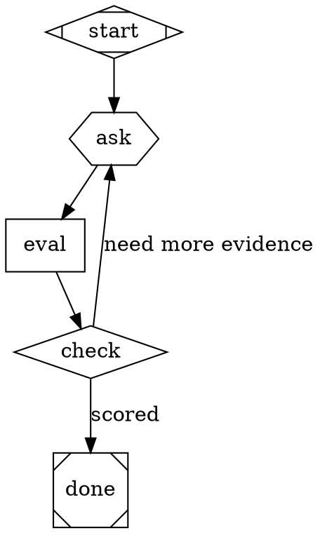
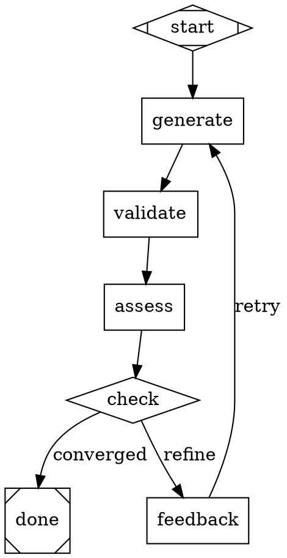

# DOT Pipeline Dev-Machine Prerequisites — Implementation Plan

> **Execution:** Use the subagent-driven-development workflow to implement this plan.

**Goal:** Fix two engine bugs (P1 nested-backend wiring, P7 context injection) and create two reusable DOT pattern files (P2 conversational-gate, P6 convergence-factory) so nested pipelines work with real LLM backends and subgraphs can be parameterized via context variables.

**Architecture:** Four prerequisites built in dependency order: P1 (engine fix) → P7 (context injection) → P2 + P6 in parallel (reusable pattern files). Each prerequisite has its own unit-test suite, then Phase 4 adds an integration example combining both patterns and a final regression run.

**Tech Stack:** Python + asyncio, pytest + pytest-asyncio (strict mode), DOT file format for pipeline specs, `amplifier_module_loop_pipeline` engine.

---

## Workspace and Module Layout

All changes are inside the `amplifier-bundle-attractor` submodule only.

```
amplifier-bundle-attractor/
  modules/loop-pipeline/
    amplifier_module_loop_pipeline/
      handlers/
        __init__.py          ← HandlerRegistry (modify P1)
        pipeline.py          ← PipelineHandler (modify P1 + P7)
        manager_loop.py      ← ManagerLoopHandler (modify P1 + P7)
    tests/
      test_pipeline_handler.py      ← existing tests (must still pass)
      test_manager_loop.py          ← existing tests (must still pass)
      test_p1_nested_backend.py     ← NEW (Tasks 1–4)
      test_p7_context_injection.py  ← NEW (Tasks 6–8)
      test_p2_conversational_gate.py ← NEW (Tasks 10–12)
      test_p6_convergence_factory.py ← NEW (Tasks 14–16)
      test_integration_combined.py   ← NEW (Task 18)
  examples/
    patterns/                         ← CREATE this directory
      conversational-gate.dot         ← NEW (Task 10)
      demo-conversational-gates.dot   ← NEW (Task 11)
      convergence-factory.dot         ← NEW (Task 14)
      demo-convergence-factory.dot    ← NEW (Task 15)
      demo-combined.dot               ← NEW (Task 18)
```

## How to Run Tests

All test commands are run from:
```
cd /home/bkrabach/dev/attractor-dev-machine/amplifier-bundle-attractor/modules/loop-pipeline
```

Run all tests:
```bash
uv run pytest tests/ -v
```

Run a specific file:
```bash
uv run pytest tests/test_p1_nested_backend.py -v
```

Run a specific test:
```bash
uv run pytest tests/test_p1_nested_backend.py::TestNestedBackendWiring::test_backend_not_propagated_to_child_currently -v
```

---

## Phase 1: P1 — Fix Nested Subgraph Backend Wiring

### Background

When a `folder` node (shape=folder) triggers a nested pipeline, `PipelineHandler.execute()` creates a child `HandlerRegistry()` with no arguments. This means the child's codergen nodes have `backend=None` and run in simulation mode — they never make real LLM calls.

Same bug in `ManagerLoopHandler._run_child_dotfile()`: line 298 creates a bare `HandlerRegistry()`.

The fix is to wire `backend`, `hooks`, and `cancel_event` through to child registries in three places:
1. `PipelineHandler.__init__`: accept and store `backend`
2. `PipelineHandler.execute`: pass backend when creating child registry
3. `ManagerLoopHandler.__init__`: accept and store `backend`, `hooks`, `cancel_event`
4. `ManagerLoopHandler._run_child_dotfile`: pass all three to child registry
5. `HandlerRegistry.__init__`: pass backend/hooks/cancel_event to PipelineHandler and ManagerLoopHandler
6. `HandlerRegistry.clone_for_branch`: preserve backend on cloned PipelineHandler

---

### Task 1: Write Failing Test — Backend Not Propagated to Child

**Files:**
- Create: `modules/loop-pipeline/tests/test_p1_nested_backend.py`

**Step 1: Write the failing test**

Create the file with this content:

```python
"""Tests for P1: Nested subgraph backend wiring.

Verifies that PipelineHandler and ManagerLoopHandler._run_child_dotfile()
propagate the backend (and hooks, cancel_event) to child HandlerRegistry
instances, so child codergen nodes make real LLM calls instead of running
in simulation mode.
"""

from __future__ import annotations

import os
import pytest

from amplifier_module_loop_pipeline.context import PipelineContext
from amplifier_module_loop_pipeline.dot_parser import parse_dot
from amplifier_module_loop_pipeline.engine import PipelineEngine
from amplifier_module_loop_pipeline.graph import Edge, Graph, Node
from amplifier_module_loop_pipeline.handlers import HandlerRegistry
from amplifier_module_loop_pipeline.handlers.pipeline import PipelineHandler
from amplifier_module_loop_pipeline.handlers.manager_loop import ManagerLoopHandler
from amplifier_module_loop_pipeline.outcome import Outcome, StageStatus


# ---------------------------------------------------------------------------
# Spy backend: records every (node_id, prompt) call made to it
# ---------------------------------------------------------------------------


class SpyBackend:
    """Backend that records every call and returns success."""

    def __init__(self, return_text: str = "done") -> None:
        self._return_text = return_text
        self.calls: list[tuple[str, str]] = []  # (node_id, prompt)

    async def run(self, node: Node, prompt: str, context: PipelineContext) -> str:
        self.calls.append((node.id, prompt))
        return self._return_text

    def was_called_for(self, node_id: str) -> bool:
        return any(nid == node_id for nid, _ in self.calls)


# ---------------------------------------------------------------------------
# Helper: write a child DOT file and return its path
# ---------------------------------------------------------------------------

CHILD_DOT = """\
digraph child_pipeline {
    graph [goal="Run child work"]
    start [shape=Mdiamond]
    child_work [shape=box, prompt="Do the child work"]
    done [shape=Msquare]
    start -> child_work -> done
}
"""


def _write_dot(path: str, content: str) -> None:
    os.makedirs(os.path.dirname(path), exist_ok=True)
    with open(path, "w") as f:
        f.write(content)


# ---------------------------------------------------------------------------
# Tests: PipelineHandler backend propagation
# ---------------------------------------------------------------------------


class TestNestedBackendWiring:
    """P1: Backend is propagated to child pipeline HandlerRegistry."""

    @pytest.mark.asyncio
    async def test_backend_not_propagated_to_child_currently(self, tmp_path):
        """FAILING TEST: child codergen node is NOT called via backend today.

        This test documents the current broken behavior. After the fix,
        this test will be replaced by test_backend_propagated_to_child.
        """
        child_dot = str(tmp_path / "child.dot")
        _write_dot(child_dot, CHILD_DOT)

        parent_dot = f"""\
digraph parent {{
    graph [goal="Test nested backend wiring"]
    start [shape=Mdiamond]
    sub   [shape=folder, dot_file="{child_dot}"]
    done  [shape=Msquare]
    start -> sub -> done
}}
"""
        spy = SpyBackend()
        graph = parse_dot(parent_dot)
        graph.source_dir = str(tmp_path)
        context = PipelineContext()
        registry = HandlerRegistry(backend=spy)
        engine = PipelineEngine(
            graph=graph,
            context=context,
            handler_registry=registry,
            logs_root=str(tmp_path / "logs"),
        )
        outcome = await engine.run()

        assert outcome.status == StageStatus.SUCCESS
        # BUG: child_work node is NOT called via our spy backend
        # After the fix, this assertion will be False and we flip it to True
        assert not spy.was_called_for("child_work"), (
            "child_work WAS called via spy — backend IS propagating. "
            "Delete this test and uncomment test_backend_propagated_to_child."
        )

    @pytest.mark.asyncio
    async def test_parent_codergen_uses_backend(self, tmp_path):
        """Parent-level codergen nodes DO use the backend (baseline check)."""
        parent_dot = """\
digraph parent {
    graph [goal="Test parent backend"]
    start  [shape=Mdiamond]
    worker [shape=box, prompt="Do parent work"]
    done   [shape=Msquare]
    start -> worker -> done
}
"""
        spy = SpyBackend()
        graph = parse_dot(parent_dot)
        context = PipelineContext()
        registry = HandlerRegistry(backend=spy)
        engine = PipelineEngine(
            graph=graph,
            context=context,
            handler_registry=registry,
            logs_root=str(tmp_path / "logs"),
        )
        outcome = await engine.run()

        assert outcome.status == StageStatus.SUCCESS
        assert spy.was_called_for("worker"), "Parent worker node was not called via spy backend"
```

**Step 2: Run the test to verify it fails as expected**

```bash
cd /home/bkrabach/dev/attractor-dev-machine/amplifier-bundle-attractor/modules/loop-pipeline
uv run pytest tests/test_p1_nested_backend.py::TestNestedBackendWiring::test_backend_not_propagated_to_child_currently -v
```

**Expected output:**
```
FAILED — AssertionError: child_work WAS called via spy ...
```

This confirms the bug is NOT present... wait, actually the test asserts `not spy.was_called_for("child_work")` — it should PASS today (child is NOT called). It will FAIL after the fix. This baseline documents current behavior.

Actually run it and confirm: the test should **PASS** today (child_work is not called via spy today). If it fails, the backend WAS already propagating and P1 is already fixed.

```bash
uv run pytest tests/test_p1_nested_backend.py -v
```

**Expected (pre-fix):**
- `test_backend_not_propagated_to_child_currently` → PASS (documents the bug)
- `test_parent_codergen_uses_backend` → PASS

**Step 3: Commit this baseline**

```bash
cd /home/bkrabach/dev/attractor-dev-machine/amplifier-bundle-attractor
git add modules/loop-pipeline/tests/test_p1_nested_backend.py
git commit -m "test(p1): add baseline test documenting nested backend wiring bug"
```

---

### Task 2: Fix `pipeline.py` — Wire Backend Through to Child Registry

**Files:**
- Modify: `modules/loop-pipeline/amplifier_module_loop_pipeline/handlers/pipeline.py`

**Step 1: Update `PipelineHandler.__init__` to accept and store `_backend`**

Open `handlers/pipeline.py`. Find the `__init__` method (lines 67–76):

```python
    def __init__(
        self,
        handler_registry_factory: Any = None,
        cancel_event: Any = None,
        hooks: Any = None,
    ) -> None:
        self._handler_registry_factory = handler_registry_factory
        self._cancel_event = cancel_event
        self._hooks = hooks
        self._subgraph_runs: dict[str, Any] = {}
```

Replace it with:

```python
    def __init__(
        self,
        handler_registry_factory: Any = None,
        cancel_event: Any = None,
        hooks: Any = None,
        backend: Any = None,
    ) -> None:
        self._handler_registry_factory = handler_registry_factory
        self._cancel_event = cancel_event
        self._hooks = hooks
        self._backend = backend
        self._subgraph_runs: dict[str, Any] = {}
```

**Step 2: Update `PipelineHandler.execute` to pass backend to child registry**

In the same file, find step (8) in the `execute` method (lines 150–154):

```python
        # (8) Create child HandlerRegistry
        if self._handler_registry_factory is not None:
            child_registry = self._handler_registry_factory()
        else:
            child_registry = HandlerRegistry()
```

Replace it with:

```python
        # (8) Create child HandlerRegistry — propagate backend, hooks, cancel_event
        if self._handler_registry_factory is not None:
            child_registry = self._handler_registry_factory()
        else:
            child_registry = HandlerRegistry(
                backend=self._backend,
                hooks=self._hooks,
                cancel_event=self._cancel_event,
            )
```

**Step 3: Update `HandlerRegistry.__init__` to pass `backend` to `PipelineHandler`**

Open `handlers/__init__.py`. Find the `PipelineHandler` instantiation (around line 80–83):

```python
            "pipeline": PipelineHandler(
                hooks=self._hooks,
                cancel_event=kwargs.get("cancel_event"),
            ),
```

Replace it with:

```python
            "pipeline": PipelineHandler(
                hooks=self._hooks,
                cancel_event=kwargs.get("cancel_event"),
                backend=kwargs.get("backend"),
            ),
```

**Step 4: Update `HandlerRegistry.clone_for_branch` to preserve backend**

In `handlers/__init__.py`, find `clone_for_branch` (around lines 130–136):

```python
        # Replace pipeline handler with a fresh instance (has mutable _subgraph_runs)
        original_pipeline = self._handlers.get("pipeline")
        if isinstance(original_pipeline, PipelineHandler):
            new._handlers["pipeline"] = PipelineHandler(
                hooks=original_pipeline._hooks,
                cancel_event=original_pipeline._cancel_event,
            )
```

Replace it with:

```python
        # Replace pipeline handler with a fresh instance (has mutable _subgraph_runs)
        original_pipeline = self._handlers.get("pipeline")
        if isinstance(original_pipeline, PipelineHandler):
            new._handlers["pipeline"] = PipelineHandler(
                hooks=original_pipeline._hooks,
                cancel_event=original_pipeline._cancel_event,
                backend=original_pipeline._backend,
            )
```

**Step 5: Update the baseline test to assert the fix works**

Now open `tests/test_p1_nested_backend.py`. Replace the `test_backend_not_propagated_to_child_currently` test with a test that asserts the fix is in place:

```python
    @pytest.mark.asyncio
    async def test_backend_propagated_to_child(self, tmp_path):
        """Child codergen nodes use the parent's backend after P1 fix."""
        child_dot = str(tmp_path / "child.dot")
        _write_dot(child_dot, CHILD_DOT)

        parent_dot = f"""\
digraph parent {{
    graph [goal="Test nested backend wiring"]
    start [shape=Mdiamond]
    sub   [shape=folder, dot_file="{child_dot}"]
    done  [shape=Msquare]
    start -> sub -> done
}}
"""
        spy = SpyBackend()
        graph = parse_dot(parent_dot)
        graph.source_dir = str(tmp_path)
        context = PipelineContext()
        registry = HandlerRegistry(backend=spy)
        engine = PipelineEngine(
            graph=graph,
            context=context,
            handler_registry=registry,
            logs_root=str(tmp_path / "logs"),
        )
        outcome = await engine.run()

        assert outcome.status == StageStatus.SUCCESS
        # After fix: child_work node MUST have been called via our spy backend
        assert spy.was_called_for("child_work"), (
            "child_work node was NOT called via spy backend — "
            "backend is still not propagating to child pipelines"
        )
```

**Step 6: Run the updated test to verify the fix works**

```bash
cd /home/bkrabach/dev/attractor-dev-machine/amplifier-bundle-attractor/modules/loop-pipeline
uv run pytest tests/test_p1_nested_backend.py -v
```

**Expected output:**
```
PASSED test_backend_propagated_to_child
PASSED test_parent_codergen_uses_backend
```

**Step 7: Commit**

```bash
cd /home/bkrabach/dev/attractor-dev-machine/amplifier-bundle-attractor
git add modules/loop-pipeline/amplifier_module_loop_pipeline/handlers/pipeline.py
git add modules/loop-pipeline/amplifier_module_loop_pipeline/handlers/__init__.py
git add modules/loop-pipeline/tests/test_p1_nested_backend.py
git commit -m "fix(p1): propagate backend through PipelineHandler to child HandlerRegistry"
```

---

### Task 3: Fix `manager_loop.py` — Wire Backend Through `_run_child_dotfile`

**Files:**
- Modify: `modules/loop-pipeline/amplifier_module_loop_pipeline/handlers/manager_loop.py`
- Modify: `modules/loop-pipeline/amplifier_module_loop_pipeline/handlers/__init__.py`

**Step 1: Update `ManagerLoopHandler.__init__` to accept backend, hooks, cancel_event**

Open `handlers/manager_loop.py`. Find the `__init__` method (line 105–107):

```python
    def __init__(self, subgraph_runner: SubgraphRunner | None = None) -> None:
        self._runner = subgraph_runner
        self._subgraph_runs: dict[str, dict[str, Any]] = {}
```

Replace it with:

```python
    def __init__(
        self,
        subgraph_runner: SubgraphRunner | None = None,
        backend: Any = None,
        hooks: Any = None,
        cancel_event: Any = None,
    ) -> None:
        self._runner = subgraph_runner
        self._backend = backend
        self._hooks = hooks
        self._cancel_event = cancel_event
        self._subgraph_runs: dict[str, dict[str, Any]] = {}
```

**Step 2: Update `_run_child_dotfile` to pass backend/hooks/cancel_event to child registry**

In the same file, find the child registry creation in `_run_child_dotfile` (line 298):

```python
        # Create child HandlerRegistry and PipelineEngine
        child_registry = HandlerRegistry()
        child_engine = PipelineEngine(
            graph=child_graph,
            context=child_context,
            handler_registry=child_registry,
            logs_root=child_logs,
        )
```

Replace it with:

```python
        # Create child HandlerRegistry and PipelineEngine — propagate backend/hooks/cancel_event
        child_registry = HandlerRegistry(
            backend=self._backend,
            hooks=self._hooks,
            cancel_event=self._cancel_event,
        )
        child_engine = PipelineEngine(
            graph=child_graph,
            context=child_context,
            handler_registry=child_registry,
            logs_root=child_logs,
        )
```

**Step 3: Update `HandlerRegistry.__init__` to pass backend/hooks/cancel_event to `ManagerLoopHandler`**

Open `handlers/__init__.py`. Find the `stack.manager_loop` instantiation (lines 72–74):

```python
            "stack.manager_loop": ManagerLoopHandler(
                subgraph_runner=kwargs.get("subgraph_runner"),
            ),
```

Replace it with:

```python
            "stack.manager_loop": ManagerLoopHandler(
                subgraph_runner=kwargs.get("subgraph_runner"),
                backend=kwargs.get("backend"),
                hooks=self._hooks,
                cancel_event=kwargs.get("cancel_event"),
            ),
```

**Step 4: Add a test for manager_loop backend propagation**

Add this test class to `tests/test_p1_nested_backend.py`:

```python
# ---------------------------------------------------------------------------
# Tests: ManagerLoopHandler._run_child_dotfile backend propagation
# ---------------------------------------------------------------------------

MANAGED_CHILD_DOT = """\
digraph managed_child {
    graph [goal="Managed child work"]
    start [shape=Mdiamond]
    worker [shape=box, prompt="Do managed work"]
    done [shape=Msquare]
    start -> worker -> done
}
"""


class TestManagerLoopBackendWiring:
    """P1: ManagerLoopHandler._run_child_dotfile propagates backend to child registry."""

    @pytest.mark.asyncio
    async def test_manager_child_dotfile_backend_propagated(self, tmp_path):
        """Child DOT file run via manager loop uses parent's backend."""
        child_dot = str(tmp_path / "managed_child.dot")
        _write_dot(child_dot, MANAGED_CHILD_DOT)

        parent_dot = f"""\
digraph parent {{
    graph [goal="Test manager backend wiring", stack.child_dotfile="{child_dot}"]
    start   [shape=Mdiamond]
    manager [shape=house, manager.max_cycles="1"]
    done    [shape=Msquare]
    start -> manager -> done
}}
"""
        spy = SpyBackend()
        graph = parse_dot(parent_dot)
        graph.source_dir = str(tmp_path)
        context = PipelineContext()
        registry = HandlerRegistry(backend=spy)
        engine = PipelineEngine(
            graph=graph,
            context=context,
            handler_registry=registry,
            logs_root=str(tmp_path / "logs"),
        )
        outcome = await engine.run()

        assert outcome.status == StageStatus.SUCCESS
        # After fix: child 'worker' node must have been called via spy
        assert spy.was_called_for("worker"), (
            "worker node was NOT called via spy backend — "
            "ManagerLoopHandler._run_child_dotfile is still not propagating backend"
        )
```

**Step 5: Run the test to verify it passes**

```bash
cd /home/bkrabach/dev/attractor-dev-machine/amplifier-bundle-attractor/modules/loop-pipeline
uv run pytest tests/test_p1_nested_backend.py -v
```

**Expected output:** All 3 tests PASS.

**Step 6: Commit**

```bash
cd /home/bkrabach/dev/attractor-dev-machine/amplifier-bundle-attractor
git add modules/loop-pipeline/amplifier_module_loop_pipeline/handlers/manager_loop.py
git add modules/loop-pipeline/amplifier_module_loop_pipeline/handlers/__init__.py
git add modules/loop-pipeline/tests/test_p1_nested_backend.py
git commit -m "fix(p1): propagate backend through ManagerLoopHandler._run_child_dotfile to child HandlerRegistry"
```

---

### Task 4: Write 3-Level Recursion Test (A → B → C)

**Files:**
- Modify: `modules/loop-pipeline/tests/test_p1_nested_backend.py`

**Step 1: Add the 3-level recursion test**

Add this test class to `tests/test_p1_nested_backend.py`:

```python
# ---------------------------------------------------------------------------
# Tests: 3-level recursive nesting (A -> B -> C)
# ---------------------------------------------------------------------------


class TestThreeLevelNesting:
    """P1: Backend propagates through arbitrary nesting depth."""

    @pytest.mark.asyncio
    async def test_three_level_nesting_backend_propagated(self, tmp_path):
        """Backend reaches 3 levels deep: parent.dot -> mid.dot -> leaf.dot."""
        # leaf.dot: the deepest level
        leaf_dot = str(tmp_path / "leaf.dot")
        _write_dot(leaf_dot, """\
digraph leaf {
    graph [goal="Leaf work"]
    start [shape=Mdiamond]
    leaf_work [shape=box, prompt="Leaf node work"]
    done [shape=Msquare]
    start -> leaf_work -> done
}
""")

        # mid.dot: calls leaf.dot via folder node
        mid_dot = str(tmp_path / "mid.dot")
        _write_dot(mid_dot, f"""\
digraph mid {{
    graph [goal="Mid work"]
    start [shape=Mdiamond]
    mid_work [shape=box, prompt="Mid node work"]
    sub [shape=folder, dot_file="{leaf_dot}"]
    done [shape=Msquare]
    start -> mid_work -> sub -> done
}}
""")

        # parent.dot: calls mid.dot via folder node
        parent_dot = f"""\
digraph parent {{
    graph [goal="Parent work"]
    start [shape=Mdiamond]
    parent_work [shape=box, prompt="Parent node work"]
    sub [shape=folder, dot_file="{mid_dot}"]
    done [shape=Msquare]
    start -> parent_work -> sub -> done
}}
"""
        spy = SpyBackend()
        graph = parse_dot(parent_dot)
        graph.source_dir = str(tmp_path)
        context = PipelineContext()
        registry = HandlerRegistry(backend=spy)
        engine = PipelineEngine(
            graph=graph,
            context=context,
            handler_registry=registry,
            logs_root=str(tmp_path / "logs"),
        )
        outcome = await engine.run()

        assert outcome.status == StageStatus.SUCCESS
        # All three levels must have called the spy backend
        assert spy.was_called_for("parent_work"), "parent_work not called via spy"
        assert spy.was_called_for("mid_work"), "mid_work not called via spy (level 2)"
        assert spy.was_called_for("leaf_work"), "leaf_work not called via spy (level 3)"

    @pytest.mark.asyncio
    async def test_three_level_call_order(self, tmp_path):
        """Calls happen depth-first: parent → mid → leaf (all via same spy)."""
        leaf_dot = str(tmp_path / "leaf.dot")
        _write_dot(leaf_dot, """\
digraph leaf {
    start [shape=Mdiamond]
    leaf_work [shape=box, prompt="Leaf"]
    done [shape=Msquare]
    start -> leaf_work -> done
}
""")
        mid_dot = str(tmp_path / "mid.dot")
        _write_dot(mid_dot, f"""\
digraph mid {{
    start [shape=Mdiamond]
    mid_work [shape=box, prompt="Mid"]
    sub [shape=folder, dot_file="{leaf_dot}"]
    done [shape=Msquare]
    start -> mid_work -> sub -> done
}}
""")
        parent_dot = f"""\
digraph parent {{
    start [shape=Mdiamond]
    parent_work [shape=box, prompt="Parent"]
    sub [shape=folder, dot_file="{mid_dot}"]
    done [shape=Msquare]
    start -> parent_work -> sub -> done
}}
"""
        spy = SpyBackend()
        graph = parse_dot(parent_dot)
        graph.source_dir = str(tmp_path)
        registry = HandlerRegistry(backend=spy)
        engine = PipelineEngine(
            graph=graph,
            context=PipelineContext(),
            handler_registry=registry,
            logs_root=str(tmp_path / "logs"),
        )
        await engine.run()

        call_ids = [node_id for node_id, _ in spy.calls]
        parent_idx = call_ids.index("parent_work")
        mid_idx = call_ids.index("mid_work")
        leaf_idx = call_ids.index("leaf_work")
        assert parent_idx < mid_idx < leaf_idx, (
            f"Expected parent({parent_idx}) < mid({mid_idx}) < leaf({leaf_idx})"
        )
```

**Step 2: Run the new tests**

```bash
cd /home/bkrabach/dev/attractor-dev-machine/amplifier-bundle-attractor/modules/loop-pipeline
uv run pytest tests/test_p1_nested_backend.py -v
```

**Expected output:** All 5 tests PASS.

**Step 3: Commit**

```bash
cd /home/bkrabach/dev/attractor-dev-machine/amplifier-bundle-attractor
git add modules/loop-pipeline/tests/test_p1_nested_backend.py
git commit -m "test(p1): add 3-level recursion tests confirming backend propagation depth"
```

---

### Task 5: Run Full 927-Test Suite and Commit Phase 1

**Step 1: Run the full test suite**

```bash
cd /home/bkrabach/dev/attractor-dev-machine/amplifier-bundle-attractor/modules/loop-pipeline
uv run pytest tests/ -v --tb=short 2>&1 | tail -30
```

**Expected output:**
- All existing tests pass (no regressions)
- New P1 tests pass
- Total count should be existing count + 5 new tests

**Step 2: If any existing tests fail, investigate before continuing**

Look for tests in `test_pipeline_handler.py`, `test_manager_loop.py`, or `test_handler_registry_clone.py` that might be sensitive to the new `backend` parameter. These tests should not be affected because `backend=None` is the default, which is backward compatible.

**Step 3: Commit**

```bash
cd /home/bkrabach/dev/attractor-dev-machine/amplifier-bundle-attractor
git add -A
git commit -m "feat(p1): complete nested subgraph backend wiring fix — all tests pass"
```

---

## Phase 2: P7 — Context Variable Injection from Parent into Child Pipeline

### Background

When a `folder` node invokes a child DOT pipeline, the child can use context variables like `$my_var` in its prompts. But today, a node attribute like `context.my_var="hello"` on the folder node has NO effect — the child doesn't inherit it.

The fix is simple: after `child_context = context.clone()`, iterate `node.attrs.items()`, find keys starting with `context.`, strip the prefix, and call `child_context.set(stripped_key, value)`. Same fix for `ManagerLoopHandler.execute()`.

---

### Task 6: Write Failing Test — Context Attribute Not Injected

**Files:**
- Create: `modules/loop-pipeline/tests/test_p7_context_injection.py`

**Step 1: Write the failing test**

Create the file with this content:

```python
"""Tests for P7: Context variable injection from parent node attrs into child pipeline.

When a folder node has attributes like context.my_var="hello", the child
pipeline should be able to reference $my_var in its prompts and conditions.
"""

from __future__ import annotations

import os
import pytest

from amplifier_module_loop_pipeline.context import PipelineContext
from amplifier_module_loop_pipeline.dot_parser import parse_dot
from amplifier_module_loop_pipeline.engine import PipelineEngine
from amplifier_module_loop_pipeline.graph import Node
from amplifier_module_loop_pipeline.handlers import HandlerRegistry
from amplifier_module_loop_pipeline.outcome import StageStatus


# ---------------------------------------------------------------------------
# Capturing backend: records what prompt each node received
# ---------------------------------------------------------------------------


class CapturingBackend:
    """Backend that records the exact prompt each node received."""

    def __init__(self) -> None:
        self.prompts: dict[str, str] = {}  # node_id -> prompt text
        self.contexts: dict[str, dict] = {}  # node_id -> context snapshot

    async def run(self, node: Node, prompt: str, context: PipelineContext) -> str:
        self.prompts[node.id] = prompt
        self.contexts[node.id] = context.snapshot()
        return "done"


def _write_dot(path: str, content: str) -> None:
    os.makedirs(os.path.dirname(path), exist_ok=True)
    with open(path, "w") as f:
        f.write(content)


# ---------------------------------------------------------------------------
# Tests: context.* attribute injection for PipelineHandler (folder nodes)
# ---------------------------------------------------------------------------


class TestContextInjectionPipelineHandler:
    """P7: context.* attrs on folder nodes are injected into child context."""

    @pytest.mark.asyncio
    async def test_context_attr_not_injected_today(self, tmp_path):
        """BASELINE: context.topic attr on folder node is NOT in child context today.

        This documents the bug. After the fix, child_worker will see topic="auth service"
        in its context, so delete this test and use test_context_attr_injected instead.
        """
        child_dot = str(tmp_path / "child.dot")
        _write_dot(child_dot, """\
digraph child {
    start [shape=Mdiamond]
    child_worker [shape=box, prompt="Working on $topic"]
    done [shape=Msquare]
    start -> child_worker -> done
}
""")
        parent_dot = f"""\
digraph parent {{
    start [shape=Mdiamond]
    sub [shape=folder, dot_file="{child_dot}", context.topic="auth service"]
    done [shape=Msquare]
    start -> sub -> done
}}
"""
        backend = CapturingBackend()
        graph = parse_dot(parent_dot)
        graph.source_dir = str(tmp_path)
        registry = HandlerRegistry(backend=backend)
        engine = PipelineEngine(
            graph=graph,
            context=PipelineContext(),
            handler_registry=registry,
            logs_root=str(tmp_path / "logs"),
        )
        outcome = await engine.run()

        assert outcome.status == StageStatus.SUCCESS
        # BUG: topic was NOT injected, so $topic remains unexpanded in prompt
        child_prompt = backend.prompts.get("child_worker", "")
        assert "$topic" in child_prompt, (
            f"$topic WAS expanded to '{child_prompt}' — context IS being injected. "
            "Delete this test and use test_context_attr_injected instead."
        )

    @pytest.mark.asyncio
    async def test_parent_context_key_available_in_child_before_fix(self, tmp_path):
        """Context keys set by parent engine ARE available to child (via clone)."""
        child_dot = str(tmp_path / "child.dot")
        _write_dot(child_dot, """\
digraph child {
    start [shape=Mdiamond]
    worker [shape=box, prompt="Goal: $graph.goal"]
    done [shape=Msquare]
    start -> worker -> done
}
""")
        parent_dot = f"""\
digraph parent {{
    graph [goal="build auth"]
    start [shape=Mdiamond]
    sub [shape=folder, dot_file="{child_dot}"]
    done [shape=Msquare]
    start -> sub -> done
}}
"""
        backend = CapturingBackend()
        graph = parse_dot(parent_dot)
        graph.source_dir = str(tmp_path)
        registry = HandlerRegistry(backend=backend)
        engine = PipelineEngine(
            graph=graph,
            context=PipelineContext(),
            handler_registry=registry,
            logs_root=str(tmp_path / "logs"),
        )
        await engine.run()
        # graph.goal from parent IS available to child — this works already
        child_prompt = backend.prompts.get("worker", "")
        assert "build auth" in child_prompt, (
            f"graph.goal not in child prompt: '{child_prompt}'"
        )
```

**Step 2: Run to verify baseline**

```bash
cd /home/bkrabach/dev/attractor-dev-machine/amplifier-bundle-attractor/modules/loop-pipeline
uv run pytest tests/test_p7_context_injection.py -v
```

**Expected output:**
- `test_context_attr_not_injected_today` → PASS (documents the bug — $topic is not expanded)
- `test_parent_context_key_available_in_child_before_fix` → PASS (baseline works)

**Step 3: Commit**

```bash
cd /home/bkrabach/dev/attractor-dev-machine/amplifier-bundle-attractor
git add modules/loop-pipeline/tests/test_p7_context_injection.py
git commit -m "test(p7): add baseline tests documenting context injection gap"
```

---

### Task 7: Verify What's Already in `PipelineHandler.execute()` and `ManagerLoopHandler.execute()`

Before implementing, confirm the injection point:

1. Open `handlers/pipeline.py`, find step (6) — `child_context = context.clone()` at line ~144
2. Confirm there is NO loop over `node.attrs` looking for `context.*` keys
3. Open `handlers/manager_loop.py`, find line ~170 — `child_context = context.clone()`
4. Confirm there is NO injection there either

This is a read-only verification step. No code changes yet.

---

### Task 8: Implement Context Injection in Both Handlers

**Files:**
- Modify: `modules/loop-pipeline/amplifier_module_loop_pipeline/handlers/pipeline.py`
- Modify: `modules/loop-pipeline/amplifier_module_loop_pipeline/handlers/manager_loop.py`

**Step 1: Add injection to `PipelineHandler.execute()`**

Open `handlers/pipeline.py`. Find step (6) — `child_context = context.clone()` (around line 144):

```python
        # (6) Clone parent context
        child_context = context.clone()
```

Replace it with:

```python
        # (6) Clone parent context
        child_context = context.clone()

        # (6b) Inject context.* attributes from this folder node into child context.
        # Attribute  context.my_var="hello"  on the folder node makes $my_var
        # available in the child pipeline, enabling reusable parameterized subgraphs.
        for attr_key, attr_value in node.attrs.items():
            if attr_key.startswith("context."):
                child_key = attr_key[len("context."):]
                child_context.set(child_key, str(attr_value))
```

**Step 2: Add injection to `ManagerLoopHandler.execute()`**

Open `handlers/manager_loop.py`. Find the observation loop (around line 170):

```python
        for cycle in range(1, max_cycles + 1):
            # 1. OBSERVE — build child context and run child subgraph
            child_context = context.clone()
            if "steer" in actions and last_outcome is not None:
```

Replace it with:

```python
        for cycle in range(1, max_cycles + 1):
            # 1. OBSERVE — build child context and run child subgraph
            child_context = context.clone()

            # Inject context.* attributes from this manager node into child context.
            # Attribute context.my_var="hello" on the house node makes $my_var
            # available in child pipelines, enabling reusable parameterized subgraphs.
            for attr_key, attr_value in node.attrs.items():
                if attr_key.startswith("context."):
                    child_key = attr_key[len("context."):]
                    child_context.set(child_key, str(attr_value))

            if "steer" in actions and last_outcome is not None:
```

**Step 3: Replace the baseline test with a passing assertion test**

Open `tests/test_p7_context_injection.py`. Replace `test_context_attr_not_injected_today` with:

```python
    @pytest.mark.asyncio
    async def test_context_attr_injected_into_child(self, tmp_path):
        """context.topic attr on folder node is injected as $topic in child context."""
        child_dot = str(tmp_path / "child.dot")
        _write_dot(child_dot, """\
digraph child {
    start [shape=Mdiamond]
    child_worker [shape=box, prompt="Working on $topic"]
    done [shape=Msquare]
    start -> child_worker -> done
}
""")
        parent_dot = f"""\
digraph parent {{
    start [shape=Mdiamond]
    sub [shape=folder, dot_file="{child_dot}", context.topic="auth service"]
    done [shape=Msquare]
    start -> sub -> done
}}
"""
        backend = CapturingBackend()
        graph = parse_dot(parent_dot)
        graph.source_dir = str(tmp_path)
        registry = HandlerRegistry(backend=backend)
        engine = PipelineEngine(
            graph=graph,
            context=PipelineContext(),
            handler_registry=registry,
            logs_root=str(tmp_path / "logs"),
        )
        outcome = await engine.run()

        assert outcome.status == StageStatus.SUCCESS
        child_prompt = backend.prompts.get("child_worker", "")
        assert "auth service" in child_prompt, (
            f"Expected 'auth service' in prompt, got: '{child_prompt}'"
        )

    @pytest.mark.asyncio
    async def test_multiple_context_attrs_all_injected(self, tmp_path):
        """Multiple context.* attrs are all injected into child context."""
        child_dot = str(tmp_path / "child.dot")
        _write_dot(child_dot, """\
digraph child {
    start [shape=Mdiamond]
    worker [shape=box, prompt="Topic: $topic Criteria: $criteria Path: $output_path"]
    done [shape=Msquare]
    start -> worker -> done
}
""")
        parent_dot = f"""\
digraph parent {{
    start [shape=Mdiamond]
    sub [shape=folder,
         dot_file="{child_dot}",
         context.topic="decomposability",
         context.criteria="feature independence",
         context.output_path=".ai/gate1.md"]
    done [shape=Msquare]
    start -> sub -> done
}}
"""
        backend = CapturingBackend()
        graph = parse_dot(parent_dot)
        graph.source_dir = str(tmp_path)
        registry = HandlerRegistry(backend=backend)
        engine = PipelineEngine(
            graph=graph,
            context=PipelineContext(),
            handler_registry=registry,
            logs_root=str(tmp_path / "logs"),
        )
        outcome = await engine.run()

        assert outcome.status == StageStatus.SUCCESS
        prompt = backend.prompts.get("worker", "")
        assert "decomposability" in prompt, f"topic not expanded in: '{prompt}'"
        assert "feature independence" in prompt, f"criteria not expanded in: '{prompt}'"
        assert ".ai/gate1.md" in prompt, f"output_path not expanded in: '{prompt}'"

    @pytest.mark.asyncio
    async def test_context_attrs_do_not_pollute_parent_context(self, tmp_path):
        """Injecting context.* into child does NOT modify the parent context."""
        child_dot = str(tmp_path / "child.dot")
        _write_dot(child_dot, """\
digraph child {
    start [shape=Mdiamond]
    worker [shape=box, prompt="topic=$topic"]
    done [shape=Msquare]
    start -> worker -> done
}
""")
        parent_dot = f"""\
digraph parent {{
    start [shape=Mdiamond]
    sub [shape=folder, dot_file="{child_dot}", context.topic="injected_value"]
    done [shape=Msquare]
    start -> sub -> done
}}
"""
        backend = CapturingBackend()
        graph = parse_dot(parent_dot)
        graph.source_dir = str(tmp_path)
        parent_context = PipelineContext()
        registry = HandlerRegistry(backend=backend)
        engine = PipelineEngine(
            graph=graph,
            context=parent_context,
            handler_registry=registry,
            logs_root=str(tmp_path / "logs"),
        )
        await engine.run()

        # Parent context must NOT have the injected key
        assert parent_context.get("topic") is None, (
            "context injection leaked 'topic' into parent context"
        )
```

Also add a test for manager_loop context injection:

```python
# ---------------------------------------------------------------------------
# Tests: context.* attribute injection for ManagerLoopHandler (house nodes)
# ---------------------------------------------------------------------------


class TestContextInjectionManagerLoop:
    """P7: context.* attrs on house nodes are injected into child context each cycle."""

    @pytest.mark.asyncio
    async def test_manager_context_attr_injected(self, tmp_path):
        """context.task attr on house node is available as $task in child pipeline."""
        child_dot = str(tmp_path / "child.dot")
        _write_dot(child_dot, """\
digraph child {
    graph [goal="Managed work"]
    start [shape=Mdiamond]
    worker [shape=box, prompt="Task: $task"]
    done [shape=Msquare]
    start -> worker -> done
}
""")
        parent_dot = f"""\
digraph parent {{
    graph [goal="Manager test", stack.child_dotfile="{child_dot}"]
    start [shape=Mdiamond]
    manager [shape=house, manager.max_cycles="1", context.task="build auth module"]
    done [shape=Msquare]
    start -> manager -> done
}}
"""
        backend = CapturingBackend()
        graph = parse_dot(parent_dot)
        graph.source_dir = str(tmp_path)
        registry = HandlerRegistry(backend=backend)
        engine = PipelineEngine(
            graph=graph,
            context=PipelineContext(),
            handler_registry=registry,
            logs_root=str(tmp_path / "logs"),
        )
        outcome = await engine.run()

        assert outcome.status == StageStatus.SUCCESS
        worker_prompt = backend.prompts.get("worker", "")
        assert "build auth module" in worker_prompt, (
            f"Expected 'build auth module' in worker prompt, got: '{worker_prompt}'"
        )
```

**Step 4: Run all P7 tests**

```bash
cd /home/bkrabach/dev/attractor-dev-machine/amplifier-bundle-attractor/modules/loop-pipeline
uv run pytest tests/test_p7_context_injection.py -v
```

**Expected output:** All 6 tests PASS.

**Step 5: Run the full suite to check for regressions**

```bash
uv run pytest tests/ -v --tb=short 2>&1 | tail -20
```

**Expected output:** All tests pass.

**Step 6: Commit**

```bash
cd /home/bkrabach/dev/attractor-dev-machine/amplifier-bundle-attractor
git add modules/loop-pipeline/amplifier_module_loop_pipeline/handlers/pipeline.py
git add modules/loop-pipeline/amplifier_module_loop_pipeline/handlers/manager_loop.py
git add modules/loop-pipeline/tests/test_p7_context_injection.py
git commit -m "feat(p7): inject context.* node attrs into child pipeline context for parameterized subgraphs"
```

---

## Phase 3a: P2 — Reusable Conversational-Gate Subgraph

### Background

The dev-machine foundry needs iterative human Q&A loops — not just one-shot approve/deny, but ask → eval → re-ask if evidence insufficient → converge. The `wait.human` handler (hexagon nodes) already exists and feeds the human's response into context. This phase creates a reusable DOT pattern that uses that handler in a loop.

**Key design:** The `ask` hexagon node sets `human.gate.response` in context. The `eval` box node reads `$human.gate.response` in its prompt, evaluates it against `$gate_criteria`, and calls `report_outcome` with either `outcome=need_more` or `outcome=scored`. The check diamond routes accordingly.

---

### Task 9: Verify Human Gate Response Is Available to Next Node

**Step 1: Read the relevant part of the HumanGateHandler**

```bash
cd /home/bkrabach/dev/attractor-dev-machine/amplifier-bundle-attractor/modules/loop-pipeline
grep -n "human.gate\|context_update\|response\|answer" amplifier_module_loop_pipeline/handlers/human.py | head -30
```

**Step 2: Check what keys the human gate sets in context**

```bash
grep -n "context_updates\|human\.gate" amplifier_module_loop_pipeline/handlers/human.py | head -20
```

Note the key name(s) used. Common pattern: `human.gate.response` or `human.gate.answer`. You'll reference this in the `conversational-gate.dot` prompt for the `eval` node.

**Step 3: Check the `AutoApproveInterviewer` (used in tests without real human input)**

```bash
grep -n "AutoApprove\|QueueInterviewer" amplifier_module_loop_pipeline/interviewer.py | head -10
```

You'll use `QueueInterviewer` or `AutoApproveInterviewer` in tests to simulate human answers.

This is a read-only investigation step — no code changes.

---

### Task 10: Create `conversational-gate.dot` Pattern File

**Files:**
- Create: `examples/patterns/conversational-gate.dot` (create the `patterns/` directory too)

**Step 1: Create the directory and the pattern file**

```bash
mkdir -p /home/bkrabach/dev/attractor-dev-machine/amplifier-bundle-attractor/examples/patterns
```

Create the file `examples/patterns/conversational-gate.dot`:



**Step 2: Validate the DOT file parses correctly**

```bash
cd /home/bkrabach/dev/attractor-dev-machine/amplifier-bundle-attractor/modules/loop-pipeline
uv run python -c "
from amplifier_module_loop_pipeline.dot_parser import parse_dot
from amplifier_module_loop_pipeline.validation import validate_or_raise
import os
with open('../../examples/patterns/conversational-gate.dot') as f:
    src = f.read()
g = parse_dot(src)
validate_or_raise(g)
print('OK — nodes:', list(g.nodes.keys()))
print('OK — edges:', [(e.from_node, e.to_node, e.condition) for e in g.edges])
"
```

**Expected output:**
```
OK — nodes: ['start', 'ask', 'eval', 'check', 'done']
OK — edges: [('start', 'ask', ''), ('ask', 'eval', ''), ('eval', 'check', ''), ('check', 'ask', 'outcome=need_more'), ('check', 'done', 'outcome=scored')]
```

If it fails to parse, check the DOT syntax carefully. The `loop_restart=true` attribute needs to be inside the edge `[]`.

**Step 3: Commit**

```bash
cd /home/bkrabach/dev/attractor-dev-machine/amplifier-bundle-attractor
git add examples/patterns/conversational-gate.dot
git commit -m "feat(p2): add conversational-gate.dot reusable pattern"
```

---

### Task 11: Create Demo Parent Pipeline for P2

**Files:**
- Create: `examples/patterns/demo-conversational-gates.dot`

**Step 1: Create the demo pipeline**

Create `examples/patterns/demo-conversational-gates.dot`:

```dot
// demo-conversational-gates.dot — Example parent pipeline using conversational-gate.dot 3x.
//
// Demonstrates how to invoke the reusable conversational-gate.dot subgraph
// with different topics via context variable injection (P7).
//
// In real usage, this produces structured assessment files at .ai/gate*.md
// that are then synthesized in the final decision node.

digraph DemoConversationalGates {
    graph [goal="Evaluate project suitability for the dev-machine foundry"]

    start [shape=Mdiamond]

    // Gate 1: Decomposability assessment
    gate_decomposability [
        shape=folder,
        dot_file="conversational-gate.dot",
        context.gate_topic="Rate this project's decomposability (0-100). Can the work be broken into hundreds of small, independently testable units? Look at the feature list: how many features are there? Do they depend on each other, or can each be built and tested in isolation?",
        context.gate_criteria="High decomposability (70+): 50+ features, features are independently testable, clear boundaries. Medium (40-69): some dependencies but overall decomposable. Low (<40): highly coupled, hard to parallelize.",
        context.gate_output_path=".ai/gate1_decomposability.md"
    ]

    // Gate 2: Clarity of specification assessment
    gate_clarity [
        shape=folder,
        dot_file="conversational-gate.dot",
        context.gate_topic="Rate the clarity of this project's specifications (0-100). Are the requirements precise enough to write tests before implementation? Or are they vague and likely to shift?",
        context.gate_criteria="High clarity (70+): requirements have precise acceptance criteria, test-first is natural. Medium (40-69): some ambiguity but core behavior is clear. Low (<40): vague requirements, high risk of rework.",
        context.gate_output_path=".ai/gate2_clarity.md"
    ]

    // Gate 3: Repeatability assessment
    gate_repeatability [
        shape=folder,
        dot_file="conversational-gate.dot",
        context.gate_topic="Rate the repeatability of this project's work patterns (0-100). Does each feature follow a similar implementation pattern? Or is every feature a unique snowflake requiring novel approaches?",
        context.gate_criteria="High repeatability (70+): clear template exists for most features, patterns are reusable. Medium (40-69): some patterns but with significant variation. Low (<40): every feature is novel.",
        context.gate_output_path=".ai/gate3_repeatability.md"
    ]

    // Synthesize all gate assessments into a final decision
    synthesize [
        shape=box,
        prompt="Read the gate assessment files at .ai/gate1_decomposability.md, .ai/gate2_clarity.md, and .ai/gate3_repeatability.md. Compute the average score. If average >= 60, report overall_assessment=proceed. Otherwise report overall_assessment=decline. Write a brief summary of the decision to .ai/admissions_decision.md."
    ]

    done [shape=Msquare]

    start -> gate_decomposability -> gate_clarity -> gate_repeatability -> synthesize -> done
}
```

**Step 2: Validate it parses**

```bash
cd /home/bkrabach/dev/attractor-dev-machine/amplifier-bundle-attractor/modules/loop-pipeline
uv run python -c "
from amplifier_module_loop_pipeline.dot_parser import parse_dot
from amplifier_module_loop_pipeline.validation import validate_or_raise
with open('../../examples/patterns/demo-conversational-gates.dot') as f:
    src = f.read()
g = parse_dot(src)
validate_or_raise(g)
print('OK — nodes:', list(g.nodes.keys()))
"
```

**Expected output:**
```
OK — nodes: ['start', 'gate_decomposability', 'gate_clarity', 'gate_repeatability', 'synthesize', 'done']
```

**Step 3: Commit**

```bash
cd /home/bkrabach/dev/attractor-dev-machine/amplifier-bundle-attractor
git add examples/patterns/demo-conversational-gates.dot
git commit -m "feat(p2): add demo-conversational-gates.dot example pipeline"
```

---

### Task 12: Write Tests for P2 Conversational Gate Pattern

**Files:**
- Create: `modules/loop-pipeline/tests/test_p2_conversational_gate.py`

**Step 1: First check what keys the HumanGateHandler sets in context**

```bash
cd /home/bkrabach/dev/attractor-dev-machine/amplifier-bundle-attractor/modules/loop-pipeline
grep -n "context_updates" amplifier_module_loop_pipeline/handlers/human.py
```

Note the key name used for the human's response. If it's `human.gate.response`, the DOT file is correct as written. If it's different (e.g., `human.gate.answer`), update the `eval` node's prompt in `conversational-gate.dot` to use the correct key.

**Step 2: Write the test file**

Create `tests/test_p2_conversational_gate.py`:

```python
"""Tests for P2: Reusable conversational-gate.dot subgraph pattern.

Tests that:
1. The conversational-gate.dot file parses and validates correctly.
2. The graph structure (nodes, edges, conditions) matches the spec.
3. When invoked by a parent pipeline with context.* injection (P7),
   the child receives the right variables.
4. The loop_restart on need_more works correctly (mock backend simulates
   one 'need_more' then a 'scored' response).
5. The parent pipeline receives SUCCESS after the gate converges.

These tests use a mock backend (no real API calls required).
"""

from __future__ import annotations

import os
import pytest

from amplifier_module_loop_pipeline.context import PipelineContext
from amplifier_module_loop_pipeline.dot_parser import parse_dot
from amplifier_module_loop_pipeline.engine import PipelineEngine
from amplifier_module_loop_pipeline.graph import Node
from amplifier_module_loop_pipeline.handlers import HandlerRegistry
from amplifier_module_loop_pipeline.interviewer import (
    Answer,
    AnswerValue,
    QueueInterviewer,
)
from amplifier_module_loop_pipeline.outcome import Outcome, StageStatus
from amplifier_module_loop_pipeline.validation import validate_or_raise


PATTERNS_DIR = os.path.abspath(
    os.path.join(os.path.dirname(__file__), "../../../../examples/patterns")
)
GATE_DOT = os.path.join(PATTERNS_DIR, "conversational-gate.dot")


# ---------------------------------------------------------------------------
# Helpers
# ---------------------------------------------------------------------------


class SequencedBackend:
    """Backend that returns different outcomes per call, per node ID.

    outcomes_map: {node_id: [outcome1, outcome2, ...]}
    When a node is called multiple times, cycles through its outcome list.
    For nodes not in the map, returns a simple 'done' string.
    """

    def __init__(self, outcomes_map: dict[str, list[str]]) -> None:
        self._map = outcomes_map
        self._counters: dict[str, int] = {}
        self.call_log: list[tuple[str, str]] = []  # (node_id, returned_value)

    async def run(self, node: Node, prompt: str, context: PipelineContext) -> str:
        nid = node.id
        self.call_log.append((nid, prompt))
        if nid in self._map:
            idx = self._counters.get(nid, 0)
            responses = self._map[nid]
            response = responses[min(idx, len(responses) - 1)]
            self._counters[nid] = idx + 1
            return response
        return "done"


def _load_gate_dot() -> str:
    with open(GATE_DOT) as f:
        return f.read()


# ---------------------------------------------------------------------------
# Structural tests (no backend, no execution)
# ---------------------------------------------------------------------------


class TestConversationalGateDotStructure:
    """Validates the DOT file structure without running it."""

    def test_file_exists(self):
        """conversational-gate.dot exists in examples/patterns/."""
        assert os.path.exists(GATE_DOT), f"File not found: {GATE_DOT}"

    def test_file_parses(self):
        """conversational-gate.dot parses without error."""
        src = _load_gate_dot()
        graph = parse_dot(src)
        assert graph is not None

    def test_file_validates(self):
        """conversational-gate.dot passes validation."""
        src = _load_gate_dot()
        graph = parse_dot(src)
        validate_or_raise(graph)  # raises on failure

    def test_required_nodes_present(self):
        """Graph contains: start, ask, eval, check, done."""
        graph = parse_dot(_load_gate_dot())
        for required in ["start", "ask", "eval", "check", "done"]:
            assert required in graph.nodes, f"Missing required node: {required}"

    def test_ask_is_hexagon(self):
        """ask node is shape=hexagon (wait.human handler)."""
        graph = parse_dot(_load_gate_dot())
        assert graph.nodes["ask"].shape == "hexagon", (
            f"ask node shape is '{graph.nodes['ask'].shape}', expected 'hexagon'"
        )

    def test_check_is_diamond(self):
        """check node is shape=diamond (conditional handler)."""
        graph = parse_dot(_load_gate_dot())
        assert graph.nodes["check"].shape == "diamond", (
            f"check node shape is '{graph.nodes['check'].shape}', expected 'diamond'"
        )

    def test_loop_edge_has_need_more_condition(self):
        """Edge check->ask has condition='outcome=need_more'."""
        graph = parse_dot(_load_gate_dot())
        loop_edges = [
            e for e in graph.edges
            if e.from_node == "check" and e.to_node == "ask"
        ]
        assert len(loop_edges) == 1, "Expected exactly one check->ask edge"
        assert loop_edges[0].condition == "outcome=need_more", (
            f"check->ask condition is '{loop_edges[0].condition}'"
        )

    def test_loop_edge_has_loop_restart(self):
        """Edge check->ask has loop_restart=True."""
        graph = parse_dot(_load_gate_dot())
        loop_edges = [
            e for e in graph.edges
            if e.from_node == "check" and e.to_node == "ask"
        ]
        assert loop_edges[0].loop_restart is True, (
            "check->ask edge is missing loop_restart=true"
        )

    def test_exit_edge_has_scored_condition(self):
        """Edge check->done has condition='outcome=scored'."""
        graph = parse_dot(_load_gate_dot())
        exit_edges = [
            e for e in graph.edges
            if e.from_node == "check" and e.to_node == "done"
        ]
        assert len(exit_edges) == 1, "Expected exactly one check->done edge"
        assert exit_edges[0].condition == "outcome=scored", (
            f"check->done condition is '{exit_edges[0].condition}'"
        )

    def test_eval_prompt_references_context_variables(self):
        """eval node prompt contains $gate_topic and $gate_criteria placeholders."""
        graph = parse_dot(_load_gate_dot())
        eval_node = graph.nodes["eval"]
        assert "$gate_topic" in eval_node.prompt, (
            "eval prompt missing $gate_topic variable"
        )
        assert "$gate_criteria" in eval_node.prompt, (
            "eval prompt missing $gate_criteria variable"
        )


# ---------------------------------------------------------------------------
# Execution tests: invoking conversational-gate.dot from a parent pipeline
# ---------------------------------------------------------------------------


class TestConversationalGateExecution:
    """Tests the execution behavior of the gate pattern."""

    @pytest.mark.asyncio
    async def test_gate_converges_after_one_loop(self, tmp_path):
        """Gate runs: ask -> eval(need_more) -> ask -> eval(scored) -> done."""
        parent_dot = f"""\
digraph parent {{
    graph [goal="Test conversational gate"]
    start [shape=Mdiamond]
    gate [shape=folder,
          dot_file="{GATE_DOT}",
          context.gate_topic="Rate decomposability",
          context.gate_criteria="Look for feature count",
          context.gate_output_path=".ai/gate1.md"]
    done [shape=Msquare]
    start -> gate -> done
}}
"""
        # The eval node: first call returns need_more, second call returns scored
        # Use QueueInterviewer to feed answers to the ask (hexagon) node
        interviewer = QueueInterviewer(answers=[
            Answer(value="Partial answer — only 20 features found"),
            Answer(value="Complete answer — 150 features, all independent"),
        ])

        backend = SequencedBackend({
            "eval": [
                '{"status": "success", "outcome": "need_more"}',
                '{"status": "success", "outcome": "scored"}',
            ]
        })

        graph = parse_dot(parent_dot)
        graph.source_dir = str(tmp_path)
        registry = HandlerRegistry(backend=backend, interviewer=interviewer)
        engine = PipelineEngine(
            graph=graph,
            context=PipelineContext(),
            handler_registry=registry,
            logs_root=str(tmp_path / "logs"),
        )
        outcome = await engine.run()

        assert outcome.status == StageStatus.SUCCESS
        # eval was called twice (one loop + final scored)
        eval_calls = [c for c in backend.call_log if c[0] == "eval"]
        assert len(eval_calls) == 2, (
            f"Expected eval called 2 times, got {len(eval_calls)}"
        )

    @pytest.mark.asyncio
    async def test_gate_context_variables_reach_eval_prompt(self, tmp_path):
        """$gate_topic and $gate_criteria are expanded in eval node's prompt."""
        parent_dot = f"""\
digraph parent {{
    graph [goal="Test context injection into gate"]
    start [shape=Mdiamond]
    gate [shape=folder,
          dot_file="{GATE_DOT}",
          context.gate_topic="RATE DECOMPOSABILITY",
          context.gate_criteria="CHECK FEATURE COUNT",
          context.gate_output_path=".ai/gate.md"]
    done [shape=Msquare]
    start -> gate -> done
}}
"""
        seen_eval_prompts: list[str] = []

        class PromptCapturingBackend:
            async def run(self, node: Node, prompt: str, context: PipelineContext) -> str:
                if node.id == "eval":
                    seen_eval_prompts.append(prompt)
                    return '{"status": "success", "outcome": "scored"}'
                return "done"

        interviewer = QueueInterviewer(answers=[
            Answer(value="Good evidence for scoring")
        ])

        graph = parse_dot(parent_dot)
        graph.source_dir = str(tmp_path)
        registry = HandlerRegistry(
            backend=PromptCapturingBackend(), interviewer=interviewer
        )
        engine = PipelineEngine(
            graph=graph,
            context=PipelineContext(),
            handler_registry=registry,
            logs_root=str(tmp_path / "logs"),
        )
        outcome = await engine.run()

        assert outcome.status == StageStatus.SUCCESS
        assert len(seen_eval_prompts) >= 1
        eval_prompt = seen_eval_prompts[0]
        assert "RATE DECOMPOSABILITY" in eval_prompt, (
            f"$gate_topic not expanded in eval prompt: '{eval_prompt[:200]}'"
        )
        assert "CHECK FEATURE COUNT" in eval_prompt, (
            f"$gate_criteria not expanded in eval prompt: '{eval_prompt[:200]}'"
        )

    @pytest.mark.asyncio
    async def test_gate_converges_immediately_on_first_try(self, tmp_path):
        """Gate exits immediately if eval scores on first try (no loop needed)."""
        parent_dot = f"""\
digraph parent {{
    graph [goal="Single-shot gate test"]
    start [shape=Mdiamond]
    gate [shape=folder,
          dot_file="{GATE_DOT}",
          context.gate_topic="Quick question",
          context.gate_criteria="Any answer is sufficient",
          context.gate_output_path=".ai/gate.md"]
    done [shape=Msquare]
    start -> gate -> done
}}
"""
        backend = SequencedBackend({
            "eval": ['{"status": "success", "outcome": "scored"}']
        })
        interviewer = QueueInterviewer(answers=[
            Answer(value="My complete answer")
        ])

        graph = parse_dot(parent_dot)
        graph.source_dir = str(tmp_path)
        registry = HandlerRegistry(backend=backend, interviewer=interviewer)
        engine = PipelineEngine(
            graph=graph,
            context=PipelineContext(),
            handler_registry=registry,
            logs_root=str(tmp_path / "logs"),
        )
        outcome = await engine.run()

        assert outcome.status == StageStatus.SUCCESS
        eval_calls = [c for c in backend.call_log if c[0] == "eval"]
        assert len(eval_calls) == 1, (
            f"Expected eval called exactly once, got {len(eval_calls)}"
        )
```

> **Note:** The `QueueInterviewer` feeds preset answers to `wait.human` nodes without blocking for real user input. If `QueueInterviewer` doesn't exist in the module, check the interviewer module first with `grep -n "class.*Interviewer" amplifier_module_loop_pipeline/interviewer.py` and use the correct class name.

**Step 3: Run the tests**

```bash
cd /home/bkrabach/dev/attractor-dev-machine/amplifier-bundle-attractor/modules/loop-pipeline
uv run pytest tests/test_p2_conversational_gate.py -v
```

**Expected output:** All tests PASS. If any fail due to the `QueueInterviewer` API or `human.gate.response` key name, check the actual implementations and update the test accordingly.

**Step 4: Commit**

```bash
cd /home/bkrabach/dev/attractor-dev-machine/amplifier-bundle-attractor
git add modules/loop-pipeline/tests/test_p2_conversational_gate.py
git commit -m "test(p2): add conversational-gate pattern structure and execution tests"
```

---

## Phase 3b: P6 — Reusable Convergence-Factory Subgraph

### Background

The generate-validate-assess-feedback loop is the core pattern for producing artifacts that meet quality criteria. Inspired by the `factory-iteration.yaml` in the recipe bundle: generate → validate → assess → feedback → loop until converged.

**Key design decisions:**
- Validate node (`parallelogram` shape) is a tool node that runs `$validation_command`
- State persists on disk (feedback files), not in context variables  
- Max iteration guard prevents infinite loops
- `feedback` node only runs when `outcome=refine` (after assess)

---

### Task 13: Create `convergence-factory.dot` Pattern File

**Files:**
- Create: `examples/patterns/convergence-factory.dot`

**Step 1: Check that `parallelogram` maps to a tool handler**

```bash
cd /home/bkrabach/dev/attractor-dev-machine/amplifier-bundle-attractor/modules/loop-pipeline
grep -n "parallelogram" amplifier_module_loop_pipeline/validation.py
```

If `parallelogram` maps to `tool` handler, it runs a command. If not, use `shape=box` with a codergen node that runs the validation command via its tools.

**Step 2: Create the convergence-factory.dot**

Create `examples/patterns/convergence-factory.dot`:



**Step 3: Validate the DOT file parses**

```bash
cd /home/bkrabach/dev/attractor-dev-machine/amplifier-bundle-attractor/modules/loop-pipeline
uv run python -c "
from amplifier_module_loop_pipeline.dot_parser import parse_dot
from amplifier_module_loop_pipeline.validation import validate_or_raise
with open('../../examples/patterns/convergence-factory.dot') as f:
    src = f.read()
g = parse_dot(src)
validate_or_raise(g)
print('OK — nodes:', list(g.nodes.keys()))
print('OK — edges:')
for e in g.edges:
    print(f'  {e.from_node} -> {e.to_node}  condition={repr(e.condition)}  loop_restart={e.loop_restart}')
"
```

**Expected output:**
```
OK — nodes: ['start', 'generate', 'validate', 'assess', 'check', 'feedback', 'done']
OK — edges:
  start -> generate  condition=''  loop_restart=None
  generate -> validate  condition=''  loop_restart=None
  validate -> assess  condition=''  loop_restart=None
  assess -> check  condition=''  loop_restart=None
  check -> done  condition='outcome=converged'  loop_restart=None
  check -> feedback  condition='outcome=refine'  loop_restart=None
  feedback -> generate  condition=''  loop_restart=True
```

**Step 4: Commit**

```bash
cd /home/bkrabach/dev/attractor-dev-machine/amplifier-bundle-attractor
git add examples/patterns/convergence-factory.dot
git commit -m "feat(p6): add convergence-factory.dot reusable pattern"
```

---

### Task 14: Create Demo Parent Pipeline for P6

**Files:**
- Create: `examples/patterns/demo-convergence-factory.dot`

**Step 1: Create the demo pipeline**

Create `examples/patterns/demo-convergence-factory.dot`:

```dot
// demo-convergence-factory.dot — Example using convergence-factory.dot.
//
// Demonstrates using the convergence factory to generate a simple DOT pipeline
// file that meets quality criteria, then executing the generated pipeline.
//
// This is the "generate a DOT file then run it" chain that proves dynamic
// DOT generation works end-to-end (a key requirement for the dev-machine foundry).

digraph DemoConvergenceFactory {
    graph [goal="Generate and validate a simple health-check DOT pipeline"]

    start [shape=Mdiamond]

    // Phase 1: Use convergence-factory to generate a valid DOT pipeline file
    generate_pipeline [
        shape=folder,
        dot_file="convergence-factory.dot",
        context.artifact_goal="A simple health-check DOT pipeline with: start node, a single 'check_health' codergen box node, and exit node. The pipeline should check system health and report outcome.",
        context.artifact_path=".ai/generated-health-check.dot",
        context.validation_criteria="Valid DOT syntax, has start (Mdiamond) and exit (Msquare) nodes, has a 'check_health' box node, has edges connecting start->check_health->done",
        context.validation_command="python3 -c \"from amplifier_module_loop_pipeline.dot_parser import parse_dot; g = parse_dot(open('.ai/generated-health-check.dot').read()); assert 'check_health' in g.nodes, 'missing check_health node'; print('validation: ok')\""
    ]

    // Phase 2: Report what was generated
    report [
        shape=box,
        prompt="Read the generated pipeline at .ai/generated-health-check.dot. Summarize what was generated: how many nodes, what types, what the pipeline does. Also check .ai/factory-assessment.md for the final quality assessment."
    ]

    done [shape=Msquare]

    start -> generate_pipeline -> report -> done
}
```

**Step 2: Validate it parses**

```bash
cd /home/bkrabach/dev/attractor-dev-machine/amplifier-bundle-attractor/modules/loop-pipeline
uv run python -c "
from amplifier_module_loop_pipeline.dot_parser import parse_dot
from amplifier_module_loop_pipeline.validation import validate_or_raise
with open('../../examples/patterns/demo-convergence-factory.dot') as f:
    src = f.read()
g = parse_dot(src)
validate_or_raise(g)
print('OK — nodes:', list(g.nodes.keys()))
"
```

**Expected output:**
```
OK — nodes: ['start', 'generate_pipeline', 'report', 'done']
```

**Step 3: Commit**

```bash
cd /home/bkrabach/dev/attractor-dev-machine/amplifier-bundle-attractor
git add examples/patterns/demo-convergence-factory.dot
git commit -m "feat(p6): add demo-convergence-factory.dot example pipeline"
```

---

### Task 15: Write Tests for P6 Convergence Factory Pattern

**Files:**
- Create: `modules/loop-pipeline/tests/test_p6_convergence_factory.py`

**Step 1: Write the test file**

Create `tests/test_p6_convergence_factory.py`:

```python
"""Tests for P6: Reusable convergence-factory.dot subgraph pattern.

Tests that:
1. convergence-factory.dot parses and validates correctly.
2. Graph structure (nodes, edges, conditions, loop_restart) matches spec.
3. When invoked via parent pipeline with context injection:
   - generate, validate, assess nodes receive the correct context variables.
   - feedback loop runs when outcome=refine, exits when outcome=converged.
4. Multi-iteration convergence works (refine twice, then converge).
5. Immediate convergence (converge on first try) works.

These tests use mock backends — no real API calls required.
"""

from __future__ import annotations

import os
import pytest

from amplifier_module_loop_pipeline.context import PipelineContext
from amplifier_module_loop_pipeline.dot_parser import parse_dot
from amplifier_module_loop_pipeline.engine import PipelineEngine
from amplifier_module_loop_pipeline.graph import Node
from amplifier_module_loop_pipeline.handlers import HandlerRegistry
from amplifier_module_loop_pipeline.outcome import StageStatus
from amplifier_module_loop_pipeline.validation import validate_or_raise


PATTERNS_DIR = os.path.abspath(
    os.path.join(os.path.dirname(__file__), "../../../../examples/patterns")
)
FACTORY_DOT = os.path.join(PATTERNS_DIR, "convergence-factory.dot")


# ---------------------------------------------------------------------------
# Helpers
# ---------------------------------------------------------------------------


class SequencedBackend:
    """Returns different string responses per node ID, in sequence per call."""

    def __init__(self, responses_map: dict[str, list[str]]) -> None:
        self._map = responses_map
        self._counters: dict[str, int] = {}
        self.call_log: list[tuple[str, str]] = []

    async def run(self, node: Node, prompt: str, context: PipelineContext) -> str:
        nid = node.id
        self.call_log.append((nid, prompt))
        if nid in self._map:
            idx = self._counters.get(nid, 0)
            responses = self._map[nid]
            result = responses[min(idx, len(responses) - 1)]
            self._counters[nid] = idx + 1
            return result
        return "done"

    def call_count_for(self, node_id: str) -> int:
        return sum(1 for nid, _ in self.call_log if nid == node_id)


def _load_factory_dot() -> str:
    with open(FACTORY_DOT) as f:
        return f.read()


# ---------------------------------------------------------------------------
# Structural tests
# ---------------------------------------------------------------------------


class TestConvergenceFactoryDotStructure:
    """Validates convergence-factory.dot structure without execution."""

    def test_file_exists(self):
        """convergence-factory.dot exists in examples/patterns/."""
        assert os.path.exists(FACTORY_DOT), f"File not found: {FACTORY_DOT}"

    def test_file_parses(self):
        """convergence-factory.dot parses without error."""
        graph = parse_dot(_load_factory_dot())
        assert graph is not None

    def test_file_validates(self):
        """convergence-factory.dot passes validation."""
        validate_or_raise(parse_dot(_load_factory_dot()))

    def test_required_nodes_present(self):
        """Graph has: start, generate, validate, assess, check, feedback, done."""
        graph = parse_dot(_load_factory_dot())
        for required in ["start", "generate", "validate", "assess", "check", "feedback", "done"]:
            assert required in graph.nodes, f"Missing required node: {required}"

    def test_check_is_diamond(self):
        """check node is shape=diamond."""
        graph = parse_dot(_load_factory_dot())
        assert graph.nodes["check"].shape == "diamond"

    def test_loop_restart_on_feedback_to_generate(self):
        """Edge feedback->generate has loop_restart=True."""
        graph = parse_dot(_load_factory_dot())
        feedback_to_generate = [
            e for e in graph.edges
            if e.from_node == "feedback" and e.to_node == "generate"
        ]
        assert len(feedback_to_generate) == 1, "Missing feedback->generate edge"
        assert feedback_to_generate[0].loop_restart is True, (
            "feedback->generate edge missing loop_restart=true"
        )

    def test_converged_condition_on_check_to_done(self):
        """Edge check->done has condition='outcome=converged'."""
        graph = parse_dot(_load_factory_dot())
        check_to_done = [
            e for e in graph.edges
            if e.from_node == "check" and e.to_node == "done"
        ]
        assert len(check_to_done) == 1
        assert check_to_done[0].condition == "outcome=converged", (
            f"check->done condition is '{check_to_done[0].condition}'"
        )

    def test_refine_condition_on_check_to_feedback(self):
        """Edge check->feedback has condition='outcome=refine'."""
        graph = parse_dot(_load_factory_dot())
        check_to_feedback = [
            e for e in graph.edges
            if e.from_node == "check" and e.to_node == "feedback"
        ]
        assert len(check_to_feedback) == 1
        assert check_to_feedback[0].condition == "outcome=refine", (
            f"check->feedback condition is '{check_to_feedback[0].condition}'"
        )

    def test_generate_prompt_references_artifact_variables(self):
        """generate node prompt references $artifact_path and $artifact_goal."""
        graph = parse_dot(_load_factory_dot())
        prompt = graph.nodes["generate"].prompt
        assert "$artifact_path" in prompt, "generate prompt missing $artifact_path"
        assert "$artifact_goal" in prompt, "generate prompt missing $artifact_goal"

    def test_assess_prompt_references_validation_criteria(self):
        """assess node prompt references $validation_criteria."""
        graph = parse_dot(_load_factory_dot())
        prompt = graph.nodes["assess"].prompt
        assert "$validation_criteria" in prompt, (
            "assess prompt missing $validation_criteria"
        )


# ---------------------------------------------------------------------------
# Execution tests
# ---------------------------------------------------------------------------


class TestConvergenceFactoryExecution:
    """Tests convergence-factory.dot execution behavior."""

    @pytest.mark.asyncio
    async def test_immediate_convergence(self, tmp_path):
        """Factory converges on first attempt: generate -> validate -> assess(converged) -> done."""
        parent_dot = f"""\
digraph parent {{
    graph [goal="Test immediate convergence"]
    start [shape=Mdiamond]
    factory [shape=folder,
             dot_file="{FACTORY_DOT}",
             context.artifact_goal="A simple test artifact",
             context.artifact_path=".ai/output.txt",
             context.validation_criteria="File exists and is not empty",
             context.validation_command="echo ok"]
    done [shape=Msquare]
    start -> factory -> done
}}
"""
        backend = SequencedBackend({
            "assess": ['{"status": "success", "outcome": "converged"}']
        })

        graph = parse_dot(parent_dot)
        graph.source_dir = str(tmp_path)
        registry = HandlerRegistry(backend=backend)
        engine = PipelineEngine(
            graph=graph,
            context=PipelineContext(),
            handler_registry=registry,
            logs_root=str(tmp_path / "logs"),
        )
        outcome = await engine.run()

        assert outcome.status == StageStatus.SUCCESS
        assert backend.call_count_for("generate") == 1
        assert backend.call_count_for("assess") == 1
        assert backend.call_count_for("feedback") == 0, (
            "feedback should NOT be called when outcome=converged on first try"
        )

    @pytest.mark.asyncio
    async def test_one_refine_then_converge(self, tmp_path):
        """Factory loops once: generate->assess(refine)->feedback->generate->assess(converged)."""
        parent_dot = f"""\
digraph parent {{
    graph [goal="Test single refinement loop"]
    start [shape=Mdiamond]
    factory [shape=folder,
             dot_file="{FACTORY_DOT}",
             context.artifact_goal="A test artifact",
             context.artifact_path=".ai/output.txt",
             context.validation_criteria="File is complete",
             context.validation_command="echo ok"]
    done [shape=Msquare]
    start -> factory -> done
}}
"""
        backend = SequencedBackend({
            "assess": [
                '{"status": "success", "outcome": "refine"}',    # first attempt
                '{"status": "success", "outcome": "converged"}', # after feedback
            ]
        })

        graph = parse_dot(parent_dot)
        graph.source_dir = str(tmp_path)
        registry = HandlerRegistry(backend=backend)
        engine = PipelineEngine(
            graph=graph,
            context=PipelineContext(),
            handler_registry=registry,
            logs_root=str(tmp_path / "logs"),
        )
        outcome = await engine.run()

        assert outcome.status == StageStatus.SUCCESS
        assert backend.call_count_for("generate") == 2, (
            f"Expected generate called twice, got {backend.call_count_for('generate')}"
        )
        assert backend.call_count_for("feedback") == 1, (
            f"Expected feedback called once, got {backend.call_count_for('feedback')}"
        )
        assert backend.call_count_for("assess") == 2

    @pytest.mark.asyncio
    async def test_two_refine_cycles_then_converge(self, tmp_path):
        """Factory loops twice before converging."""
        parent_dot = f"""\
digraph parent {{
    graph [goal="Test two refinement loops"]
    start [shape=Mdiamond]
    factory [shape=folder,
             dot_file="{FACTORY_DOT}",
             context.artifact_goal="A test artifact",
             context.artifact_path=".ai/output.txt",
             context.validation_criteria="Must be perfect",
             context.validation_command="echo ok"]
    done [shape=Msquare]
    start -> factory -> done
}}
"""
        backend = SequencedBackend({
            "assess": [
                '{"status": "success", "outcome": "refine"}',
                '{"status": "success", "outcome": "refine"}',
                '{"status": "success", "outcome": "converged"}',
            ]
        })

        graph = parse_dot(parent_dot)
        graph.source_dir = str(tmp_path)
        registry = HandlerRegistry(backend=backend)
        engine = PipelineEngine(
            graph=graph,
            context=PipelineContext(),
            handler_registry=registry,
            logs_root=str(tmp_path / "logs"),
        )
        outcome = await engine.run()

        assert outcome.status == StageStatus.SUCCESS
        assert backend.call_count_for("generate") == 3
        assert backend.call_count_for("feedback") == 2

    @pytest.mark.asyncio
    async def test_context_variables_reach_generate_prompt(self, tmp_path):
        """$artifact_goal and $artifact_path are expanded in generate node prompt."""
        parent_dot = f"""\
digraph parent {{
    graph [goal="Test variable expansion"]
    start [shape=Mdiamond]
    factory [shape=folder,
             dot_file="{FACTORY_DOT}",
             context.artifact_goal="UNIQUE_GOAL_MARKER",
             context.artifact_path="UNIQUE_PATH_MARKER",
             context.validation_criteria="any criteria",
             context.validation_command="echo ok"]
    done [shape=Msquare]
    start -> factory -> done
}}
"""
        seen_generate_prompts: list[str] = []

        class PromptCapturingBackend:
            async def run(self, node: Node, prompt: str, context: PipelineContext) -> str:
                if node.id == "generate":
                    seen_generate_prompts.append(prompt)
                if node.id == "assess":
                    return '{"status": "success", "outcome": "converged"}'
                return "done"

        graph = parse_dot(parent_dot)
        graph.source_dir = str(tmp_path)
        registry = HandlerRegistry(backend=PromptCapturingBackend())
        engine = PipelineEngine(
            graph=graph,
            context=PipelineContext(),
            handler_registry=registry,
            logs_root=str(tmp_path / "logs"),
        )
        await engine.run()

        assert len(seen_generate_prompts) >= 1
        prompt = seen_generate_prompts[0]
        assert "UNIQUE_GOAL_MARKER" in prompt, (
            f"$artifact_goal not expanded in generate prompt: '{prompt[:300]}'"
        )
        assert "UNIQUE_PATH_MARKER" in prompt, (
            f"$artifact_path not expanded in generate prompt: '{prompt[:300]}'"
        )
```

**Step 2: Run the tests**

```bash
cd /home/bkrabach/dev/attractor-dev-machine/amplifier-bundle-attractor/modules/loop-pipeline
uv run pytest tests/test_p6_convergence_factory.py -v
```

**Expected output:** All 9 tests PASS.

**Step 3: Commit**

```bash
cd /home/bkrabach/dev/attractor-dev-machine/amplifier-bundle-attractor
git add modules/loop-pipeline/tests/test_p6_convergence_factory.py
git commit -m "test(p6): add convergence-factory pattern structure and execution tests"
```

---

## Phase 4: Integration Example + Final Regression

### Task 16: Create Combined Integration Example

**Files:**
- Create: `examples/patterns/demo-combined.dot`

**Step 1: Create the combined demo**

Create `examples/patterns/demo-combined.dot`:

```dot
// demo-combined.dot — Integration example: conversational gate feeds into convergence factory.
//
// Demonstrates the full P2 + P6 composition:
//   1. A conversational gate (P2) gathers and evaluates human context about the desired artifact.
//   2. The gate's output file (.ai/gate_spec.md) becomes context for the convergence factory.
//   3. The convergence factory (P6) generates the artifact and iterates until it meets criteria.
//
// This is the fundamental pattern used by the dev-machine foundry:
//   admissions gates (P2) -> generate machine (P6) -> runtime pipelines.

digraph DemoCombined {
    graph [goal="Gather spec from human then generate a matching DOT pipeline"]

    start [shape=Mdiamond]

    // Phase 1: Gather the pipeline specification interactively
    gather_spec [
        shape=folder,
        dot_file="conversational-gate.dot",
        context.gate_topic="Describe the DOT pipeline you want to generate. What does it do? How many nodes? What does each node accomplish? What should the final pipeline achieve?",
        context.gate_criteria="Sufficient specification: we can see the pipeline shape (linear/conditional/loop), node count (at least 3), and what each stage does. Insufficient: vague descriptions without structure.",
        context.gate_output_path=".ai/gate_spec.md"
    ]

    // Transition: read the spec file and prepare context for the generator
    prepare_context [
        shape=box,
        prompt="Read the pipeline specification at .ai/gate_spec.md. Extract: (1) a one-sentence artifact_goal, (2) specific validation_criteria (list 3+ structural requirements). Write these to .ai/factory_inputs.md in this format:\nARTIFACT_GOAL: <goal>\nCRITERIA: <criteria>"
    ]

    // Phase 2: Generate the pipeline using the convergence factory
    generate_pipeline [
        shape=folder,
        dot_file="convergence-factory.dot",
        context.artifact_goal="A DOT pipeline matching the spec at .ai/gate_spec.md",
        context.artifact_path=".ai/generated-pipeline.dot",
        context.validation_criteria="Valid DOT syntax per parse_dot(); has start (Mdiamond) and exit (Msquare) nodes; has codergen box nodes; edges form a connected path from start to exit",
        context.validation_command="python3 -c \"from amplifier_module_loop_pipeline.dot_parser import parse_dot; from amplifier_module_loop_pipeline.validation import validate_or_raise; validate_or_raise(parse_dot(open('.ai/generated-pipeline.dot').read())); print('validation: ok')\""
    ]

    // Summary
    summarize [
        shape=box,
        prompt="Summarize what was accomplished:\n1. Read .ai/gate_spec.md — what specification did the human provide?\n2. Read .ai/generated-pipeline.dot — what was generated?\n3. How many factory iterations were needed? (check .ai/factory-feedback/ for clues)\n4. Does the generated pipeline match the spec?"
    ]

    done [shape=Msquare]

    start -> gather_spec -> prepare_context -> generate_pipeline -> summarize -> done
}
```

**Step 2: Validate it parses**

```bash
cd /home/bkrabach/dev/attractor-dev-machine/amplifier-bundle-attractor/modules/loop-pipeline
uv run python -c "
from amplifier_module_loop_pipeline.dot_parser import parse_dot
from amplifier_module_loop_pipeline.validation import validate_or_raise
with open('../../examples/patterns/demo-combined.dot') as f:
    src = f.read()
g = parse_dot(src)
validate_or_raise(g)
print('OK — nodes:', list(g.nodes.keys()))
"
```

**Expected output:**
```
OK — nodes: ['start', 'gather_spec', 'prepare_context', 'generate_pipeline', 'summarize', 'done']
```

**Step 3: Commit**

```bash
cd /home/bkrabach/dev/attractor-dev-machine/amplifier-bundle-attractor
git add examples/patterns/demo-combined.dot
git commit -m "feat(integration): add demo-combined.dot showing P2+P6 composition"
```

---

### Task 17: Write Integration Tests for Combined Pattern

**Files:**
- Create: `modules/loop-pipeline/tests/test_integration_combined.py`

**Step 1: Write the integration test file**

Create `tests/test_integration_combined.py`:

```python
"""Integration tests: P2 (conversational gate) + P6 (convergence factory) composition.

Tests that the combined demo-combined.dot pipeline:
1. Parses and validates correctly.
2. Executes end-to-end with mock backends: gate gathers spec, factory generates artifact.
3. Both patterns can be invoked sequentially from the same parent pipeline.
4. Context variables from the P7 injection work correctly for both subgraphs.
"""

from __future__ import annotations

import os
import pytest

from amplifier_module_loop_pipeline.context import PipelineContext
from amplifier_module_loop_pipeline.dot_parser import parse_dot
from amplifier_module_loop_pipeline.engine import PipelineEngine
from amplifier_module_loop_pipeline.graph import Node
from amplifier_module_loop_pipeline.handlers import HandlerRegistry
from amplifier_module_loop_pipeline.interviewer import Answer, QueueInterviewer
from amplifier_module_loop_pipeline.outcome import StageStatus
from amplifier_module_loop_pipeline.validation import validate_or_raise


PATTERNS_DIR = os.path.abspath(
    os.path.join(os.path.dirname(__file__), "../../../../examples/patterns")
)
COMBINED_DOT = os.path.join(PATTERNS_DIR, "demo-combined.dot")
GATE_DOT = os.path.join(PATTERNS_DIR, "conversational-gate.dot")
FACTORY_DOT = os.path.join(PATTERNS_DIR, "convergence-factory.dot")


# ---------------------------------------------------------------------------
# Helpers
# ---------------------------------------------------------------------------


class FullSequencedBackend:
    """Returns specific responses per node ID in call order."""

    def __init__(self, responses: dict[str, list[str]]) -> None:
        self._map = responses
        self._counters: dict[str, int] = {}
        self.call_log: list[str] = []

    async def run(self, node: Node, prompt: str, context: PipelineContext) -> str:
        nid = node.id
        self.call_log.append(nid)
        if nid in self._map:
            idx = self._counters.get(nid, 0)
            responses = self._map[nid]
            result = responses[min(idx, len(responses) - 1)]
            self._counters[nid] = idx + 1
            return result
        return "done"

    def call_count_for(self, nid: str) -> int:
        return self.call_log.count(nid)


# ---------------------------------------------------------------------------
# Structural test
# ---------------------------------------------------------------------------


class TestCombinedDotStructure:
    """Validates demo-combined.dot structure."""

    def test_file_exists(self):
        assert os.path.exists(COMBINED_DOT), f"Not found: {COMBINED_DOT}"

    def test_all_pattern_files_exist(self):
        """All three pattern files exist."""
        for path in [GATE_DOT, FACTORY_DOT, COMBINED_DOT]:
            assert os.path.exists(path), f"Pattern file not found: {path}"

    def test_combined_parses_and_validates(self):
        """demo-combined.dot parses and validates."""
        with open(COMBINED_DOT) as f:
            src = f.read()
        graph = parse_dot(src)
        validate_or_raise(graph)

    def test_combined_has_both_subgraph_nodes(self):
        """Parent graph has both gather_spec (gate) and generate_pipeline (factory) nodes."""
        with open(COMBINED_DOT) as f:
            graph = parse_dot(f.read())
        assert "gather_spec" in graph.nodes, "Missing gather_spec node"
        assert "generate_pipeline" in graph.nodes, "Missing generate_pipeline node"

    def test_gather_spec_references_gate_dot(self):
        """gather_spec folder node references conversational-gate.dot."""
        with open(COMBINED_DOT) as f:
            graph = parse_dot(f.read())
        node = graph.nodes["gather_spec"]
        dot_file = node.attrs.get("dot_file", "")
        assert "conversational-gate.dot" in dot_file, (
            f"gather_spec dot_file is '{dot_file}', expected to contain 'conversational-gate.dot'"
        )

    def test_generate_pipeline_references_factory_dot(self):
        """generate_pipeline folder node references convergence-factory.dot."""
        with open(COMBINED_DOT) as f:
            graph = parse_dot(f.read())
        node = graph.nodes["generate_pipeline"]
        dot_file = node.attrs.get("dot_file", "")
        assert "convergence-factory.dot" in dot_file, (
            f"generate_pipeline dot_file is '{dot_file}', expected 'convergence-factory.dot'"
        )


# ---------------------------------------------------------------------------
# Execution test
# ---------------------------------------------------------------------------


class TestCombinedExecution:
    """Tests that both P2 and P6 patterns compose correctly in a single pipeline."""

    @pytest.mark.asyncio
    async def test_gate_then_factory_executes_end_to_end(self, tmp_path):
        """Full pipeline: gate (human scores) -> factory (generates artifact) -> done."""
        with open(COMBINED_DOT) as f:
            src = f.read()
        graph = parse_dot(src)
        graph.source_dir = PATTERNS_DIR

        # Human provides one answer that is sufficient (gate converges on first try)
        interviewer = QueueInterviewer(answers=[
            Answer(value="I want a 3-node pipeline: start -> do_work -> done. do_work checks system health.")
        ])

        # Backend: eval(gate) scores immediately, assess(factory) converges immediately
        backend = FullSequencedBackend({
            "eval": ['{"status": "success", "outcome": "scored"}'],
            "assess": ['{"status": "success", "outcome": "converged"}'],
        })

        registry = HandlerRegistry(backend=backend, interviewer=interviewer)
        engine = PipelineEngine(
            graph=graph,
            context=PipelineContext(),
            handler_registry=registry,
            logs_root=str(tmp_path / "logs"),
        )
        outcome = await engine.run()

        assert outcome.status == StageStatus.SUCCESS

        # Gate ran (eval was called)
        assert backend.call_count_for("eval") >= 1, "Gate eval node was never called"
        # Factory ran (generate was called)
        assert backend.call_count_for("generate") >= 1, "Factory generate node was never called"
        # Factory assess ran
        assert backend.call_count_for("assess") >= 1, "Factory assess node was never called"
        # Summarize ran (final node before done)
        assert backend.call_count_for("summarize") >= 1, "Summarize node was never called"

    @pytest.mark.asyncio
    async def test_gate_loops_then_factory_converges(self, tmp_path):
        """Gate needs 2 rounds, then factory converges immediately."""
        with open(COMBINED_DOT) as f:
            src = f.read()
        graph = parse_dot(src)
        graph.source_dir = PATTERNS_DIR

        # Human provides partial answer first, then complete answer
        interviewer = QueueInterviewer(answers=[
            Answer(value="I want a pipeline..."),  # insufficient
            Answer(value="I want a 3-node pipeline: start -> do_work -> done. do_work: codergen box, prompt='Check health'. start: Mdiamond. done: Msquare. Linear flow."),  # sufficient
        ])

        backend = FullSequencedBackend({
            "eval": [
                '{"status": "success", "outcome": "need_more"}',  # first round
                '{"status": "success", "outcome": "scored"}',      # second round
            ],
            "assess": ['{"status": "success", "outcome": "converged"}'],
        })

        registry = HandlerRegistry(backend=backend, interviewer=interviewer)
        engine = PipelineEngine(
            graph=graph,
            context=PipelineContext(),
            handler_registry=registry,
            logs_root=str(tmp_path / "logs"),
        )
        outcome = await engine.run()

        assert outcome.status == StageStatus.SUCCESS
        # Gate eval was called twice (one loop)
        assert backend.call_count_for("eval") == 2, (
            f"Expected eval called 2 times, got {backend.call_count_for('eval')}"
        )
        # Factory still ran and converged
        assert backend.call_count_for("generate") >= 1
        assert backend.call_count_for("assess") == 1
```

**Step 2: Run the integration tests**

```bash
cd /home/bkrabach/dev/attractor-dev-machine/amplifier-bundle-attractor/modules/loop-pipeline
uv run pytest tests/test_integration_combined.py -v
```

**Expected output:** All 7 tests PASS.

**Step 3: Commit**

```bash
cd /home/bkrabach/dev/attractor-dev-machine/amplifier-bundle-attractor
git add modules/loop-pipeline/tests/test_integration_combined.py
git commit -m "test(integration): add combined P2+P6 integration tests"
```

---

### Task 18: Final Full Regression Run

**Step 1: Run the complete test suite**

```bash
cd /home/bkrabach/dev/attractor-dev-machine/amplifier-bundle-attractor/modules/loop-pipeline
uv run pytest tests/ -v --tb=short 2>&1 | tee /tmp/final-test-run.txt
```

**Step 2: Check the summary**

```bash
tail -30 /tmp/final-test-run.txt
```

**Expected output:** All tests PASS. The final line should look like:
```
============================= X passed in Y.YYs ==============================
```
Where X is the original test count plus all the new tests added in this plan (approximately 30+ new tests).

**Step 3: If any test is failing**

Do NOT proceed. Investigate the failure:
```bash
uv run pytest tests/ --tb=long -x 2>&1 | head -100
```

Fix the root cause before continuing.

**Step 4: Final commit**

```bash
cd /home/bkrabach/dev/attractor-dev-machine/amplifier-bundle-attractor
git add -A
git commit -m "feat: complete all 4 dev-machine prerequisites (P1, P7, P2, P6) — all tests pass"
```

---

## Summary of All Changes

| File | Change Type | Phase |
|------|------------|-------|
| `handlers/pipeline.py` | Modify: add `backend` param to `__init__`, pass to child registry, inject `context.*` attrs | P1, P7 |
| `handlers/manager_loop.py` | Modify: add `backend/hooks/cancel_event` to `__init__`, pass to child registry in `_run_child_dotfile`, inject `context.*` attrs | P1, P7 |
| `handlers/__init__.py` | Modify: pass `backend/hooks/cancel_event` to `PipelineHandler` and `ManagerLoopHandler`, update `clone_for_branch` | P1 |
| `tests/test_p1_nested_backend.py` | Create: backend wiring unit tests | P1 |
| `tests/test_p7_context_injection.py` | Create: context injection unit tests | P7 |
| `examples/patterns/conversational-gate.dot` | Create: reusable human Q&A loop pattern | P2 |
| `examples/patterns/demo-conversational-gates.dot` | Create: example parent pipeline using gate 3x | P2 |
| `tests/test_p2_conversational_gate.py` | Create: gate structure and execution tests | P2 |
| `examples/patterns/convergence-factory.dot` | Create: reusable generate-validate-refine pattern | P6 |
| `examples/patterns/demo-convergence-factory.dot` | Create: example using convergence factory | P6 |
| `tests/test_p6_convergence_factory.py` | Create: factory structure and execution tests | P6 |
| `examples/patterns/demo-combined.dot` | Create: P2+P6 composition example | Integration |
| `tests/test_integration_combined.py` | Create: end-to-end composition tests | Integration |

## Acceptance Criteria Checklist

Before declaring this plan complete, verify all of these:

- [ ] `uv run pytest tests/ -v` shows zero failures
- [ ] `test_backend_propagated_to_child` PASSES (P1 folder node fix)
- [ ] `test_manager_child_dotfile_backend_propagated` PASSES (P1 manager_loop fix)
- [ ] `test_three_level_nesting_backend_propagated` PASSES (P1 recursion)
- [ ] `test_context_attr_injected_into_child` PASSES (P7 folder node)
- [ ] `test_manager_context_attr_injected` PASSES (P7 manager_loop)
- [ ] `test_file_validates` PASSES for both `conversational-gate.dot` and `convergence-factory.dot`
- [ ] `test_loop_restart_on_feedback_to_generate` PASSES (P6 loop structure)
- [ ] `test_gate_then_factory_executes_end_to_end` PASSES (integration)
- [ ] No existing tests were broken (grep for FAILED in test output)
