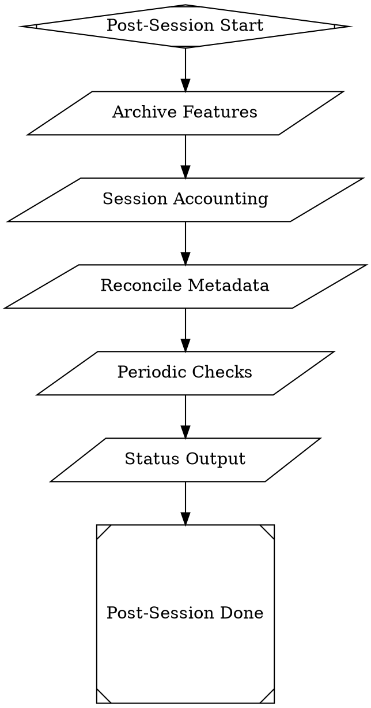
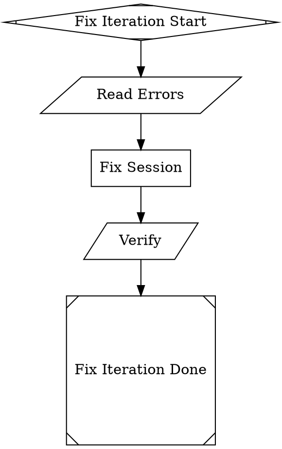
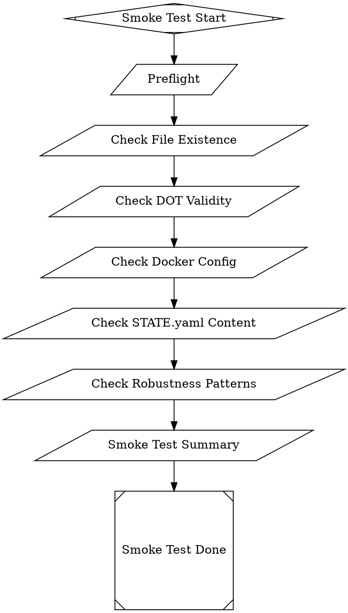
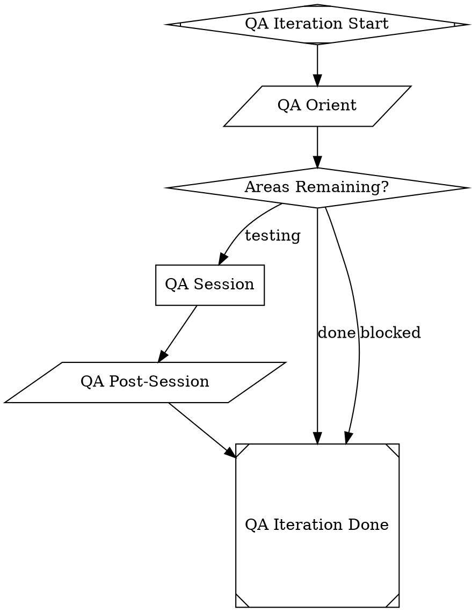

# Phase 3: Core Runtime DOTs — Implementation Plan

> **Execution:** Use the subagent-driven-development workflow to implement this plan.

**Goal:** Translate the dev-machine's 7 recipe YAML templates into 7 executable DOT pipeline files living in `examples/dev-machine/runtime/`, preserving every behavioral contract verbatim.

**Architecture:** Each recipe step becomes a DOT node with the matching shape: `parallelogram` for bash/tool nodes, `box` for agent (codergen) nodes, `diamond` for routing gates, `folder` for nested pipeline calls, and `house` for manager loops. The three engine enhancements from Phase 1 (`continue_on_fail`, `parse_json`, `tool_env`) enable all control flow. Agent prompts transfer verbatim from templates with only `{{variable}}` → `$variable` syntax adaptation.

**Tech Stack:** DOT pipeline language, `amplifier_module_loop_pipeline` (parse_dot, PipelineEngine, HandlerRegistry), pytest + pytest-asyncio, Python 3.

---

## Prerequisites Verification

Before starting, verify these are in place from Phase 1 and Phase 2:

```bash
cd amplifier-bundle-attractor

# Phase 1 engine enhancements exist
grep -n "continue_on_fail" modules/loop-pipeline/src/amplifier_module_loop_pipeline/engine.py
grep -n "parse_json" modules/loop-pipeline/src/amplifier_module_loop_pipeline/handlers.py

# Phase 2 scripts exist
ls examples/dev-machine/scripts/pipeline/

# Existing patterns exist (these are the models to follow)
ls examples/patterns/conversational-gate.dot
ls examples/patterns/convergence-factory.dot

# Existing test patterns (read these before writing any tests)
ls modules/loop-pipeline/tests/test_p2_conversational_gate.py
ls modules/loop-pipeline/tests/test_p6_convergence_factory.py
```

**If Phase 1 engine features are missing:** The DOT files can still be written, but execution tests that rely on `continue_on_fail` or `parse_json` will need to mock those behaviors. Write a note in the test if you skip an execution path for this reason.

**Create runtime directory:**
```bash
mkdir -p amplifier-bundle-attractor/examples/dev-machine/runtime
```

---

## Context: DOT Shape Conventions

Established by existing patterns (`conversational-gate.dot`, `convergence-factory.dot`, `09-manager-supervisor.dot`):

| Shape | Meaning | Handler |
|-------|---------|---------|
| `Mdiamond` | Pipeline start | — |
| `Msquare` | Pipeline end | — |
| `diamond` | Routing gate | Reads `context.preferred_label` or condition |
| `parallelogram` | Tool/bash node | ToolHandler; `tool_command` attr required |
| `box` | Codergen/agent node | CodergenHandler; `prompt` attr required |
| `folder` | Nested pipeline | PipelineHandler; `dot_file` attr required |
| `house` | Manager loop | ManagerLoopHandler; `manager.*` attrs required |
| `hexagon` | Human gate | HumanHandler |

**Edge conditions:** `[label="name", condition="context.var=value"]`
**Loop restart:** `[loop_restart="true"]` on edge from feedback back to generate
**Context injection into child:** `context.varname="value"` as node attr on folder/house node

---

## JSON Output Contracts (what extracted scripts must produce)

These are the `parse_json` outputs that DOT diamond gates route on. Scripts are written in Phase 2 but must emit exactly these keys:

| Script | JSON keys emitted | Notes |
|--------|------------------|-------|
| `orient.py` | `{"status": "blocked"\|"healthy", "phase": N, "epoch": N, ...}` | status drives orient_gate |
| `test-env-preflight.py` | `{"status": "healthy"\|"test_env_broken", "test_env": "ok"\|"broken"}` | exits 0 always; gate routes |
| `build-check.py` | `{"build_status": "clean"\|"failed"}` | drives build_gate |
| `post-session-status.py` | `{"status": "...", "session_count": "N", ...}` | drives post-session output |
| `read-errors.py` | `{"iteration": N, ...}` | iteration counter for fix session |
| health `initial-check.py` (= `build-check.py`) | `{"build_status": "clean"\|"failed"}` | drives clean_gate |
| `qa-orient.py` | `{"status": "testing"\|"done"\|"blocked", "next_test": "..."\|null}` | drives qa orient_gate |
| `qa-post.py` | `{"status": "testing"\|"done"\|"blocked", "session_count": "N"}` | outer loop control |

**Critical adaptation:** `test-env-preflight.py` in DOT mode **exits 0 regardless** and puts the routing signal in JSON (`status: "test_env_broken"`). It still writes the postmortem file and sentinel file as side effects. The diamond gate (not exit code) routes to done. This is the only behavioral adaptation beyond `{{var}}` → `$var`.

---

## Task 15: `iteration.dot` — The Core 8-Step Pipeline

**Source:** `dev-machine-iteration.yaml` (820 lines, 8 steps)
**Files:**
- Create: `examples/dev-machine/runtime/iteration.dot`
- Create: `modules/loop-pipeline/tests/test_phase3_iteration.py`

---

### Step 1: Write the failing parse test

Create `modules/loop-pipeline/tests/test_phase3_iteration.py`:

```python
"""Tests for Phase 3: iteration.dot — the core 8-step dev-machine pipeline.

Structural parse tests verify the DOT file has the correct nodes, shapes,
and edges. Execution tests verify routing paths using mock backends.

Source recipe: dev-machine-iteration.yaml (820 lines, 8 steps).
"""

from __future__ import annotations

from pathlib import Path

import pytest

from amplifier_module_loop_pipeline.context import PipelineContext
from amplifier_module_loop_pipeline.dot_parser import parse_dot
from amplifier_module_loop_pipeline.engine import PipelineEngine
from amplifier_module_loop_pipeline.graph import Graph, Node
from amplifier_module_loop_pipeline.handlers import HandlerRegistry
from amplifier_module_loop_pipeline.outcome import Outcome, StageStatus

# ---------------------------------------------------------------------------
# Path helpers
# ---------------------------------------------------------------------------

_REPO_ROOT = Path(__file__).parent.parent.parent.parent
_RUNTIME_DIR = _REPO_ROOT / "examples" / "dev-machine" / "runtime"
_ITERATION_DOT = _RUNTIME_DIR / "iteration.dot"


# ---------------------------------------------------------------------------
# Structural tests
# ---------------------------------------------------------------------------


class TestIterationParse:
    """Structural parse tests: iteration.dot has correct nodes and edges."""

    def test_file_exists(self):
        """iteration.dot exists at examples/dev-machine/runtime/iteration.dot."""
        assert _ITERATION_DOT.exists(), f"File not found: {_ITERATION_DOT}"

    def test_parses_without_error(self):
        """iteration.dot parses without raising exceptions."""
        source = _ITERATION_DOT.read_text()
        g = parse_dot(source)
        assert len(g.nodes) > 0

    def test_has_thirteen_nodes(self):
        """Pipeline has exactly 13 nodes (start, 6 parallelograms, 3 diamonds, 1 box, 1 folder, done)."""
        source = _ITERATION_DOT.read_text()
        g = parse_dot(source)
        assert len(g.nodes) == 13, (
            f"Expected 13 nodes, got {len(g.nodes)}: {list(g.nodes.keys())}"
        )

    def test_has_start_and_done_nodes(self):
        """Pipeline has exactly one Mdiamond start and one Msquare done."""
        source = _ITERATION_DOT.read_text()
        g = parse_dot(source)
        starts = [n for n in g.nodes.values() if n.shape == "Mdiamond"]
        dones = [n for n in g.nodes.values() if n.shape == "Msquare"]
        assert len(starts) == 1, f"Expected 1 Mdiamond, got {len(starts)}"
        assert len(dones) == 1, f"Expected 1 Msquare, got {len(dones)}"

    def test_has_six_parallelogram_nodes(self):
        """Pipeline has 6 parallelogram tool nodes (orient, spec_drift, api_inventory, test_preflight, module_health, build_check)."""
        source = _ITERATION_DOT.read_text()
        g = parse_dot(source)
        paras = [n for n in g.nodes.values() if n.shape == "parallelogram"]
        assert len(paras) == 6, (
            f"Expected 6 parallelogram nodes, got {len(paras)}: "
            f"{[n.id for n in paras]}"
        )

    def test_has_three_diamond_nodes(self):
        """Pipeline has 3 diamond routing gates (orient_gate, test_preflight_gate, build_gate)."""
        source = _ITERATION_DOT.read_text()
        g = parse_dot(source)
        diamonds = [n for n in g.nodes.values() if n.shape == "diamond"]
        assert len(diamonds) == 3, (
            f"Expected 3 diamond nodes, got {len(diamonds)}: "
            f"{[n.id for n in diamonds]}"
        )

    def test_has_one_box_node_working_session(self):
        """Pipeline has exactly 1 box node (working_session codergen)."""
        source = _ITERATION_DOT.read_text()
        g = parse_dot(source)
        boxes = [n for n in g.nodes.values() if n.shape in ("box", "")]
        # Exclude Mdiamond, Msquare, diamond, parallelogram, folder
        codergen = [
            n for n in g.nodes.values()
            if n.shape not in ("Mdiamond", "Msquare", "diamond", "parallelogram", "folder", "house", "hexagon")
        ]
        assert len(codergen) == 1, (
            f"Expected 1 codergen (box) node, got {len(codergen)}: "
            f"{[(n.id, n.shape) for n in codergen]}"
        )

    def test_has_one_folder_node_post_session(self):
        """Pipeline has exactly 1 folder node (post_session)."""
        source = _ITERATION_DOT.read_text()
        g = parse_dot(source)
        folders = [n for n in g.nodes.values() if n.shape == "folder"]
        assert len(folders) == 1, (
            f"Expected 1 folder node, got {len(folders)}: {[n.id for n in folders]}"
        )

    def test_required_node_ids_present(self):
        """All 13 required node IDs are present."""
        source = _ITERATION_DOT.read_text()
        g = parse_dot(source)
        expected_ids = {
            "start", "orient", "orient_gate",
            "spec_drift", "api_inventory", "test_preflight", "test_preflight_gate",
            "module_health", "working_session", "build_check", "build_gate",
            "post_session", "done",
        }
        actual = set(g.nodes.keys())
        assert expected_ids == actual, (
            f"Node ID mismatch.\nMissing: {expected_ids - actual}\nExtra: {actual - expected_ids}"
        )

    def test_orient_has_parse_json(self):
        """orient node has parse_json='true' attribute."""
        source = _ITERATION_DOT.read_text()
        g = parse_dot(source)
        assert "orient" in g.nodes
        assert g.nodes["orient"].attrs.get("parse_json") == "true", (
            "Expected orient node to have parse_json='true'"
        )

    def test_orient_has_tool_command_with_state_file(self):
        """orient node's tool_command references $state_file."""
        source = _ITERATION_DOT.read_text()
        g = parse_dot(source)
        cmd = g.nodes["orient"].attrs.get("tool_command", "")
        assert "$state_file" in cmd, (
            f"Expected orient tool_command to reference $state_file, got: {cmd!r}"
        )

    def test_continue_on_fail_nodes(self):
        """spec_drift, api_inventory, and module_health have continue_on_fail='true'."""
        source = _ITERATION_DOT.read_text()
        g = parse_dot(source)
        for node_id in ("spec_drift", "api_inventory", "module_health"):
            val = g.nodes[node_id].attrs.get("continue_on_fail")
            assert val == "true", (
                f"Expected {node_id} to have continue_on_fail='true', got {val!r}"
            )

    def test_test_preflight_has_no_continue_on_fail(self):
        """test_preflight does NOT have continue_on_fail (hard fail → gate routing)."""
        source = _ITERATION_DOT.read_text()
        g = parse_dot(source)
        val = g.nodes["test_preflight"].attrs.get("continue_on_fail")
        assert val != "true", (
            "test_preflight should NOT have continue_on_fail — it's a hard gate"
        )

    def test_working_session_has_truncate_fidelity(self):
        """working_session box node has context_fidelity='truncate'."""
        source = _ITERATION_DOT.read_text()
        g = parse_dot(source)
        fidelity = g.nodes["working_session"].attrs.get("context_fidelity")
        assert fidelity == "truncate", (
            f"Expected working_session to have context_fidelity='truncate', got {fidelity!r}"
        )

    def test_working_session_prompt_contains_safety_constraints(self):
        """working_session prompt contains the SAFETY CONSTRAINTS section verbatim."""
        source = _ITERATION_DOT.read_text()
        g = parse_dot(source)
        prompt = g.nodes["working_session"].prompt or ""
        assert "SAFETY CONSTRAINTS" in prompt, (
            "Expected working_session prompt to contain 'SAFETY CONSTRAINTS'"
        )
        assert "FORBIDDEN commands" in prompt, (
            "Expected working_session prompt to contain 'FORBIDDEN commands'"
        )
        assert "VIOLATION OF THESE CONSTRAINTS MAY CAUSE DATA LOSS" in prompt, (
            "Expected working_session prompt to contain the violation warning"
        )

    def test_working_session_prompt_contains_platform_grounding(self):
        """working_session prompt contains Platform Grounding section."""
        source = _ITERATION_DOT.read_text()
        g = parse_dot(source)
        prompt = g.nodes["working_session"].prompt or ""
        assert "Platform Grounding" in prompt, (
            "Expected working_session prompt to contain 'Platform Grounding'"
        )
        assert "Hallucinating APIs" in prompt, (
            "Expected working_session prompt to contain 'Hallucinating APIs'"
        )

    def test_working_session_prompt_references_state_file(self):
        """working_session prompt references $state_file (not {{state_file}})."""
        source = _ITERATION_DOT.read_text()
        g = parse_dot(source)
        prompt = g.nodes["working_session"].prompt or ""
        assert "$state_file" in prompt, (
            "Expected $state_file in working_session prompt"
        )
        assert "{{state_file}}" not in prompt, (
            "Expected Jinja2 {{state_file}} to be replaced with $state_file"
        )

    def test_post_session_references_post_session_dot(self):
        """post_session folder node references post-session.dot."""
        source = _ITERATION_DOT.read_text()
        g = parse_dot(source)
        dot_file = g.nodes["post_session"].attrs.get("dot_file", "")
        assert "post-session.dot" in dot_file, (
            f"Expected post_session dot_file to reference post-session.dot, got {dot_file!r}"
        )

    def test_has_fifteen_edges(self):
        """Pipeline has exactly 15 edges."""
        source = _ITERATION_DOT.read_text()
        g = parse_dot(source)
        assert len(g.edges) == 15, (
            f"Expected 15 edges, got {len(g.edges)}: "
            f"{[(e.from_node, e.to_node, e.label) for e in g.edges]}"
        )

    def test_orient_gate_has_two_conditional_edges(self):
        """orient_gate has edges for 'blocked' → done and 'healthy' → spec_drift."""
        source = _ITERATION_DOT.read_text()
        g = parse_dot(source)
        gate_edges = [e for e in g.edges if e.from_node == "orient_gate"]
        assert len(gate_edges) == 2, (
            f"Expected 2 edges from orient_gate, got {len(gate_edges)}"
        )
        labels = {e.label for e in gate_edges}
        assert "blocked" in labels, f"Expected 'blocked' edge from orient_gate, got {labels}"
        assert "healthy" in labels, f"Expected 'healthy' edge from orient_gate, got {labels}"

    def test_orient_gate_blocked_goes_to_done(self):
        """orient_gate 'blocked' edge routes to done."""
        source = _ITERATION_DOT.read_text()
        g = parse_dot(source)
        blocked_edge = next(
            (e for e in g.edges if e.from_node == "orient_gate" and e.label == "blocked"),
            None,
        )
        assert blocked_edge is not None, "No 'blocked' edge from orient_gate"
        assert blocked_edge.to_node == "done", (
            f"Expected blocked edge to go to 'done', got {blocked_edge.to_node!r}"
        )

    def test_test_preflight_gate_broken_goes_to_done(self):
        """test_preflight_gate 'broken' edge routes to done (hard stop on broken test env)."""
        source = _ITERATION_DOT.read_text()
        g = parse_dot(source)
        broken_edge = next(
            (e for e in g.edges if e.from_node == "test_preflight_gate" and e.label == "broken"),
            None,
        )
        assert broken_edge is not None, "No 'broken' edge from test_preflight_gate"
        assert broken_edge.to_node == "done", (
            f"Expected broken edge to go to 'done', got {broken_edge.to_node!r}"
        )

    def test_build_check_has_parse_json(self):
        """build_check parallelogram has parse_json='true'."""
        source = _ITERATION_DOT.read_text()
        g = parse_dot(source)
        assert g.nodes["build_check"].attrs.get("parse_json") == "true"

    def test_build_gate_both_edges_go_to_post_session(self):
        """build_gate routes both 'clean' and 'failed' to post_session."""
        source = _ITERATION_DOT.read_text()
        g = parse_dot(source)
        build_edges = [e for e in g.edges if e.from_node == "build_gate"]
        assert len(build_edges) == 2, (
            f"Expected 2 edges from build_gate, got {len(build_edges)}"
        )
        for e in build_edges:
            assert e.to_node == "post_session", (
                f"Expected build_gate edge to go to post_session, got {e.to_node!r}"
            )
```

### Step 2: Run test to verify it fails

```bash
cd amplifier-bundle-attractor
python -m pytest modules/loop-pipeline/tests/test_phase3_iteration.py -v 2>&1 | head -30
```

Expected: `FAILED` — `test_file_exists` fails because the file doesn't exist yet. All other tests also fail.

---

### Step 3: Write `iteration.dot`

Create `examples/dev-machine/runtime/iteration.dot`:

```dot
// iteration.dot -- Core 8-step dev-machine working session pipeline.
//
// Directly replaces dev-machine-iteration.yaml (820 lines, 8 steps).
// Called by entrypoint.sh in a retry loop. Each invocation:
//   1. orient       -- reads STATE.yaml, extracts phase/epoch/status (parse_json)
//   2. spec_drift   -- compares spec mtimes vs impl mtimes (continue_on_fail)
//   3. api_inventory-- scans source for public APIs, writes to SCRATCH.md (continue_on_fail)
//   4. test_preflight -- validates test runner works (hard gate)
//   5. module_health-- LOC per package, content-aware bypass (continue_on_fail)
//   6. working_session -- codergen agent that does actual work (truncate fidelity)
//   7. build_check  -- full regression suite + paper tiger detection (parse_json)
//   8. post_session -- decomposed monolith: archive, reconcile, periodic, status
//
// Engine features required (Phase 1):
//   continue_on_fail="true" -- nodes 2, 3, 5
//   parse_json="true"       -- nodes 1, 4, 7
//
// Context variables required (set by foundry or caller):
//   $state_file, $context_file, $specs_dir, $project_dir, $architecture_spec,
//   $test_command, $build_command, $commit_prefix, $max_features_per_session,
//   $module_size_threshold, $session_timeout, $build_timeout

digraph iteration {
    graph [goal="Execute one dev-machine working session"]

    start [shape=Mdiamond, label="Session Start"]

    // Step 1: Orient -- read STATE.yaml, extract structured data.
    // parse_json populates context.status, context.phase, context.epoch, etc.
    orient [
        shape=parallelogram,
        label="Orient",
        tool_command="python3 .dev-machine/scripts/pipeline/orient.py $state_file",
        parse_json="true"
    ]

    // orient_gate routes on context.status from orient's JSON output.
    // blocked -> done (machine is blocked, no point running a session)
    // healthy -> proceed to preflight checks
    orient_gate [shape=diamond, label="Blocked?"]

    // Step 2: Spec drift check -- compare spec file mtimes against impl mtimes.
    // Informational; failure is logged but does not stop the session.
    spec_drift [
        shape=parallelogram,
        label="Spec Drift Check",
        tool_command="python3 .dev-machine/scripts/pipeline/spec-drift-check.py $specs_dir $project_dir",
        continue_on_fail="true"
    ]

    // Step 3: API inventory -- scan source for public types/APIs, write to SCRATCH.md.
    // Feeds Platform Grounding in the working session.
    api_inventory [
        shape=parallelogram,
        label="API Inventory",
        tool_command="python3 .dev-machine/scripts/pipeline/api-inventory.py $project_dir",
        continue_on_fail="true"
    ]

    // Step 4: Test environment preflight -- validate the test runner works.
    // Hard gate: if test runner is broken, no point running a working session.
    // ADAPTED: script exits 0 always; outputs {"status":"healthy"} or {"status":"test_env_broken"}.
    // Gate routes to done on broken (not exit code).
    test_preflight [
        shape=parallelogram,
        label="Test Env Preflight",
        tool_command="python3 .dev-machine/scripts/pipeline/test-env-preflight.py $test_command $project_dir",
        parse_json="true"
    ]

    // test_preflight_gate routes on context.status from test_preflight's JSON output.
    // broken -> done (test runner is broken; postmortem + sentinel written by script)
    // healthy -> proceed to module health check
    test_preflight_gate [shape=diamond, label="Test Env OK?"]

    // Step 5: Module health check -- flag oversized packages before working session.
    // Content-aware bypass: only blocks unplanned oversized modules.
    module_health [
        shape=parallelogram,
        label="Module Health Check",
        tool_command="python3 .dev-machine/scripts/pipeline/module-health-check.py $project_dir $state_file $module_size_threshold",
        continue_on_fail="true"
    ]

    // Step 6: Working session -- the agent that does actual development work.
    // Reads STATE.yaml, CONTEXT-TRANSFER.md, specs from disk each time.
    // truncate fidelity: fresh context window every session.
    // PROMPT IS VERBATIM from dev-machine-iteration.yaml working-session step,
    // with {{variable}} -> $variable syntax adaptation only.
    working_session [
        shape=box,
        label="Working Session",
        context_fidelity="truncate",
        prompt="You are a WORKING SESSION of the $project_name development machine.\nYou start with ZERO prior context. Your job: read state, do work, persist state, exit.\n\nSTART BY READING THESE FILES (in this order):\n1. $state_file -- current phase, what's done, what's next\n2. $context_file -- recent decisions and handoff context\n3. .dev-machine/working-session-instructions.md -- your detailed operating procedure\n\nTHEN READ THE RELEVANT SPECS:\n4. $architecture_spec -- the overall architecture (always read this)\n5. Module specs for whatever module you're working on (check $state_file module_specs)\n6. Feature specs marked \"ready\" in $state_file features section\n\n## Platform Grounding (MANDATORY before writing any code)\n\nBefore writing ANY code that uses project-internal APIs, types, or interfaces:\n1. **Enumerate actual types/interfaces**: Read source files to find what actually exists.\n   For each module you're working in, grep or read for: `interface `, `type `, `class `,\n   `export type`, `export function`, `def `, `pub struct`, `pub fn` (use the language-\n   appropriate patterns). DO NOT rely on your training data -- read what's actually there.\n2. **Map each requirement to an existing type**: For each feature requirement, identify the\n   actual type/API you will call. Write this mapping as a comment before coding.\n3. **If a requirement cannot be mapped to an existing type**: Do NOT invent an API.\n   Add a blocker to $state_file describing the missing type/interface, then stop.\n   Hallucinating APIs is worse than stopping -- it creates non-functional code that\n   looks correct and wastes the next session's time.\n\nYOUR MISSION THIS SESSION:\n- Determine what work is ready from $state_file (next_action + ready features)\n- Pick the next batch of ready work ($max_features_per_session features or the current next_action)\n- For each piece of work:\n  * Update $state_file to mark it in-progress with timestamp\n  * Apply Platform Grounding (above) -- enumerate actual APIs before writing code\n  * Write failing tests first (TDD)\n  * Implement minimal code to pass tests\n  * Run: $test_command\n  * Run: $build_command\n  * BOTH must pass before proceeding.\n  * Verify integration: confirm completed features are reachable through actual entry\n    points (not just tested in isolation), and that no stub/mock implementations\n    remain in production code paths.\n  * Spawn a fresh sub-agent for antagonistic review (give it the spec + your diff)\n  * Fix any review issues found\n  * Commit: $commit_prefix(<module>): <description>\n  * Update $state_file to mark it done with commit hash\n- Update $context_file with decisions made and work completed\n\n## Important: Files are Factored (Do NOT Read Archives)\n\nSTATE.yaml and CONTEXT-TRANSFER.md are kept slim (~300 lines each).\n- STATE.yaml: only active features. Completed features archived in FEATURE-ARCHIVE.yaml.\n- CONTEXT-TRANSFER.md: only last 5 sessions. Older sessions archived in SESSION-ARCHIVE.md.\n- Do NOT read FEATURE-ARCHIVE.yaml or SESSION-ARCHIVE.md -- they are append-only archives.\n- The post-session step auto-archives completed features and old sessions.\n\nIF BLOCKED: add blocker to $state_file blockers list, update $context_file, stop.\nIF DEGRADATION DETECTED (repeating yourself, losing coherence): commit work, update state, stop.\n\nYou are one session in a long chain. Persist everything to files.\nWhat you don't write down is lost forever.\n\n## SAFETY CONSTRAINTS (MANDATORY -- NEVER VIOLATE)\n- Your working directory is $project_dir. Do NOT read, write, or execute commands on files outside this directory.\n- FORBIDDEN commands: rm -rf, find -delete, any command targeting paths outside your working directory\n- Do NOT cd to .., ~, /, or any path outside $project_dir\n- Do NOT access: ~/.ssh/, ~/.amplifier/keys.env, .env files, *.pem, *.key, or any credential files\n- Do NOT run: git push, git remote add, or any command that sends code to a remote repository\n- Do NOT start background processes with &, nohup, or disown unless the recipe infrastructure started them\n- Do NOT install global packages (pip install without venv, npm install -g)\n- If you need something outside these boundaries, add a blocker to $state_file and STOP.\n- VIOLATION OF THESE CONSTRAINTS MAY CAUSE DATA LOSS ACROSS THE ENTIRE DEVELOPMENT ENVIRONMENT."
    ]

    // Step 7: Build check -- full regression suite + paper tiger detection.
    // parse_json populates context.build_status ("clean" or "failed").
    build_check [
        shape=parallelogram,
        label="Build Check",
        tool_command="python3 .dev-machine/scripts/pipeline/build-check.py $build_command $test_command $state_file $project_dir",
        parse_json="true"
    ]

    // build_gate routes on context.build_status.
    // Both clean and failed proceed to post_session (post-session always runs).
    // In future: failed could invoke health-check.dot before post_session.
    build_gate [shape=diamond, label="Build Clean?"]

    // Step 8: Post-session -- decomposed monolith (archive, reconcile, periodic, status).
    // Nested pipeline via folder node. Inherits full context.
    post_session [
        shape=folder,
        label="Post Session",
        dot_file=".dev-machine/runtime/post-session.dot"
    ]

    done [shape=Msquare, label="Session Done"]

    // --- Edges ---

    start -> orient
    orient -> orient_gate

    // orient_gate: blocked status exits early (no work to do if blocked)
    orient_gate -> done         [label="blocked", condition="context.status=blocked"]
    orient_gate -> spec_drift   [label="healthy",  condition="context.status=healthy"]

    // preflight chain
    spec_drift -> api_inventory -> test_preflight -> test_preflight_gate

    // test_preflight_gate: broken test runner exits early
    test_preflight_gate -> done         [label="broken", condition="context.status=test_env_broken"]
    test_preflight_gate -> module_health [label="ok",     condition="context.status=healthy"]

    // main work path
    module_health -> working_session -> build_check -> build_gate

    // build_gate: both outcomes proceed to post_session
    build_gate -> post_session [label="clean",  condition="context.build_status=clean"]
    build_gate -> post_session [label="failed", condition="context.build_status=failed"]

    post_session -> done
}
```



### Step 4: Run test to verify it passes

```bash
cd amplifier-bundle-attractor
python -m pytest modules/loop-pipeline/tests/test_phase3_iteration.py -v
```

Expected: All tests **PASS**.

If `test_has_thirteen_nodes` fails: count your nodes and adjust. The node IDs in `test_required_node_ids_present` are authoritative.

If `test_has_fifteen_edges` fails: count edges in the DOT file. Each `->` is one edge. Expected: `start->orient`, `orient->orient_gate`, `orient_gate->done`, `orient_gate->spec_drift`, `spec_drift->api_inventory`, `api_inventory->test_preflight`, `test_preflight->test_preflight_gate`, `test_preflight_gate->done`, `test_preflight_gate->module_health`, `module_health->working_session`, `working_session->build_check`, `build_check->build_gate`, `build_gate->post_session` (x2), `post_session->done` = 15.

### Step 5: Commit

```bash
cd amplifier-bundle-attractor
git add examples/dev-machine/runtime/iteration.dot modules/loop-pipeline/tests/test_phase3_iteration.py
git commit -m "feat(phase3): add iteration.dot — core 8-step dev-machine pipeline"
```

---

## Task 16: `post-session.dot` — Decomposed Post-Session Monolith

**Source:** Post-session step of `dev-machine-iteration.yaml` (lines 491–820, 330 lines)
**Files:**
- Create: `examples/dev-machine/runtime/post-session.dot`
- Modify: `modules/loop-pipeline/tests/test_phase3_iteration.py` (add `TestPostSessionParse` class)

The 330-line bash monolith decomposes into 5 sequential parallelogram nodes, each calling an extracted script. This gives per-step observability, checkpoint coverage, and independent testability.

**Script decomposition mapping:**

| DOT Node | Script | Source lines | continue_on_fail | parse_json |
|----------|--------|-------------|-----------------|-----------|
| `archive_features` | `post-session-archive.py` | 504–556 | no | no |
| `session_accounting` | `post-session-accounting.py` | 557–575 | no | no |
| `reconcile` | `post-session-reconcile.py` | 577–613 | yes | no |
| `periodic_check` | `post-session-periodic.py` | 615–791 | yes | no |
| `status_output` | `post-session-status.py` | 593–606 | no | yes |

---

### Step 1: Write the failing parse test

Append to `modules/loop-pipeline/tests/test_phase3_iteration.py`:

```python
# ---------------------------------------------------------------------------
# Post-session pipeline tests
# ---------------------------------------------------------------------------

_POST_SESSION_DOT = _RUNTIME_DIR / "post-session.dot"


class TestPostSessionParse:
    """Structural parse tests: post-session.dot has correct nodes and edges."""

    def test_file_exists(self):
        """post-session.dot exists at examples/dev-machine/runtime/post-session.dot."""
        assert _POST_SESSION_DOT.exists(), f"File not found: {_POST_SESSION_DOT}"

    def test_parses_without_error(self):
        """post-session.dot parses without raising exceptions."""
        source = _POST_SESSION_DOT.read_text()
        g = parse_dot(source)
        assert len(g.nodes) > 0

    def test_has_seven_nodes(self):
        """Pipeline has exactly 7 nodes (start, 5 parallelograms, done)."""
        source = _POST_SESSION_DOT.read_text()
        g = parse_dot(source)
        assert len(g.nodes) == 7, (
            f"Expected 7 nodes, got {len(g.nodes)}: {list(g.nodes.keys())}"
        )

    def test_has_five_parallelogram_nodes(self):
        """Pipeline has 5 parallelogram nodes (the 5 decomposed steps)."""
        source = _POST_SESSION_DOT.read_text()
        g = parse_dot(source)
        paras = [n for n in g.nodes.values() if n.shape == "parallelogram"]
        assert len(paras) == 5, (
            f"Expected 5 parallelogram nodes, got {len(paras)}: {[n.id for n in paras]}"
        )

    def test_required_node_ids_present(self):
        """All 7 required node IDs are present."""
        source = _POST_SESSION_DOT.read_text()
        g = parse_dot(source)
        expected = {
            "start", "archive_features", "session_accounting",
            "reconcile", "periodic_check", "status_output", "done",
        }
        actual = set(g.nodes.keys())
        assert expected == actual, (
            f"Node ID mismatch.\nMissing: {expected - actual}\nExtra: {actual - expected}"
        )

    def test_reconcile_and_periodic_have_continue_on_fail(self):
        """reconcile and periodic_check have continue_on_fail='true' (housekeeping, not critical)."""
        source = _POST_SESSION_DOT.read_text()
        g = parse_dot(source)
        for node_id in ("reconcile", "periodic_check"):
            val = g.nodes[node_id].attrs.get("continue_on_fail")
            assert val == "true", (
                f"Expected {node_id} to have continue_on_fail='true', got {val!r}"
            )

    def test_archive_and_accounting_no_continue_on_fail(self):
        """archive_features and session_accounting do NOT have continue_on_fail (session-critical)."""
        source = _POST_SESSION_DOT.read_text()
        g = parse_dot(source)
        for node_id in ("archive_features", "session_accounting"):
            val = g.nodes[node_id].attrs.get("continue_on_fail")
            assert val != "true", (
                f"{node_id} should NOT have continue_on_fail (it is session-critical)"
            )

    def test_status_output_has_parse_json(self):
        """status_output has parse_json='true'."""
        source = _POST_SESSION_DOT.read_text()
        g = parse_dot(source)
        val = g.nodes["status_output"].attrs.get("parse_json")
        assert val == "true", (
            f"Expected status_output to have parse_json='true', got {val!r}"
        )

    def test_linear_chain_six_edges(self):
        """Pipeline has exactly 6 edges (linear chain: start -> ... -> done)."""
        source = _POST_SESSION_DOT.read_text()
        g = parse_dot(source)
        assert len(g.edges) == 6, (
            f"Expected 6 edges, got {len(g.edges)}: "
            f"{[(e.from_node, e.to_node) for e in g.edges]}"
        )

    def test_linear_chain_order(self):
        """Chain is: start -> archive_features -> session_accounting -> reconcile -> periodic_check -> status_output -> done."""
        source = _POST_SESSION_DOT.read_text()
        g = parse_dot(source)
        edge_map = {e.from_node: e.to_node for e in g.edges}
        expected_chain = [
            "start", "archive_features", "session_accounting",
            "reconcile", "periodic_check", "status_output", "done",
        ]
        current = "start"
        visited = [current]
        for _ in range(6):
            nxt = edge_map.get(current)
            if nxt is None:
                break
            visited.append(nxt)
            current = nxt
        assert visited == expected_chain, (
            f"Expected chain {expected_chain}, got {visited}"
        )
```

### Step 2: Run test to verify it fails

```bash
cd amplifier-bundle-attractor
python -m pytest modules/loop-pipeline/tests/test_phase3_iteration.py::TestPostSessionParse -v 2>&1 | head -20
```

Expected: `FAILED` on `test_file_exists`.

---

### Step 3: Write `post-session.dot`

Create `examples/dev-machine/runtime/post-session.dot`:



### Step 4: Run test to verify it passes

```bash
cd amplifier-bundle-attractor
python -m pytest modules/loop-pipeline/tests/test_phase3_iteration.py -v
```

Expected: All tests in both `TestIterationParse` and `TestPostSessionParse` **PASS**.

### Step 5: Commit

```bash
cd amplifier-bundle-attractor
git add examples/dev-machine/runtime/post-session.dot modules/loop-pipeline/tests/test_phase3_iteration.py
git commit -m "feat(phase3): add post-session.dot — decomposed 330-line post-session monolith"
```

---

## Task 17: `health-check.dot` + `fix-iteration.dot`

**Sources:**
- `dev-machine-health-check.yaml` (169 lines)
- `dev-machine-fix-iteration.yaml` (152 lines)

**Files:**
- Create: `examples/dev-machine/runtime/health-check.dot`
- Create: `examples/dev-machine/runtime/fix-iteration.dot`
- Create: `modules/loop-pipeline/tests/test_phase3_health_check.py`

**Pattern:** `health-check.dot` uses a `house` manager loop node that runs `fix-iteration.dot` repeatedly until clean or max cycles reached. `fix-iteration.dot` is a 3-step pipeline: read-errors → fix-session (codergen with VERBATIM prompt) → verify.

**House node attribute reference:** Before writing, verify the correct attribute names by checking `modules/loop-pipeline/tests/test_manager_loop.py` and the `09-manager-supervisor.dot` example. The design doc uses `manager.max_cycles`, `manager.stop_condition`, `manager.poll_interval` — confirm these match the engine's `ManagerLoopHandler`.

---

### Step 1: Write the failing parse tests

Create `modules/loop-pipeline/tests/test_phase3_health_check.py`:

```python
"""Tests for Phase 3: health-check.dot + fix-iteration.dot.

health-check.dot: initial build check -> clean_gate -> optional fix_loop (house) -> done.
fix-iteration.dot: read_errors -> fix_session (codergen, VERBATIM prompt) -> verify -> done.

Source recipes:
- dev-machine-health-check.yaml (169 lines)
- dev-machine-fix-iteration.yaml (152 lines)
"""

from __future__ import annotations

from pathlib import Path

import pytest

from amplifier_module_loop_pipeline.context import PipelineContext
from amplifier_module_loop_pipeline.dot_parser import parse_dot
from amplifier_module_loop_pipeline.engine import PipelineEngine
from amplifier_module_loop_pipeline.graph import Graph, Node
from amplifier_module_loop_pipeline.handlers import HandlerRegistry
from amplifier_module_loop_pipeline.outcome import Outcome, StageStatus

_REPO_ROOT = Path(__file__).parent.parent.parent.parent
_RUNTIME_DIR = _REPO_ROOT / "examples" / "dev-machine" / "runtime"
_HEALTH_CHECK_DOT = _RUNTIME_DIR / "health-check.dot"
_FIX_ITER_DOT = _RUNTIME_DIR / "fix-iteration.dot"


# ---------------------------------------------------------------------------
# Structural tests: health-check.dot
# ---------------------------------------------------------------------------


class TestHealthCheckParse:
    """Structural parse tests: health-check.dot."""

    def test_file_exists(self):
        assert _HEALTH_CHECK_DOT.exists(), f"File not found: {_HEALTH_CHECK_DOT}"

    def test_parses_without_error(self):
        source = _HEALTH_CHECK_DOT.read_text()
        g = parse_dot(source)
        assert len(g.nodes) > 0

    def test_has_five_nodes(self):
        """Pipeline has 5 nodes: start, initial_check (parallelogram), clean_gate (diamond), fix_loop (house), done."""
        source = _HEALTH_CHECK_DOT.read_text()
        g = parse_dot(source)
        assert len(g.nodes) == 5, (
            f"Expected 5 nodes, got {len(g.nodes)}: {list(g.nodes.keys())}"
        )

    def test_required_node_ids_present(self):
        source = _HEALTH_CHECK_DOT.read_text()
        g = parse_dot(source)
        expected = {"start", "initial_check", "clean_gate", "fix_loop", "done"}
        actual = set(g.nodes.keys())
        assert expected == actual, (
            f"Node ID mismatch.\nMissing: {expected - actual}\nExtra: {actual - expected}"
        )

    def test_initial_check_is_parallelogram_with_parse_json(self):
        """initial_check is a parallelogram tool node with parse_json='true'."""
        source = _HEALTH_CHECK_DOT.read_text()
        g = parse_dot(source)
        node = g.nodes["initial_check"]
        assert node.shape == "parallelogram", (
            f"Expected initial_check shape=parallelogram, got {node.shape!r}"
        )
        assert node.attrs.get("parse_json") == "true", (
            "Expected initial_check to have parse_json='true'"
        )

    def test_clean_gate_is_diamond(self):
        source = _HEALTH_CHECK_DOT.read_text()
        g = parse_dot(source)
        assert g.nodes["clean_gate"].shape == "diamond"

    def test_fix_loop_is_house(self):
        """fix_loop is a house (manager loop) node."""
        source = _HEALTH_CHECK_DOT.read_text()
        g = parse_dot(source)
        assert g.nodes["fix_loop"].shape == "house", (
            f"Expected fix_loop shape=house, got {g.nodes['fix_loop'].shape!r}"
        )

    def test_fix_loop_has_max_cycles(self):
        """fix_loop house node has manager.max_cycles attribute."""
        source = _HEALTH_CHECK_DOT.read_text()
        g = parse_dot(source)
        cycles = g.nodes["fix_loop"].attrs.get("manager.max_cycles")
        assert cycles is not None, "Expected fix_loop to have manager.max_cycles attribute"

    def test_fix_loop_has_stop_condition(self):
        """fix_loop house node has manager.stop_condition='outcome=success'."""
        source = _HEALTH_CHECK_DOT.read_text()
        g = parse_dot(source)
        stop = g.nodes["fix_loop"].attrs.get("manager.stop_condition")
        assert stop == "outcome=success", (
            f"Expected manager.stop_condition='outcome=success', got {stop!r}"
        )

    def test_has_five_edges(self):
        """Pipeline has 5 edges."""
        source = _HEALTH_CHECK_DOT.read_text()
        g = parse_dot(source)
        assert len(g.edges) == 5, (
            f"Expected 5 edges, got {len(g.edges)}: "
            f"{[(e.from_node, e.to_node, e.label) for e in g.edges]}"
        )

    def test_clean_gate_routes_to_done_when_clean(self):
        """clean_gate routes to done when context.build_status=clean."""
        source = _HEALTH_CHECK_DOT.read_text()
        g = parse_dot(source)
        clean_edge = next(
            (e for e in g.edges if e.from_node == "clean_gate" and e.to_node == "done"),
            None,
        )
        assert clean_edge is not None, "Expected clean_gate -> done edge"
        assert clean_edge.condition, "Expected clean_gate -> done to have a condition"
        assert "clean" in (clean_edge.condition or ""), (
            f"Expected 'clean' in condition, got {clean_edge.condition!r}"
        )

    def test_clean_gate_routes_to_fix_loop_when_failed(self):
        """clean_gate routes to fix_loop when context.build_status=failed."""
        source = _HEALTH_CHECK_DOT.read_text()
        g = parse_dot(source)
        failed_edge = next(
            (e for e in g.edges if e.from_node == "clean_gate" and e.to_node == "fix_loop"),
            None,
        )
        assert failed_edge is not None, "Expected clean_gate -> fix_loop edge"
        assert failed_edge.condition, "Expected clean_gate -> fix_loop to have a condition"


# ---------------------------------------------------------------------------
# Structural tests: fix-iteration.dot
# ---------------------------------------------------------------------------


class TestFixIterationParse:
    """Structural parse tests: fix-iteration.dot."""

    def test_file_exists(self):
        assert _FIX_ITER_DOT.exists(), f"File not found: {_FIX_ITER_DOT}"

    def test_parses_without_error(self):
        source = _FIX_ITER_DOT.read_text()
        g = parse_dot(source)
        assert len(g.nodes) > 0

    def test_has_five_nodes(self):
        """Pipeline has 5 nodes: start, read_errors, fix_session, verify, done."""
        source = _FIX_ITER_DOT.read_text()
        g = parse_dot(source)
        assert len(g.nodes) == 5, (
            f"Expected 5 nodes, got {len(g.nodes)}: {list(g.nodes.keys())}"
        )

    def test_required_node_ids_present(self):
        source = _FIX_ITER_DOT.read_text()
        g = parse_dot(source)
        expected = {"start", "read_errors", "fix_session", "verify", "done"}
        actual = set(g.nodes.keys())
        assert expected == actual, (
            f"Node ID mismatch.\nMissing: {expected - actual}\nExtra: {actual - expected}"
        )

    def test_read_errors_is_parallelogram_with_parse_json(self):
        source = _FIX_ITER_DOT.read_text()
        g = parse_dot(source)
        node = g.nodes["read_errors"]
        assert node.shape == "parallelogram"
        assert node.attrs.get("parse_json") == "true"

    def test_fix_session_is_box_codergen(self):
        """fix_session is a box (codergen) node with truncate fidelity."""
        source = _FIX_ITER_DOT.read_text()
        g = parse_dot(source)
        node = g.nodes["fix_session"]
        assert node.shape in ("box", ""), (
            f"Expected fix_session shape=box or default, got {node.shape!r}"
        )
        assert node.attrs.get("context_fidelity") == "truncate"

    def test_verify_is_parallelogram_with_parse_json(self):
        source = _FIX_ITER_DOT.read_text()
        g = parse_dot(source)
        node = g.nodes["verify"]
        assert node.shape == "parallelogram"
        assert node.attrs.get("parse_json") == "true"

    def test_fix_session_prompt_contains_safety_constraints(self):
        """fix_session prompt contains SAFETY CONSTRAINTS section verbatim."""
        source = _FIX_ITER_DOT.read_text()
        g = parse_dot(source)
        prompt = g.nodes["fix_session"].prompt or ""
        assert "SAFETY CONSTRAINTS" in prompt
        assert "FORBIDDEN commands" in prompt
        assert "VIOLATION OF THESE CONSTRAINTS MAY CAUSE DATA LOSS" in prompt

    def test_fix_session_prompt_contains_fixing_strategy(self):
        """fix_session prompt contains FIXING STRATEGY section."""
        source = _FIX_ITER_DOT.read_text()
        g = parse_dot(source)
        prompt = g.nodes["fix_session"].prompt or ""
        assert "FIXING STRATEGY" in prompt
        assert "Group errors by file" in prompt

    def test_fix_session_prompt_references_state_variable(self):
        """fix_session prompt references $project_dir (not {{project_dir}})."""
        source = _FIX_ITER_DOT.read_text()
        g = parse_dot(source)
        prompt = g.nodes["fix_session"].prompt or ""
        assert "$project_dir" in prompt
        assert "{{project_dir}}" not in prompt

    def test_fix_session_prompt_references_iteration(self):
        """fix_session prompt references $iteration for the iteration counter."""
        source = _FIX_ITER_DOT.read_text()
        g = parse_dot(source)
        prompt = g.nodes["fix_session"].prompt or ""
        assert "$iteration" in prompt, (
            "Expected $iteration in fix_session prompt (from read_errors parse_json output)"
        )

    def test_has_four_edges_linear_chain(self):
        """Pipeline has 4 edges (linear chain)."""
        source = _FIX_ITER_DOT.read_text()
        g = parse_dot(source)
        assert len(g.edges) == 4, (
            f"Expected 4 edges, got {len(g.edges)}"
        )

    def test_linear_chain_order(self):
        """Chain is: start -> read_errors -> fix_session -> verify -> done."""
        source = _FIX_ITER_DOT.read_text()
        g = parse_dot(source)
        edge_map = {e.from_node: e.to_node for e in g.edges}
        expected = ["start", "read_errors", "fix_session", "verify", "done"]
        current = "start"
        visited = [current]
        for _ in range(4):
            nxt = edge_map.get(current)
            if nxt is None:
                break
            visited.append(nxt)
            current = nxt
        assert visited == expected, f"Expected chain {expected}, got {visited}"
```

### Step 2: Run test to verify it fails

```bash
cd amplifier-bundle-attractor
python -m pytest modules/loop-pipeline/tests/test_phase3_health_check.py -v 2>&1 | head -20
```

Expected: `FAILED` on both `test_file_exists` tests.

---

### Step 3: Write `fix-iteration.dot` (write this first — health-check.dot references it)

Create `examples/dev-machine/runtime/fix-iteration.dot`:



### Step 3b: Write `health-check.dot`

Create `examples/dev-machine/runtime/health-check.dot`:

```dot
// health-check.dot -- Systematic build/test error detection and fix loop.
//
// Directly replaces dev-machine-health-check.yaml (169 lines).
//
// Flow:
//   1. initial_check -- run build + test, write errors to SCRATCH.md (parse_json)
//   2. clean_gate    -- if clean: done; if failed: enter fix loop
//   3. fix_loop      -- house (manager loop) that runs fix-iteration.dot per cycle
//                       until build+tests clean or max_fix_iterations reached
//
// Container check from original recipe is NOT included here — it is infrastructure
// (entrypoint.sh responsibility), not orchestration.
//
// Context variables required:
//   $project_dir, $build_command, $test_command, $state_file, $max_fix_iterations

digraph health_check {
    graph [goal="Fix build/test errors until codebase is clean"]

    start [shape=Mdiamond, label="Health Check Start"]

    // Step 1: Run build + test, write findings to SCRATCH.md for the fix session.
    // parse_json populates context.build_status ("clean" or "failed").
    // Uses build-check.py which also writes SCRATCH.md content.
    initial_check [
        shape=parallelogram,
        label="Initial Health Check",
        tool_command="python3 .dev-machine/scripts/pipeline/build-check.py $build_command $test_command $state_file $project_dir",
        parse_json="true",
        continue_on_fail="true"
    ]

    // clean_gate routes on context.build_status from initial_check.
    // clean  -> done (already healthy, nothing to fix)
    // failed -> fix_loop (enter the fix cycle)
    clean_gate [shape=diamond, label="Already Clean?"]

    // Step 3: Manager loop -- runs fix-iteration.dot on each cycle.
    // Stops when fix-iteration.dot returns success OR max_fix_iterations reached.
    // child_dotfile attribute: check test_manager_loop.py for exact attribute syntax.
    // See also: 09-manager-supervisor.dot for manager.* attribute reference.
    fix_loop [
        shape=house,
        label="Fix Loop",
        manager.max_cycles="$max_fix_iterations",
        manager.stop_condition="outcome=success",
        manager.poll_interval="0s",
        manager.child_dotfile=".dev-machine/runtime/fix-iteration.dot"
    ]

    done [shape=Msquare, label="Health Check Done"]

    // Flow
    start -> initial_check -> clean_gate

    // clean_gate routing
    clean_gate -> done     [label="clean",  condition="context.build_status=clean"]
    clean_gate -> fix_loop [label="failed", condition="context.build_status=failed"]

    // After fix loop completes (success or max cycles)
    fix_loop -> done
}
```

> **Implementer note on `manager.child_dotfile`:** The attribute name in `health-check.dot` above may need adjustment to match the ManagerLoopHandler implementation. Check `modules/loop-pipeline/tests/test_manager_loop.py` for the exact attribute name used by the engine. If the engine uses a different pattern (e.g., inline child nodes like in `09-manager-supervisor.dot`), adapt accordingly and update the test to match.

### Step 4: Run test to verify it passes

```bash
cd amplifier-bundle-attractor
python -m pytest modules/loop-pipeline/tests/test_phase3_health_check.py -v
```

Expected: All tests **PASS**. If `test_fix_loop_has_max_cycles` or `test_fix_loop_has_stop_condition` fail, check that the attribute names in `health-check.dot` match the test expectations.

### Step 5: Commit

```bash
cd amplifier-bundle-attractor
git add examples/dev-machine/runtime/health-check.dot \
        examples/dev-machine/runtime/fix-iteration.dot \
        modules/loop-pipeline/tests/test_phase3_health_check.py
git commit -m "feat(phase3): add health-check.dot + fix-iteration.dot — systematic fix loop"
```

---

## Task 18: `smoke-test.dot` — Pre-Flight Validator

**Source:** `dev-machine-smoke-test.yaml` (348 lines, 7 steps)
**Files:**
- Create: `examples/dev-machine/runtime/smoke-test.dot`
- Create: `modules/loop-pipeline/tests/test_phase3_smoke_test.py`

**Pattern:** Linear chain of 7 parallelogram nodes. The first (`preflight`) and last (`smoke_summary`) are hard-fail (no `continue_on_fail`). The five check nodes in between use `continue_on_fail="true"` so all checks run even when earlier ones fail — matching the recipe's `on_error: continue` pattern.

**Key adaptation:** The original `check-yaml-validity` step validates YAML files. The DOT version validates DOT files using `parse_dot` from the Attractor engine. The `check-robustness-patterns` step checks patterns in `scripts/infra/*.sh` (same files as original — the infra scripts are unchanged).

---

### Step 1: Write the failing parse test

Create `modules/loop-pipeline/tests/test_phase3_smoke_test.py`:

```python
"""Tests for Phase 3: smoke-test.dot — pre-flight structural validator.

7 sequential parallelogram nodes: preflight (hard-fail) + 5 checks (continue_on_fail)
+ smoke_summary (hard-fail). All steps run even when earlier ones fail.

Source recipe: dev-machine-smoke-test.yaml (348 lines, 7 steps).
"""

from __future__ import annotations

from pathlib import Path

import pytest

from amplifier_module_loop_pipeline.dot_parser import parse_dot

_REPO_ROOT = Path(__file__).parent.parent.parent.parent
_RUNTIME_DIR = _REPO_ROOT / "examples" / "dev-machine" / "runtime"
_SMOKE_TEST_DOT = _RUNTIME_DIR / "smoke-test.dot"


class TestSmokeTestParse:
    """Structural parse tests: smoke-test.dot."""

    def test_file_exists(self):
        """smoke-test.dot exists at examples/dev-machine/runtime/smoke-test.dot."""
        assert _SMOKE_TEST_DOT.exists(), f"File not found: {_SMOKE_TEST_DOT}"

    def test_parses_without_error(self):
        source = _SMOKE_TEST_DOT.read_text()
        g = parse_dot(source)
        assert len(g.nodes) > 0

    def test_has_nine_nodes(self):
        """Pipeline has 9 nodes: start, 7 parallelograms, done."""
        source = _SMOKE_TEST_DOT.read_text()
        g = parse_dot(source)
        assert len(g.nodes) == 9, (
            f"Expected 9 nodes, got {len(g.nodes)}: {list(g.nodes.keys())}"
        )

    def test_has_seven_parallelogram_nodes(self):
        """Pipeline has exactly 7 parallelogram tool nodes."""
        source = _SMOKE_TEST_DOT.read_text()
        g = parse_dot(source)
        paras = [n for n in g.nodes.values() if n.shape == "parallelogram"]
        assert len(paras) == 7, (
            f"Expected 7 parallelogram nodes, got {len(paras)}: {[n.id for n in paras]}"
        )

    def test_required_node_ids_present(self):
        source = _SMOKE_TEST_DOT.read_text()
        g = parse_dot(source)
        expected = {
            "start", "preflight",
            "check_files", "check_dot_validity", "check_docker",
            "check_state", "check_robustness",
            "smoke_summary", "done",
        }
        actual = set(g.nodes.keys())
        assert expected == actual, (
            f"Node ID mismatch.\nMissing: {expected - actual}\nExtra: {actual - expected}"
        )

    def test_five_check_nodes_have_continue_on_fail(self):
        """The 5 check nodes all have continue_on_fail='true'."""
        source = _SMOKE_TEST_DOT.read_text()
        g = parse_dot(source)
        check_nodes = [
            "check_files", "check_dot_validity", "check_docker",
            "check_state", "check_robustness",
        ]
        for node_id in check_nodes:
            val = g.nodes[node_id].attrs.get("continue_on_fail")
            assert val == "true", (
                f"Expected {node_id} to have continue_on_fail='true', got {val!r}"
            )

    def test_preflight_has_no_continue_on_fail(self):
        """preflight does NOT have continue_on_fail (hard fail if .dev-machine/ missing)."""
        source = _SMOKE_TEST_DOT.read_text()
        g = parse_dot(source)
        val = g.nodes["preflight"].attrs.get("continue_on_fail")
        assert val != "true", "preflight should NOT have continue_on_fail"

    def test_smoke_summary_has_no_continue_on_fail(self):
        """smoke_summary does NOT have continue_on_fail (final hard-fail aggregation)."""
        source = _SMOKE_TEST_DOT.read_text()
        g = parse_dot(source)
        val = g.nodes["smoke_summary"].attrs.get("continue_on_fail")
        assert val != "true", "smoke_summary should NOT have continue_on_fail"

    def test_check_dot_validity_not_yaml_validity(self):
        """check_dot_validity validates DOT files (not YAML recipes as in original)."""
        source = _SMOKE_TEST_DOT.read_text()
        g = parse_dot(source)
        cmd = g.nodes["check_dot_validity"].attrs.get("tool_command", "")
        # Should reference .dot files, not .yaml recipe files
        assert ".dot" in cmd or "dot" in cmd.lower(), (
            f"Expected check_dot_validity to reference DOT files, got cmd: {cmd!r}"
        )

    def test_has_eight_edges_linear_chain(self):
        """Pipeline has 8 edges (linear chain of 9 nodes)."""
        source = _SMOKE_TEST_DOT.read_text()
        g = parse_dot(source)
        assert len(g.edges) == 8, (
            f"Expected 8 edges, got {len(g.edges)}"
        )

    def test_linear_chain_order(self):
        """Chain order: start -> preflight -> check_files -> check_dot_validity -> check_docker -> check_state -> check_robustness -> smoke_summary -> done."""
        source = _SMOKE_TEST_DOT.read_text()
        g = parse_dot(source)
        edge_map = {e.from_node: e.to_node for e in g.edges}
        expected = [
            "start", "preflight", "check_files", "check_dot_validity",
            "check_docker", "check_state", "check_robustness", "smoke_summary", "done",
        ]
        current = "start"
        visited = [current]
        for _ in range(8):
            nxt = edge_map.get(current)
            if nxt is None:
                break
            visited.append(nxt)
            current = nxt
        assert visited == expected, f"Expected chain {expected}, got {visited}"
```

### Step 2: Run test to verify it fails

```bash
cd amplifier-bundle-attractor
python -m pytest modules/loop-pipeline/tests/test_phase3_smoke_test.py -v 2>&1 | head -20
```

Expected: `FAILED` on `test_file_exists`.

---

### Step 3: Write `smoke-test.dot`

Create `examples/dev-machine/runtime/smoke-test.dot`:



### Step 4: Run test to verify it passes

```bash
cd amplifier-bundle-attractor
python -m pytest modules/loop-pipeline/tests/test_phase3_smoke_test.py -v
```

Expected: All tests **PASS**.

### Step 5: Commit

```bash
cd amplifier-bundle-attractor
git add examples/dev-machine/runtime/smoke-test.dot \
        modules/loop-pipeline/tests/test_phase3_smoke_test.py
git commit -m "feat(phase3): add smoke-test.dot — 7-step pre-flight structural validator"
```

---

## Task 19: `qa.dot` + `qa-iteration.dot` — QA Loop

**Sources:**
- `dev-machine-qa.yaml` (153 lines)
- `dev-machine-qa-iteration.yaml` (148 lines)

**Files:**
- Create: `examples/dev-machine/runtime/qa.dot`
- Create: `examples/dev-machine/runtime/qa-iteration.dot`
- Create: `modules/loop-pipeline/tests/test_phase3_qa.py`

**Pattern:** Same house/folder pattern as health-check. `qa.dot` reads QA-STATE.yaml, routes on blockers, then runs a house manager loop calling `qa-iteration.dot`. `qa-iteration.dot` is a 3-step pipeline: orient → qa_session (codergen with VERBATIM prompt) → post_qasession.

---

### Step 1: Write the failing parse tests

Create `modules/loop-pipeline/tests/test_phase3_qa.py`:

```python
"""Tests for Phase 3: qa.dot + qa-iteration.dot — QA machine.

qa.dot: read-qa-state -> blocked_gate -> qa_loop (house) -> final_summary -> done.
qa-iteration.dot: orient -> orient_gate -> qa_session (codergen, VERBATIM prompt) -> post_qasession -> done.

Source recipes:
- dev-machine-qa.yaml (153 lines)
- dev-machine-qa-iteration.yaml (148 lines)
"""

from __future__ import annotations

from pathlib import Path

import pytest

from amplifier_module_loop_pipeline.dot_parser import parse_dot

_REPO_ROOT = Path(__file__).parent.parent.parent.parent
_RUNTIME_DIR = _REPO_ROOT / "examples" / "dev-machine" / "runtime"
_QA_DOT = _RUNTIME_DIR / "qa.dot"
_QA_ITER_DOT = _RUNTIME_DIR / "qa-iteration.dot"


# ---------------------------------------------------------------------------
# Structural tests: qa.dot
# ---------------------------------------------------------------------------


class TestQAParse:
    """Structural parse tests: qa.dot."""

    def test_file_exists(self):
        assert _QA_DOT.exists(), f"File not found: {_QA_DOT}"

    def test_parses_without_error(self):
        source = _QA_DOT.read_text()
        g = parse_dot(source)
        assert len(g.nodes) > 0

    def test_has_seven_nodes(self):
        """Pipeline has 7 nodes: start, read_qa_state, blocked_gate, qa_loop, final_summary, done.
        Note: blocked_gate -> done is the early-exit path; done serves both paths."""
        source = _QA_DOT.read_text()
        g = parse_dot(source)
        assert len(g.nodes) == 7, (
            f"Expected 7 nodes, got {len(g.nodes)}: {list(g.nodes.keys())}"
        )

    def test_required_node_ids_present(self):
        source = _QA_DOT.read_text()
        g = parse_dot(source)
        expected = {
            "start", "read_qa_state", "blocked_gate",
            "qa_loop", "final_summary", "done", "container_check",
        }
        actual = set(g.nodes.keys())
        assert expected == actual, (
            f"Node ID mismatch.\nMissing: {expected - actual}\nExtra: {actual - expected}"
        )

    def test_read_qa_state_has_parse_json(self):
        source = _QA_DOT.read_text()
        g = parse_dot(source)
        assert g.nodes["read_qa_state"].attrs.get("parse_json") == "true"

    def test_read_qa_state_is_parallelogram(self):
        source = _QA_DOT.read_text()
        g = parse_dot(source)
        assert g.nodes["read_qa_state"].shape == "parallelogram"

    def test_blocked_gate_is_diamond(self):
        source = _QA_DOT.read_text()
        g = parse_dot(source)
        assert g.nodes["blocked_gate"].shape == "diamond"

    def test_qa_loop_is_house(self):
        source = _QA_DOT.read_text()
        g = parse_dot(source)
        assert g.nodes["qa_loop"].shape == "house", (
            f"Expected qa_loop shape=house, got {g.nodes['qa_loop'].shape!r}"
        )

    def test_qa_loop_has_max_cycles(self):
        source = _QA_DOT.read_text()
        g = parse_dot(source)
        cycles = g.nodes["qa_loop"].attrs.get("manager.max_cycles")
        assert cycles is not None, "Expected qa_loop to have manager.max_cycles"

    def test_blocked_gate_routes_to_done_when_blocked(self):
        """blocked_gate has edge to done for blocked status (early exit)."""
        source = _QA_DOT.read_text()
        g = parse_dot(source)
        blocked_edge = next(
            (e for e in g.edges if e.from_node == "blocked_gate" and e.to_node == "done"),
            None,
        )
        assert blocked_edge is not None, "Expected blocked_gate -> done edge"

    def test_blocked_gate_routes_to_qa_loop_when_testing(self):
        """blocked_gate routes to qa_loop when status=testing."""
        source = _QA_DOT.read_text()
        g = parse_dot(source)
        testing_edge = next(
            (e for e in g.edges if e.from_node == "blocked_gate" and e.to_node == "qa_loop"),
            None,
        )
        assert testing_edge is not None, "Expected blocked_gate -> qa_loop edge"


# ---------------------------------------------------------------------------
# Structural tests: qa-iteration.dot
# ---------------------------------------------------------------------------


class TestQAIterationParse:
    """Structural parse tests: qa-iteration.dot."""

    def test_file_exists(self):
        assert _QA_ITER_DOT.exists(), f"File not found: {_QA_ITER_DOT}"

    def test_parses_without_error(self):
        source = _QA_ITER_DOT.read_text()
        g = parse_dot(source)
        assert len(g.nodes) > 0

    def test_has_six_nodes(self):
        """Pipeline has 6 nodes: start, orient, orient_gate, qa_session, post_qasession, done."""
        source = _QA_ITER_DOT.read_text()
        g = parse_dot(source)
        assert len(g.nodes) == 6, (
            f"Expected 6 nodes, got {len(g.nodes)}: {list(g.nodes.keys())}"
        )

    def test_required_node_ids_present(self):
        source = _QA_ITER_DOT.read_text()
        g = parse_dot(source)
        expected = {
            "start", "orient", "orient_gate",
            "qa_session", "post_qasession", "done",
        }
        actual = set(g.nodes.keys())
        assert expected == actual, (
            f"Node ID mismatch.\nMissing: {expected - actual}\nExtra: {actual - expected}"
        )

    def test_orient_is_parallelogram_with_parse_json(self):
        source = _QA_ITER_DOT.read_text()
        g = parse_dot(source)
        node = g.nodes["orient"]
        assert node.shape == "parallelogram"
        assert node.attrs.get("parse_json") == "true"

    def test_orient_gate_is_diamond(self):
        source = _QA_ITER_DOT.read_text()
        g = parse_dot(source)
        assert g.nodes["orient_gate"].shape == "diamond"

    def test_qa_session_is_box_with_truncate_fidelity(self):
        source = _QA_ITER_DOT.read_text()
        g = parse_dot(source)
        node = g.nodes["qa_session"]
        assert node.shape in ("box", "")
        assert node.attrs.get("context_fidelity") == "truncate"

    def test_qa_session_prompt_contains_safety_constraints(self):
        """qa_session prompt contains SAFETY CONSTRAINTS section verbatim."""
        source = _QA_ITER_DOT.read_text()
        g = parse_dot(source)
        prompt = g.nodes["qa_session"].prompt or ""
        assert "SAFETY CONSTRAINTS" in prompt
        assert "FORBIDDEN commands" in prompt
        assert "VIOLATION OF THESE CONSTRAINTS MAY CAUSE DATA LOSS" in prompt

    def test_qa_session_prompt_contains_mission(self):
        """qa_session prompt contains the QA mission section."""
        source = _QA_ITER_DOT.read_text()
        g = parse_dot(source)
        prompt = g.nodes["qa_session"].prompt or ""
        assert "QA TESTING SESSION" in prompt
        assert "State Persistence" in prompt

    def test_qa_session_prompt_references_qa_state_file(self):
        """qa_session prompt references $qa_state_file (not {{qa_state_file}})."""
        source = _QA_ITER_DOT.read_text()
        g = parse_dot(source)
        prompt = g.nodes["qa_session"].prompt or ""
        assert "$qa_state_file" in prompt
        assert "{{qa_state_file}}" not in prompt

    def test_qa_session_prompt_references_next_test(self):
        """qa_session prompt references $next_test (the current test target from orient)."""
        source = _QA_ITER_DOT.read_text()
        g = parse_dot(source)
        prompt = g.nodes["qa_session"].prompt or ""
        assert "$next_test" in prompt, (
            "Expected $next_test in qa_session prompt (populated by orient parse_json output)"
        )

    def test_post_qasession_has_parse_json(self):
        source = _QA_ITER_DOT.read_text()
        g = parse_dot(source)
        assert g.nodes["post_qasession"].attrs.get("parse_json") == "true"

    def test_orient_gate_routes_testing_to_qa_session(self):
        """orient_gate routes to qa_session when status=testing."""
        source = _QA_ITER_DOT.read_text()
        g = parse_dot(source)
        testing_edge = next(
            (e for e in g.edges if e.from_node == "orient_gate" and e.to_node == "qa_session"),
            None,
        )
        assert testing_edge is not None, "Expected orient_gate -> qa_session edge for testing status"

    def test_orient_gate_routes_done_to_done(self):
        """orient_gate routes directly to done when status=done (all areas tested)."""
        source = _QA_ITER_DOT.read_text()
        g = parse_dot(source)
        done_edge = next(
            (e for e in g.edges if e.from_node == "orient_gate" and e.to_node == "done"),
            None,
        )
        assert done_edge is not None, "Expected orient_gate -> done edge for done/blocked status"
```

### Step 2: Run test to verify it fails

```bash
cd amplifier-bundle-attractor
python -m pytest modules/loop-pipeline/tests/test_phase3_qa.py -v 2>&1 | head -20
```

Expected: `FAILED` on both `test_file_exists` tests.

---

### Step 3: Write `qa-iteration.dot` (write this first — qa.dot references it)

Create `examples/dev-machine/runtime/qa-iteration.dot`:



### Step 3b: Write `qa.dot`

Create `examples/dev-machine/runtime/qa.dot`:

```dot
// qa.dot -- QA machine outer loop.
//
// Directly replaces dev-machine-qa.yaml (153 lines).
//
// Flow:
//   0. container_check -- verify running inside container (hard fail if not)
//   1. read_qa_state   -- read QA-STATE.yaml, check for blockers (parse_json)
//   2. blocked_gate    -- if blocked: done; if testing: qa_loop
//   3. qa_loop         -- house (manager loop) calling qa-iteration.dot per cycle
//   4. final_summary   -- output QA run summary
//
// Context variables required:
//   $project_dir, $qa_state_file, $qa_context_file, $project_name

digraph qa {
    graph [goal="QA machine: visual fidelity and interactive correctness testing"]

    start [shape=Mdiamond, label="QA Start"]

    // Step 0: Container safety check -- refuse to run on bare host.
    container_check [
        shape=parallelogram,
        label="Container Check",
        tool_command="python3 .dev-machine/scripts/pipeline/container-check.py"
    ]

    // Step 1: Read QA-STATE.yaml, extract phase/epoch/blockers.
    // parse_json populates context.status (blocked or testing).
    read_qa_state [
        shape=parallelogram,
        label="Read QA State",
        tool_command="python3 .dev-machine/scripts/pipeline/qa-read-state.py $qa_state_file",
        parse_json="true"
    ]

    // blocked_gate routes on context.status from read_qa_state.
    // blocked -> done (print blockers message and exit)
    // testing -> qa_loop (proceed with QA)
    blocked_gate [shape=diamond, label="Blocked?"]

    // Step 3: QA loop -- house manager calling qa-iteration.dot per cycle.
    // Max 20 cycles (matching original recipe max_while_iterations: 20).
    // Stops when qa-iteration signals done/blocked.
    qa_loop [
        shape=house,
        label="QA Loop",
        manager.max_cycles=20,
        manager.stop_condition="outcome=success",
        manager.poll_interval="0s",
        manager.child_dotfile=".dev-machine/runtime/qa-iteration.dot"
    ]

    // Step 4: Final summary -- output sessions completed and final status.
    final_summary [
        shape=parallelogram,
        label="Final QA Summary",
        tool_command="python3 .dev-machine/scripts/pipeline/qa-summary.py $qa_state_file $project_name",
        continue_on_fail="true"
    ]

    done [shape=Msquare, label="QA Done"]

    // Flow
    start -> container_check -> read_qa_state -> blocked_gate

    // blocked_gate routing
    blocked_gate -> done    [label="blocked", condition="context.status=blocked"]
    blocked_gate -> qa_loop [label="testing", condition="context.status=testing"]

    // After qa loop completes
    qa_loop -> final_summary -> done
}
```

> **Note on qa.dot node count:** The test expects 7 nodes: `start`, `container_check`, `read_qa_state`, `blocked_gate`, `qa_loop`, `final_summary`, `done`. Update the test if you need to adjust this (e.g., if container_check is handled at infrastructure level). The test `test_required_node_ids_present` is the authoritative reference.

### Step 4: Run test to verify it passes

```bash
cd amplifier-bundle-attractor
python -m pytest modules/loop-pipeline/tests/test_phase3_qa.py -v
```

Expected: All tests **PASS**.

If `test_has_seven_nodes` fails for qa.dot, check that the node IDs in `test_required_node_ids_present` exactly match the nodes in your DOT file and update accordingly.

### Step 5: Commit

```bash
cd amplifier-bundle-attractor
git add examples/dev-machine/runtime/qa.dot \
        examples/dev-machine/runtime/qa-iteration.dot \
        modules/loop-pipeline/tests/test_phase3_qa.py
git commit -m "feat(phase3): add qa.dot + qa-iteration.dot — QA machine with VERBATIM qa-session prompt"
```

---

## Task 20: Runtime DOT Tests — Execution Tests + Integration

**Files:**
- Modify: `modules/loop-pipeline/tests/test_phase3_iteration.py` (add execution tests)
- Modify: `modules/loop-pipeline/tests/test_phase3_health_check.py` (add execution tests)
- Create: `modules/loop-pipeline/tests/test_phase3_runtime_integration.py`

This task adds mock-backend execution tests following the patterns from `test_p2_conversational_gate.py` and `test_p6_convergence_factory.py`. It also verifies the complete set of 7 DOT files parse correctly and runs all Phase 3 tests together.

---

### Step 1: Add execution tests to `test_phase3_iteration.py`

Append to `modules/loop-pipeline/tests/test_phase3_iteration.py`:

```python
# ---------------------------------------------------------------------------
# Mock handlers for execution tests
# ---------------------------------------------------------------------------


class MockToolHandler:
    """Returns SUCCESS for parallelogram/tool nodes (bypasses real shell execution).

    Can be configured to return specific JSON context updates to simulate
    parse_json outputs from scripts like orient.py and build-check.py.
    """

    def __init__(self, context_updates: dict[str, dict[str, str]] | None = None) -> None:
        """
        Args:
            context_updates: node_id -> {key: value} dict of context to inject
                             when that node runs. Simulates parse_json output.
        """
        self._updates = context_updates or {}
        self.executed: list[str] = []

    async def execute(
        self,
        node: Node,
        context: PipelineContext,
        graph: Graph,
        logs_root: str,
    ) -> Outcome:
        self.executed.append(node.id)
        # Simulate parse_json output by injecting context values
        for key, value in self._updates.get(node.id, {}).items():
            context.set(key, value)
        return Outcome(status=StageStatus.SUCCESS)


class FailingToolHandler:
    """Returns FAIL for any node. Used to test continue_on_fail behavior."""

    def __init__(self) -> None:
        self.executed: list[str] = []

    async def execute(
        self,
        node: Node,
        context: PipelineContext,
        graph: Graph,
        logs_root: str,
    ) -> Outcome:
        self.executed.append(node.id)
        return Outcome(status=StageStatus.FAIL, failure_reason="Mock tool failure")


class NoOpBackend:
    """Codergen backend that returns SUCCESS immediately (no real LLM call)."""

    def __init__(self) -> None:
        self.calls: list[str] = []

    async def run(self, node: Node, prompt: str, context: PipelineContext) -> Outcome:
        self.calls.append(node.id)
        return Outcome(status=StageStatus.SUCCESS)


# ---------------------------------------------------------------------------
# Execution tests: iteration.dot routing paths
# ---------------------------------------------------------------------------


class TestIterationExecution:
    """Execution tests: iteration.dot routing with mock backends.

    These tests verify that the diamond gate routing works correctly
    for the blocked and test_env_broken early-exit paths.
    They require Phase 1 engine enhancements (continue_on_fail, parse_json).
    If engine features are missing, tests will be skipped with a note.
    """

    def _make_engine(
        self,
        tmp_path: Path,
        tool_handler: object,
        backend: object,
        initial_ctx: dict[str, str] | None = None,
        post_session_dot: str | None = None,
    ) -> PipelineEngine:
        """Build a PipelineEngine for iteration.dot with mock handlers.

        Writes a stub post-session.dot to tmp_path so the folder node resolves.
        Patches the dot_file attribute of post_session to point to the stub.
        """
        stub_post_session = """\
digraph stub_post_session {
    start [shape=Mdiamond]
    done [shape=Msquare]
    start -> done
}
"""
        stub_path = tmp_path / "post-session.dot"
        stub_path.write_text(post_session_dot or stub_post_session)

        # Read and patch iteration.dot to use the stub post-session path
        source = _ITERATION_DOT.read_text()
        source = source.replace(
            ".dev-machine/runtime/post-session.dot",
            str(stub_path),
        )
        graph = parse_dot(source)

        ctx = PipelineContext()
        # Required context variables
        ctx.set("state_file", str(tmp_path / "STATE.yaml"))
        ctx.set("context_file", str(tmp_path / "CONTEXT-TRANSFER.md"))
        ctx.set("specs_dir", str(tmp_path / "specs"))
        ctx.set("project_dir", str(tmp_path))
        ctx.set("architecture_spec", str(tmp_path / "ARCHITECTURE.md"))
        ctx.set("test_command", "echo 'tests ok'")
        ctx.set("build_command", "echo 'build ok'")
        ctx.set("commit_prefix", "feat")
        ctx.set("max_features_per_session", "3")
        ctx.set("module_size_threshold", "5000")
        ctx.set("project_name", "test-project")
        if initial_ctx:
            for key, value in initial_ctx.items():
                ctx.set(key, value)

        registry = HandlerRegistry(backend=backend)
        registry.register("tool", tool_handler)

        return PipelineEngine(
            graph=graph,
            context=ctx,
            handler_registry=registry,
            logs_root=str(tmp_path / "logs"),
        )

    @pytest.mark.asyncio
    async def test_blocked_status_exits_early(self, tmp_path):
        """When orient outputs status=blocked, pipeline routes to done without running preflight."""
        # Tool handler: orient returns status=blocked; all others succeed
        tool = MockToolHandler(
            context_updates={"orient": {"status": "blocked"}}
        )
        backend = NoOpBackend()
        engine = self._make_engine(tmp_path, tool, backend)

        outcome = await engine.run()

        assert outcome.status == StageStatus.SUCCESS, (
            f"Expected SUCCESS (pipeline exits cleanly), got {outcome.status}"
        )
        # orient and orient_gate ran; spec_drift and later should NOT have run
        assert "orient" in tool.executed, "orient should have run"
        assert "spec_drift" not in tool.executed, (
            f"spec_drift should NOT run when status=blocked. Executed: {tool.executed}"
        )
        assert "working_session" not in backend.calls, (
            "working_session should NOT run when status=blocked"
        )

    @pytest.mark.asyncio
    async def test_healthy_status_proceeds_to_preflight(self, tmp_path):
        """When orient outputs status=healthy, pipeline proceeds past orient_gate."""
        tool = MockToolHandler(
            context_updates={
                "orient": {"status": "healthy"},
                "test_preflight": {"status": "healthy", "test_env": "ok"},
                "build_check": {"build_status": "clean"},
            }
        )
        backend = NoOpBackend()
        engine = self._make_engine(tmp_path, tool, backend)

        outcome = await engine.run()

        # spec_drift should have run (after healthy status)
        assert "spec_drift" in tool.executed, (
            f"spec_drift should run when status=healthy. Executed: {tool.executed}"
        )

    @pytest.mark.asyncio
    async def test_test_env_broken_exits_early(self, tmp_path):
        """When test_preflight outputs status=test_env_broken, pipeline routes to done."""
        tool = MockToolHandler(
            context_updates={
                "orient": {"status": "healthy"},
                "test_preflight": {"status": "test_env_broken", "test_env": "broken"},
            }
        )
        backend = NoOpBackend()
        engine = self._make_engine(tmp_path, tool, backend)

        await engine.run()

        # module_health and working_session should NOT have run
        assert "module_health" not in tool.executed, (
            f"module_health should NOT run when test_env broken. Executed: {tool.executed}"
        )
        assert "working_session" not in backend.calls, (
            "working_session should NOT run when test_env broken"
        )

    @pytest.mark.asyncio
    async def test_continue_on_fail_preflight_nodes_dont_halt(self, tmp_path):
        """spec_drift, api_inventory, module_health failing does NOT stop the pipeline."""
        # FailingToolHandler for spec_drift, api_inventory, module_health
        # Regular success for orient, test_preflight, build_check
        class SelectiveFailToolHandler:
            fail_nodes = {"spec_drift", "api_inventory", "module_health"}

            def __init__(self) -> None:
                self.executed: list[str] = []
                self._ctx_updates = {
                    "orient": {"status": "healthy"},
                    "test_preflight": {"status": "healthy", "test_env": "ok"},
                    "build_check": {"build_status": "clean"},
                }

            async def execute(self, node, context, graph, logs_root) -> Outcome:
                self.executed.append(node.id)
                for key, value in self._ctx_updates.get(node.id, {}).items():
                    context.set(key, value)
                if node.id in self.fail_nodes:
                    return Outcome(status=StageStatus.FAIL, failure_reason="Mock failure")
                return Outcome(status=StageStatus.SUCCESS)

        tool = SelectiveFailToolHandler()
        backend = NoOpBackend()
        engine = self._make_engine(tmp_path, tool, backend)

        outcome = await engine.run()

        # Pipeline should have proceeded to working_session despite preflight failures
        assert "working_session" in backend.calls, (
            f"working_session should run despite preflight failures (continue_on_fail). "
            f"Tool executed: {tool.executed}, Backend calls: {backend.calls}"
        )
```

### Step 2: Add execution tests to `test_phase3_health_check.py`

Append to `modules/loop-pipeline/tests/test_phase3_health_check.py`:

```python
# ---------------------------------------------------------------------------
# Mock tool handler for execution tests
# ---------------------------------------------------------------------------


class MockToolHandler:
    """Returns SUCCESS and optionally injects context updates (simulates parse_json)."""

    def __init__(self, context_updates: dict[str, dict[str, str]] | None = None) -> None:
        self._updates = context_updates or {}
        self.executed: list[str] = []

    async def execute(self, node, context, graph, logs_root) -> Outcome:
        self.executed.append(node.id)
        for key, value in self._updates.get(node.id, {}).items():
            context.set(key, value)
        return Outcome(status=StageStatus.SUCCESS)


class NoOpBackend:
    """Codergen backend: returns SUCCESS immediately."""

    def __init__(self) -> None:
        self.calls: list[str] = []

    async def run(self, node, prompt, context) -> Outcome:
        self.calls.append(node.id)
        return Outcome(status=StageStatus.SUCCESS)


# ---------------------------------------------------------------------------
# Execution tests: fix-iteration.dot
# ---------------------------------------------------------------------------


class TestFixIterationExecution:
    """Execution tests: fix-iteration.dot linear path with mock backends."""

    @pytest.mark.asyncio
    async def test_linear_path_succeeds(self, tmp_path):
        """fix-iteration.dot runs read_errors -> fix_session -> verify successfully."""
        tool = MockToolHandler(
            context_updates={"read_errors": {"iteration": "1"}}
        )
        backend = NoOpBackend()

        source = _FIX_ITER_DOT.read_text()
        graph = parse_dot(source)

        ctx = PipelineContext()
        ctx.set("project_dir", str(tmp_path))
        ctx.set("build_command", "echo 'build ok'")
        ctx.set("test_command", "echo 'tests ok'")
        ctx.set("state_file", str(tmp_path / "STATE.yaml"))
        ctx.set("project_name", "test-project")
        ctx.set("iteration", "0")

        registry = HandlerRegistry(backend=backend)
        registry.register("tool", tool)

        engine = PipelineEngine(
            graph=graph,
            context=ctx,
            handler_registry=registry,
            logs_root=str(tmp_path / "logs"),
        )

        outcome = await engine.run()

        assert outcome.status == StageStatus.SUCCESS, (
            f"Expected SUCCESS, got {outcome.status}. "
            f"Notes: {outcome.notes!r}"
        )
        # All three tool nodes ran
        assert "read_errors" in tool.executed
        assert "verify" in tool.executed
        # fix_session is a codergen node
        assert "fix_session" in backend.calls

    @pytest.mark.asyncio
    async def test_fix_session_receives_iteration_from_context(self, tmp_path):
        """fix_session prompt expands $iteration from context (populated by read_errors parse_json)."""
        captured_prompts: dict[str, str] = {}

        class CapturingBackend:
            async def run(self, node, prompt, context) -> Outcome:
                captured_prompts[node.id] = prompt
                return Outcome(status=StageStatus.SUCCESS)

        tool = MockToolHandler(
            context_updates={"read_errors": {"iteration": "3"}}
        )

        source = _FIX_ITER_DOT.read_text()
        graph = parse_dot(source)

        ctx = PipelineContext()
        ctx.set("project_dir", str(tmp_path))
        ctx.set("build_command", "echo ok")
        ctx.set("test_command", "echo ok")
        ctx.set("state_file", str(tmp_path / "STATE.yaml"))
        ctx.set("project_name", "test-project")
        ctx.set("iteration", "0")  # will be overridden by read_errors

        registry = HandlerRegistry(backend=CapturingBackend())
        registry.register("tool", tool)

        engine = PipelineEngine(
            graph=graph,
            context=ctx,
            handler_registry=registry,
            logs_root=str(tmp_path / "logs"),
        )

        await engine.run()

        fix_prompt = captured_prompts.get("fix_session", "")
        assert "3" in fix_prompt, (
            f"Expected iteration=3 to be expanded in fix_session prompt, got: {fix_prompt!r}"
        )
        assert "$iteration" not in fix_prompt, (
            "Expected $iteration to be expanded (not raw) in fix_session prompt"
        )
```

### Step 3: Write the runtime integration test file

Create `modules/loop-pipeline/tests/test_phase3_runtime_integration.py`:

```python
"""Phase 3 runtime DOT integration tests.

Verifies that all 7 runtime DOT files:
1. Exist at the expected paths
2. Parse without errors
3. Have no obvious structural defects (no isolated nodes, valid shapes)

Run after all Tasks 15-19 are complete.
"""

from __future__ import annotations

from pathlib import Path

import pytest

from amplifier_module_loop_pipeline.dot_parser import parse_dot

_REPO_ROOT = Path(__file__).parent.parent.parent.parent
_RUNTIME_DIR = _REPO_ROOT / "examples" / "dev-machine" / "runtime"

_ALL_RUNTIME_DOTS = [
    "iteration.dot",
    "post-session.dot",
    "health-check.dot",
    "fix-iteration.dot",
    "smoke-test.dot",
    "qa.dot",
    "qa-iteration.dot",
]

# Valid DOT shapes used in dev-machine pipelines
_VALID_SHAPES = {
    "Mdiamond", "Msquare", "diamond", "parallelogram", "box", "folder", "house",
    "hexagon", "",  # empty string = default (box)
}


class TestAllRuntimeDotsExist:
    """Verify all 7 runtime DOT files exist."""

    @pytest.mark.parametrize("filename", _ALL_RUNTIME_DOTS)
    def test_runtime_dot_exists(self, filename: str):
        """Each runtime DOT file exists at examples/dev-machine/runtime/."""
        path = _RUNTIME_DIR / filename
        assert path.exists(), f"Runtime DOT file not found: {path}"


class TestAllRuntimeDotsParse:
    """Verify all 7 runtime DOT files parse without errors."""

    @pytest.mark.parametrize("filename", _ALL_RUNTIME_DOTS)
    def test_runtime_dot_parses(self, filename: str):
        """Each runtime DOT file parses without exceptions."""
        path = _RUNTIME_DIR / filename
        if not path.exists():
            pytest.skip(f"File not yet created: {filename}")
        source = path.read_text()
        g = parse_dot(source)
        assert len(g.nodes) > 0, f"Parsed graph for {filename} has no nodes"

    @pytest.mark.parametrize("filename", _ALL_RUNTIME_DOTS)
    def test_runtime_dot_has_start_and_done(self, filename: str):
        """Each DOT file has exactly one Mdiamond (start) and one Msquare (done)."""
        path = _RUNTIME_DIR / filename
        if not path.exists():
            pytest.skip(f"File not yet created: {filename}")
        source = path.read_text()
        g = parse_dot(source)

        starts = [n for n in g.nodes.values() if n.shape == "Mdiamond"]
        dones = [n for n in g.nodes.values() if n.shape == "Msquare"]

        assert len(starts) == 1, (
            f"{filename}: Expected 1 Mdiamond start node, got {len(starts)}: "
            f"{[n.id for n in starts]}"
        )
        assert len(dones) == 1, (
            f"{filename}: Expected 1 Msquare done node, got {len(dones)}: "
            f"{[n.id for n in dones]}"
        )

    @pytest.mark.parametrize("filename", _ALL_RUNTIME_DOTS)
    def test_runtime_dot_uses_valid_shapes(self, filename: str):
        """All nodes in each DOT file use valid shapes."""
        path = _RUNTIME_DIR / filename
        if not path.exists():
            pytest.skip(f"File not yet created: {filename}")
        source = path.read_text()
        g = parse_dot(source)

        invalid = [
            (n.id, n.shape) for n in g.nodes.values()
            if n.shape not in _VALID_SHAPES
        ]
        assert not invalid, (
            f"{filename}: Nodes with invalid shapes: {invalid}. "
            f"Valid shapes: {_VALID_SHAPES}"
        )

    @pytest.mark.parametrize("filename", _ALL_RUNTIME_DOTS)
    def test_runtime_dot_all_nodes_reachable(self, filename: str):
        """All non-start nodes are reachable from start (no isolated nodes)."""
        path = _RUNTIME_DIR / filename
        if not path.exists():
            pytest.skip(f"File not yet created: {filename}")
        source = path.read_text()
        g = parse_dot(source)

        # Build adjacency
        reachable: set[str] = set()
        start_node = next(
            (n.id for n in g.nodes.values() if n.shape == "Mdiamond"), None
        )
        if start_node is None:
            return

        queue = [start_node]
        while queue:
            current = queue.pop()
            if current in reachable:
                continue
            reachable.add(current)
            for edge in g.edges:
                if edge.from_node == current and edge.to_node not in reachable:
                    queue.append(edge.to_node)

        all_ids = set(g.nodes.keys())
        unreachable = all_ids - reachable
        assert not unreachable, (
            f"{filename}: Unreachable nodes (possible orphans): {unreachable}"
        )

    @pytest.mark.parametrize("filename", _ALL_RUNTIME_DOTS)
    def test_no_jinja2_syntax_in_prompts(self, filename: str):
        """No DOT file contains Jinja2 {{}} syntax — only $variable syntax allowed."""
        path = _RUNTIME_DIR / filename
        if not path.exists():
            pytest.skip(f"File not yet created: {filename}")
        source = path.read_text()
        # Check raw source for Jinja2 double-brace syntax
        assert "{{" not in source, (
            f"{filename}: Found Jinja2 {{{{}} syntax. Use $variable syntax instead."
        )


class TestAgentPromptsVerbatim:
    """Verify that agent prompts contain key verbatim content from source recipes."""

    def test_working_session_has_zero_prior_context_statement(self):
        """iteration.dot working_session prompt is verbatim (zero prior context statement)."""
        source = (_RUNTIME_DIR / "iteration.dot").read_text()
        g = parse_dot(source)
        prompt = g.nodes["working_session"].prompt or ""
        assert "ZERO prior context" in prompt, (
            "Expected 'ZERO prior context' in working_session prompt (verbatim from template)"
        )
        assert "What you don't write down is lost forever" in prompt, (
            "Expected 'What you don't write down is lost forever' (verbatim from template)"
        )

    def test_fix_session_has_verbatim_mission_statement(self):
        """fix-iteration.dot fix_session prompt is verbatim (YOUR MISSION statement)."""
        source = (_RUNTIME_DIR / "fix-iteration.dot").read_text()
        g = parse_dot(source)
        prompt = g.nodes["fix_session"].prompt or ""
        assert "YOUR MISSION: Fix all build errors and test failures." in prompt, (
            "Expected verbatim mission statement in fix_session prompt"
        )
        assert "Be surgical -- minimal changes to resolve each error." in prompt, (
            "Expected verbatim surgical instruction in fix_session prompt"
        )

    def test_qa_session_has_verbatim_state_persistence_section(self):
        """qa-iteration.dot qa_session prompt is verbatim (State Persistence section)."""
        source = (_RUNTIME_DIR / "qa-iteration.dot").read_text()
        g = parse_dot(source)
        prompt = g.nodes["qa_session"].prompt or ""
        assert "State Persistence (CRITICAL)" in prompt, (
            "Expected verbatim 'State Persistence (CRITICAL)' section in qa_session prompt"
        )
        assert "Stop gracefully -- the outer recipe will continue with the next area" in prompt, (
            "Expected verbatim stop condition in qa_session prompt"
        )

    def test_all_agent_prompts_have_safety_constraints(self):
        """All codergen nodes (working_session, fix_session, qa_session) have SAFETY CONSTRAINTS."""
        agent_nodes = {
            "iteration.dot": "working_session",
            "fix-iteration.dot": "fix_session",
            "qa-iteration.dot": "qa_session",
        }
        for filename, node_id in agent_nodes.items():
            path = _RUNTIME_DIR / filename
            if not path.exists():
                continue
            source = path.read_text()
            g = parse_dot(source)
            prompt = g.nodes[node_id].prompt or ""
            assert "SAFETY CONSTRAINTS" in prompt, (
                f"{filename}/{node_id}: Expected 'SAFETY CONSTRAINTS' in prompt"
            )
            assert "VIOLATION OF THESE CONSTRAINTS MAY CAUSE DATA LOSS" in prompt, (
                f"{filename}/{node_id}: Expected violation warning in prompt"
            )
```

### Step 4: Run all Phase 3 tests together

```bash
cd amplifier-bundle-attractor
python -m pytest \
  modules/loop-pipeline/tests/test_phase3_iteration.py \
  modules/loop-pipeline/tests/test_phase3_health_check.py \
  modules/loop-pipeline/tests/test_phase3_smoke_test.py \
  modules/loop-pipeline/tests/test_phase3_qa.py \
  modules/loop-pipeline/tests/test_phase3_runtime_integration.py \
  -v --tb=short 2>&1 | tail -40
```

Expected: All tests **PASS** (or `SKIP` for any not yet created).

If tests related to execution paths fail due to missing Phase 1 engine features (`continue_on_fail`, `parse_json`), verify those features are implemented. The test names that will fail indicate which engine features are needed.

### Step 5: Run the full existing test suite to verify no regressions

```bash
cd amplifier-bundle-attractor
python -m pytest modules/loop-pipeline/tests/ -v --tb=short -q 2>&1 | tail -20
```

Expected: All pre-existing tests still **PASS**. No regressions from Phase 3 additions.

### Step 6: Commit

```bash
cd amplifier-bundle-attractor
git add modules/loop-pipeline/tests/test_phase3_iteration.py \
        modules/loop-pipeline/tests/test_phase3_health_check.py \
        modules/loop-pipeline/tests/test_phase3_runtime_integration.py
git commit -m "feat(phase3): add execution tests + runtime integration test suite for all 7 DOT pipelines"
```

---

## Final Verification

After all 6 tasks are complete:

### Verify all 7 DOT files exist

```bash
ls -la amplifier-bundle-attractor/examples/dev-machine/runtime/
```

Expected output:
```
iteration.dot
post-session.dot
health-check.dot
fix-iteration.dot
smoke-test.dot
qa.dot
qa-iteration.dot
```

### Run complete Phase 3 test suite

```bash
cd amplifier-bundle-attractor
python -m pytest \
  modules/loop-pipeline/tests/test_phase3_iteration.py \
  modules/loop-pipeline/tests/test_phase3_health_check.py \
  modules/loop-pipeline/tests/test_phase3_smoke_test.py \
  modules/loop-pipeline/tests/test_phase3_qa.py \
  modules/loop-pipeline/tests/test_phase3_runtime_integration.py \
  -v 2>&1 | grep -E "PASSED|FAILED|ERROR|warnings summary"
```

Expected: All tests **PASSED**, no **FAILED** or **ERROR**.

### Run full test suite to confirm no regressions

```bash
cd amplifier-bundle-attractor
python -m pytest modules/loop-pipeline/tests/ -q 2>&1 | tail -5
```

Expected: Same pass count as before Phase 3 plus new Phase 3 tests.

### Verify no Jinja2 syntax leaked into DOT files

```bash
grep -r "{{" amplifier-bundle-attractor/examples/dev-machine/runtime/ && echo "FAIL: Jinja2 found" || echo "OK: No Jinja2 syntax"
```

Expected: `OK: No Jinja2 syntax`

### Verify all 3 agent prompts are present and non-empty

```bash
python3 -c "
from amplifier_module_loop_pipeline.dot_parser import parse_dot
from pathlib import Path

runtime = Path('amplifier-bundle-attractor/examples/dev-machine/runtime')
checks = [
    ('iteration.dot', 'working_session'),
    ('fix-iteration.dot', 'fix_session'),
    ('qa-iteration.dot', 'qa_session'),
]
for filename, node_id in checks:
    g = parse_dot((runtime / filename).read_text())
    prompt = g.nodes[node_id].prompt or ''
    lines = len([l for l in prompt.split(chr(92) + 'n') if l.strip()])
    print(f'{filename}/{node_id}: {lines} prompt lines, SAFETY CONSTRAINTS={\"SAFETY CONSTRAINTS\" in prompt}')
"
```

Expected: Each agent node has 40+ prompt lines and `SAFETY CONSTRAINTS=True`.

---

## Troubleshooting

### `test_has_N_nodes` fails

Count nodes carefully. Each node declaration in DOT (lines with `[...]` after the ID, or ID alone on a line before an edge chain) is one node. Check the expected set in `test_required_node_ids_present` — that's authoritative.

### `test_has_N_edges` fails

Count each `->` in the DOT file. Compound chains like `a -> b -> c` contain 2 edges. Conditional edges like `a -> b [condition="..."]` and `a -> c [condition="..."]` are 2 separate edges.

### `test_fix_loop_has_stop_condition` fails

The `manager.stop_condition` attribute name may differ in the engine implementation. Check `modules/loop-pipeline/tests/test_manager_loop.py` for the exact attribute used. Update both `health-check.dot` and `qa.dot` to match.

### Execution tests fail on `continue_on_fail` not working

This requires Phase 1 engine work. Skip execution tests with `@pytest.mark.skip(reason="Requires Phase 1: continue_on_fail")` until Phase 1 is complete, and remove the skip when the feature lands.

### Execution tests fail on `parse_json` context not being set

This requires Phase 1 engine work. The `MockToolHandler.execute()` in the tests manually calls `context.set()` to simulate `parse_json` behavior. If `parse_json` attribute handling is not in the engine, the tests simulate it via the mock. Confirm this is consistent with your mock implementation.

### `manager.child_dotfile` attribute not recognized by engine

Check `test_manager_loop.py` and `ManagerLoopHandler` source for the correct attribute name to specify the child pipeline DOT file. Common alternatives: `child_dotfile`, `stack.child_dotfile`, `dot_file`. Update `health-check.dot` and `qa.dot` accordingly, and update `test_fix_loop_has_max_cycles` / `test_qa_loop_has_max_cycles` in the tests to match.
