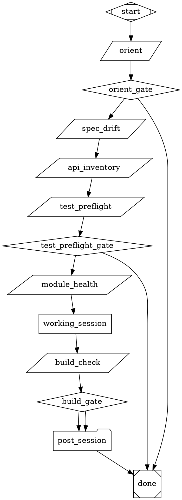
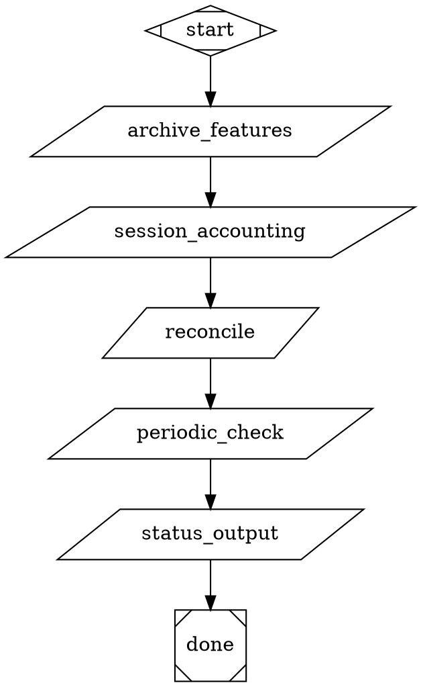
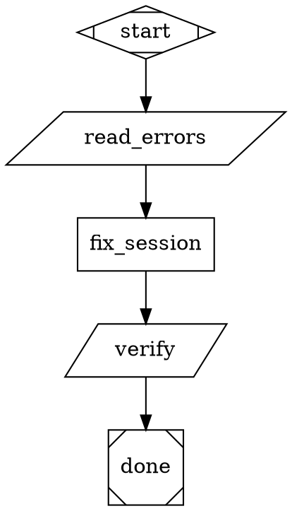

# DOT Pipeline Dev-Machine Design

## Goal

Replace the dev-machine bundle's recipe-based orchestration with pure DOT pipelines for Attractor, while preserving all behavioral contracts — prompts, safety constraints, agent protocols, state management, and operational model — verbatim. A foundry DOT pipeline produces bespoke runtime DOT pipelines tailored to each project.

## Background

The `ramparte/amplifier-bundle-dev-machine` is a 3-mode Amplifier bundle with 7 recipe templates totaling ~2,000+ lines of YAML. It orchestrates autonomous development sessions: admissions gates evaluate project readiness, machine-design builds a bespoke dev-machine spec, and generate-machine produces the runtime configuration that runs the actual build/iterate/fix/QA loops.

The recipe system works but has structural friction:

- **`{{variable}}` dual-syntax collision** — Jinja2 template syntax collides with generation-time variables, causing escaping headaches
- **Opaque orchestration** — recipe YAML is not visually inspectable; understanding control flow requires reading procedural step lists
- **Monolithic inline scripts** — 300+ line bash heredocs embedded in YAML are untestable and unlintable
- **No compositional reuse** — recipes lack a clean subgraph invocation pattern; shared behavior is copy-pasted

Attractor's DOT pipeline engine solves all four: `$variable` has no syntax collision, DOT graphs render as SVGs, extracted scripts are standalone files, and `folder` nodes compose subgraphs cleanly.

## Approach

Three-layer architecture where DOT replaces the orchestration layer only:

```
┌─────────────────────────────────────────────────────┐
│  Infrastructure Layer (unchanged — shell scripts)    │
│  entrypoint.sh · watchdog.sh · monitor.sh            │
│  Supervises the pipeline engine, not part of DOT     │
├─────────────────────────────────────────────────────┤
│  Orchestration Layer (RECIPE YAML → DOT PIPELINES)   │
│  iteration.dot · health-check.dot · foundry/*.dot    │
│  This is the core translation                        │
├─────────────────────────────────────────────────────┤
│  Agent Protocol Layer (unchanged — filesystem state)  │
│  STATE.yaml · CONTEXT-TRANSFER.md · feature specs    │
│  The universal data bus between agents and scripts    │
└─────────────────────────────────────────────────────┘
```

The middle layer changes format. The top and bottom layers are untouched. Prompts and behavioral rules transfer verbatim — we are changing how work is orchestrated, not what the agents do.

## Architecture

### System Overview

```
entrypoint.sh (infrastructure — retry loop)
  │
  └─▶ attractor run iteration.dot (one working session)
        │
        ├─ orient.py ──▶ reads STATE.yaml, outputs JSON
        ├─ spec-drift-check.py ──▶ compares spec vs impl mtimes
        ├─ api-inventory.py ──▶ scans public types/APIs
        ├─ test-env-preflight.py ──▶ validates test runner
        ├─ module-health-check.py ──▶ LOC per package
        ├─ working_session (codergen) ──▶ the agent that does actual work
        ├─ build-check.py ──▶ full regression suite
        │    │
        │    └─▶ (if failures) health-check.dot
        │          └─▶ fix-iteration.dot (loop)
        │
        └─ post-session.dot (nested)
             ├─ archive, reconcile, periodic checks
             └─ status output
```

### The Foundry (DOT pipelines that produce DOT pipelines)

```
foundry/admissions.dot
  └─ 5× conversational-gate.dot invocations
  └─ Assessment compilation + verdict routing

foundry/machine-design.dot
  └─ 6 design phases (conversational-gate + convergence-factory)

foundry/generate-machine.dot
  └─ Generates bespoke runtime DOTs via convergence-factory loops
  └─ Output: iteration.dot, post-session.dot, health-check.dot, etc.
```

## Components

### Section 1: Engine Enhancements (Prerequisites, ~100 LOC total)

Three small additions to the Attractor pipeline engine, required before the DOT pipelines can express the dev-machine's control flow.

#### 1.1 `continue_on_fail` Node Attribute (~20 LOC)

**Problem:** The dev-machine iteration has 4+ steps that use `on_error: continue` (spec-drift-check, api-inventory, module-health-check). These are informational preflight checks — failure is logged but doesn't stop the session.

**Solution:** Add `continue_on_fail="true"` as a node attribute. When present, the engine treats a FAIL outcome as SUCCESS for edge-selection purposes while still logging the failure.

**Implementation:** In `engine.py`'s main loop, after a handler returns, check `node.attrs.get("continue_on_fail") == "true"`. If the outcome is FAIL, log a warning and override to SUCCESS for routing.

#### 1.2 `parse_json` Flag (~50 LOC)

**Problem:** Recipe bash steps output JSON that gets parsed into structured context variables. DOT tool nodes dump raw stdout. The pipeline needs structured data from script output to drive diamond-node routing.

**Solution:** Add `parse_json="true"` on tool nodes. After command execution, auto-parse JSON stdout into context variables.

**Implementation:** In the tool handler, after command execution, if `parse_json` is set, `json.loads()` the output and call `context.set()` for each key-value pair.

#### 1.3 `tool_env` Attribute (~30 LOC)

**Problem:** Tool nodes need pipeline context variables as environment variables for shell commands. Scripts need to know project-specific values (state file path, build command, test command).

**Solution:** `tool_env="state_file,build_command"` injects named context vars as `STATE_FILE`, `BUILD_COMMAND` env vars.

**Implementation:** In the tool handler, before executing the command, read `tool_env`, resolve each variable name from context, inject as uppercased env vars.

---

### Section 2: Script Extraction — Pipeline-Callable Tools

Extract inline bash/Python from the 7 recipe templates into standalone scripts. Each script is designed to be called by `parallelogram` (tool) nodes in the DOT pipeline.

#### Script Contract

All extracted scripts follow the same contract:

| Property | Rule |
|----------|------|
| **Input** | Command-line args for project-specific values |
| **Output** | Structured JSON to stdout (consumed by `parse_json`) |
| **Exit code** | 0 = success, non-zero = failure |
| **Self-contained** | Reads from known file paths, no pipeline context needed beyond args |
| **Testable standalone** | `python3 scripts/orient.py STATE.yaml` works outside the pipeline |

#### Scripts Extracted from `dev-machine-iteration.yaml` (820 lines)

| Script | Source | Purpose |
|--------|--------|---------|
| `orient.py` | Orient step | Reads STATE.yaml → outputs JSON (phase, epoch, ready_count, status) |
| `spec-drift-check.py` | Preflight | Compares spec mtimes vs implementation mtimes |
| `api-inventory.py` | Preflight | Scans source for public types/APIs → appends to SCRATCH.md |
| `test-env-preflight.py` | Preflight | Validates test runner works (--collect-only) |
| `module-health-check.py` | Preflight | LOC per package with content-aware bypass |
| `build-check.py` | Build check | Full build + test, paper tiger detection, blocker writing |
| `post-session-archive.py` | Post-session | Feature archive + session archive + counting |
| `post-session-reconcile.py` | Post-session | Stale metadata, wiring audit, periodic checks |
| `post-session-cleanup.py` | Post-session | Empty session cleanup, integration test check |

#### Scripts Extracted from `dev-machine-build.yaml` (255 lines)

| Script | Source | Purpose |
|--------|--------|---------|
| `container-check.sh` | Safety gate | Refuses to run outside Docker |
| `read-state.py` | Build init | Reads STATE.yaml, extracts phase/epoch/blockers |

#### Directory Structure After Generation

```
your-project/.dev-machine/
├── scripts/pipeline/          # Called by DOT tool nodes
│   ├── orient.py
│   ├── spec-drift-check.py
│   ├── api-inventory.py
│   ├── test-env-preflight.py
│   ├── module-health-check.py
│   ├── build-check.py
│   ├── post-session-archive.py
│   ├── post-session-reconcile.py
│   └── post-session-cleanup.py
├── scripts/infra/             # Wraps the pipeline (NOT called by DOT)
│   ├── entrypoint.sh
│   ├── watchdog.sh
│   └── monitor.sh
└── runtime/                   # The DOT pipelines that call the scripts
    ├── iteration.dot
    └── ...
```

---

### Section 3: Core Runtime DOT Pipeline — `iteration.dot`

The heart of the machine — the 8-step inner loop that executes one working session. Directly replaces `dev-machine-iteration.yaml` (820 lines).



**Key decisions:**

- **`orient` outputs JSON** → `parse_json` populates context variables → diamond routes on `context.status`
- **Preflight checks use `continue_on_fail`** except test-env (hard stop on broken test runner)
- **`working_session` uses `truncate` fidelity** — fresh context each time, reads everything from disk via STATE.yaml and CONTEXT-TRANSFER.md
- **`post_session` is a nested `folder` node** — the decomposed monolith (see Section 4)
- **`entrypoint.sh` calls this pipeline repeatedly** — build.yaml disappears; the shell entrypoint IS the outer loop

---

### Section 4: Post-Session Pipeline — `post-session.dot`

The 330-line post-session bash step from the recipe becomes a decomposed nested pipeline with per-step observability and checkpoint coverage.



Scripts contain the same Python logic from the inline heredoc, extracted to standalone files. The reconcile and periodic check steps use `continue_on_fail` — they are housekeeping, not session-critical.

---

### Section 5: Support Loop DOT Pipelines

#### `health-check.dot` — Outer Fix Loop

Replaces `dev-machine-health-check.yaml` (168 lines). Runs the build check, and if failures are found, invokes the fix loop.

```dot
digraph health_check {
    graph [goal="Fix build/test errors until clean"]

    start [shape=Mdiamond]

    initial_check [shape=parallelogram,
        tool_command="python3 .dev-machine/scripts/pipeline/build-check.py $build_command $test_command",
        parse_json="true"]

    clean_gate [shape=diamond]

    fix_loop [shape=house,
        stack.child_dotfile=".dev-machine/runtime/fix-iteration.dot",
        manager.max_cycles="$max_fix_iterations",
        manager.stop_condition="outcome=success"]

    done [shape=Msquare]

    start -> initial_check -> clean_gate
    clean_gate -> done [condition="context.build_status=clean"]
    clean_gate -> fix_loop [condition="context.build_status=failed"]
    fix_loop -> done
}
```

#### `fix-iteration.dot` — Single Fix Cycle

Replaces `dev-machine-fix-iteration.yaml` (151 lines). One cycle of: read errors, fix them, verify.



#### `smoke-test.dot` — Pre-Flight Validator

Replaces `dev-machine-smoke-test.yaml` (348 lines). Linear chain of 7 parallelogram tool nodes checking:

1. File existence (STATE.yaml, specs, Dockerfile)
2. YAML validity
3. Docker configuration
4. STATE.yaml content and schema
5. Robustness patterns (error handling, retry logic)
6. Test environment sanity
7. Final summary — aggregates pass/fail across all checks

#### `qa.dot` + `qa-iteration.dot` — QA Loop

Replaces `dev-machine-qa.yaml` (152 lines) and `dev-machine-qa-iteration.yaml` (147 lines). Same house/folder pattern as health-check: outer loop with max cycles and stop condition, inner iteration with a QA agent codergen node. QA-iteration prompt transfers verbatim.

---

### Section 6: The Foundry DOT Pipelines

The foundry is three DOT pipelines that replace the three Amplifier modes. Each transfers the mode's prompts, gate criteria, and behavioral rules verbatim. The foundry's final output is bespoke runtime DOT files (Sections 3-5) tailored to the specific project.

#### `foundry/admissions.dot` — Project Readiness Evaluation

Replaces `/admissions` mode (115 lines). Five sequential `conversational-gate.dot` invocations (one per admissions gate), followed by an assessment compilation node and a routing diamond.

```dot
digraph admissions {
    graph [goal="Evaluate project readiness for autonomous dev-machine"]

    start [shape=Mdiamond]

    gate1 [shape=folder, dot_file="patterns/conversational-gate.dot",
        context.gate_topic="<verbatim decomposability gate text from gate-criteria.md>",
        context.gate_criteria="<verbatim scoring rubric>",
        context.gate_output_path=".ai/gate1_decomposability.md"]

    gate2 [shape=folder, dot_file="patterns/conversational-gate.dot",
        context.gate_topic="<verbatim correctness gate text>",
        context.gate_criteria="<verbatim scoring rubric>",
        context.gate_output_path=".ai/gate2_correctness.md"]

    gate3 [shape=folder, dot_file="patterns/conversational-gate.dot",
        context.gate_topic="<verbatim isolation gate text>",
        context.gate_criteria="<verbatim scoring rubric>",
        context.gate_output_path=".ai/gate3_isolation.md"]

    gate4 [shape=folder, dot_file="patterns/conversational-gate.dot",
        context.gate_topic="<verbatim observability gate text>",
        context.gate_criteria="<verbatim scoring rubric>",
        context.gate_output_path=".ai/gate4_observability.md"]

    gate5 [shape=folder, dot_file="patterns/conversational-gate.dot",
        context.gate_topic="<verbatim risk gate text>",
        context.gate_criteria="<verbatim scoring rubric>",
        context.gate_output_path=".ai/gate5_risk.md"]

    compile_assessment [shape=box,
        prompt="<verbatim from admissions mode: read all 5 gate scores, apply threshold rules (<50% hard stop, 50-75% caution, >75% proceed), write .dev-machine-assessment.md>"]

    verdict_gate [shape=diamond]

    done_proceed [shape=Msquare]
    done_not_ready [shape=Msquare]

    start -> gate1 -> gate2 -> gate3 -> gate4 -> gate5 -> compile_assessment -> verdict_gate
    verdict_gate -> done_proceed [condition="context.verdict=proceed"]
    verdict_gate -> done_not_ready [condition="context.verdict=not_ready"]
}
```

#### `foundry/machine-design.dot` — Bespoke Machine Specification

Replaces `/machine-design` mode (143 lines). Gate-checks that `.dev-machine-assessment.md` exists, then runs 6 design phases alternating between:

- **`conversational-gate.dot`** invocations — gathering requirements through iterative human Q&A
- **`convergence-factory.dot`** invocations — generating specification artifacts through generate→validate→refine loops

Phase topics and instructions transfer verbatim from the mode file. Output is the complete machine design specification that feeds into generation.

#### `foundry/generate-machine.dot` — Runtime DOT Generation

Replaces `/generate-machine` mode. Gate-checks that the design doc exists, then uses `convergence-factory.dot` invocations to generate each bespoke runtime DOT file. Each generated artifact goes through the convergence factory's generate → validate → assess → refine loop.

Generated artifacts include:
- All runtime DOT files (iteration.dot, post-session.dot, health-check.dot, fix-iteration.dot, smoke-test.dot, qa.dot, qa-iteration.dot)
- All extracted pipeline scripts
- Infrastructure files (entrypoint.sh, watchdog.sh, monitor.sh)
- Dockerfile and docker-compose.yaml
- STATE.yaml initial state
- Working-session instructions template

**The foundry's output IS bespoke runtime DOT files tailored to the specific project.** A DOT pipeline that produces DOT pipelines.

## Data Flow

### Iteration Data Flow

```
STATE.yaml ──▶ orient.py ──▶ JSON stdout ──▶ parse_json ──▶ context variables
                                                               │
context.status ──▶ orient_gate (diamond) ──▶ routes to preflight or done
                                                               │
preflight scripts ──▶ informational output (continue_on_fail)  │
                                                               │
context vars ──▶ working_session prompt (reads from disk)      │
                                                               │
working_session ──▶ modifies source files, updates STATE.yaml  │
                                                               │
build-check.py ──▶ JSON stdout ──▶ parse_json ──▶ context.build_status
                                                               │
context.build_status ──▶ build_gate ──▶ routes to post-session
```

### State Management

The filesystem is the universal data bus. All state flows through well-known paths:

| Artifact | Purpose | Written By | Read By |
|----------|---------|------------|---------|
| `STATE.yaml` | Phase, epoch, feature status, blockers | orient.py, working session, post-session | All scripts and agents |
| `CONTEXT-TRANSFER.md` | Session-to-session continuity | working session | Next working session |
| Feature specs (`specs/`) | What to build | foundry / human | working session |
| `SCRATCH.md` | Ephemeral working notes | api-inventory, agents | working session |
| `BLOCKERS.md` | Build/test failures | build-check.py | fix session, health-check |

### Context Variable Flow

Pipeline context variables bridge DOT nodes:

1. **Tool node output** → `parse_json` → context variables (e.g., `context.status`, `context.build_status`)
2. **Diamond nodes** read context variables for routing conditions
3. **`tool_env`** injects context variables as env vars for script execution
4. **`context.*` attributes** on folder nodes inject variables into child pipelines

## Error Handling

### Continue-on-Fail Preflight Checks

Spec-drift, api-inventory, and module-health are informational. Their failure is logged but does not stop the session. The `continue_on_fail="true"` attribute handles this.

### Hard-Stop Gates

- **Orient gate** — if STATE.yaml indicates blocked status, the iteration exits immediately
- **Test preflight gate** — if the test runner is broken, the iteration exits (no point running a working session that can't verify its work)
- **Container check** — refuses to run outside Docker (safety invariant)

### Build Failures

Build failures after the working session trigger the health-check loop (fix-iteration.dot cycles). The `house` node's `max_cycles` prevents infinite fix loops.

### Watchdog (Infrastructure Layer)

The watchdog shell script (outside DOT) monitors for:
- Stuck processes (no progress for N minutes)
- Resource exhaustion (disk, memory)
- Infinite loops at the entrypoint level

This is infrastructure, not orchestration — it stays as shell.

## Testing Strategy

### Phase 1: Engine Enhancement Tests

- Unit tests for `continue_on_fail` — verify FAIL outcome routes as SUCCESS, verify logging
- Unit tests for `parse_json` — verify JSON stdout populates context, verify malformed JSON handling
- Unit tests for `tool_env` — verify context vars become env vars with correct uppercasing

### Phase 2: Script Extraction Tests

Each extracted script is testable standalone:
- `python3 scripts/orient.py test-fixtures/STATE.yaml` → verify JSON output schema
- `python3 scripts/build-check.py "echo ok" "pytest"` → verify exit code and JSON
- Scripts tested both in isolation and as DOT pipeline tool nodes

### Phase 3: Pipeline Integration Tests

- Run `iteration.dot` with a toy project and mock STATE.yaml
- Verify diamond routing: blocked state → early exit, healthy state → full pipeline
- Verify `continue_on_fail` nodes don't halt the pipeline
- Verify nested `post-session.dot` executes all steps

### Phase 4: Foundry Integration Tests

- Run `admissions.dot` with test gate responses → verify assessment output
- Run `generate-machine.dot` → verify it produces valid DOT files
- Validate generated DOT files parse correctly

### Phase 5: Overnight Integration Run

- Full `entrypoint.sh` → `iteration.dot` loop on a real project
- Verify: sessions complete, STATE.yaml updates, features progress, blockers are detected
- Compare behavior against equivalent recipe-based run

## Hard Constraint: Verbatim Prompt Transfer

**Prompts and behavioral rules transfer verbatim.** Any change to agent behavior requires explicit justification. The following transfer unchanged:

| Artifact | Lines | Transfer |
|----------|-------|----------|
| Working-session prompt | ~100 lines | Verbatim as `prompt` attr on `working_session` codergen node |
| `working-session-instructions.md` | 336 lines | Verbatim as context file read from disk |
| Safety constraints (forbidden: rm -rf, git push, credentials, global installs) | In prompt | Verbatim in prompt |
| Antagonistic review instructions | In prompt | Verbatim in prompt |
| Feature spec template | Standalone file | Unchanged |
| STATE.yaml schema and update contract | Documented | Identical |
| CONTEXT-TRANSFER.md format and size cap rules | Documented | Identical |
| Blocker taxonomy (always-fix vs leave-as-blocker) | In resolve-blockers prompt | Verbatim |
| Gate criteria and scoring rubrics | In admissions mode | Verbatim via `context.*` attrs |

**What changes:**

| From (Recipe) | To (DOT) | Nature of Change |
|---------------|----------|------------------|
| `- id: orient` / `type: bash` | `orient [shape=parallelogram, tool_command="..."]` | Syntax only |
| `while_condition` / `break_when` | Edge conditions on diamonds + `loop_restart` edges | Control flow syntax |
| Inline heredoc scripts | Standalone `.py` files | Extraction, same logic |
| `{{variable}}` | `$variable` | Template syntax |

## Proposed File Tree

```
.dev-machine/
├── foundry/                          # The factory that builds dev-machines
│   ├── admissions.dot               # 5× conversational-gate invocations
│   ├── machine-design.dot           # 6-phase design with human Q&A
│   └── generate-machine.dot         # Generates bespoke runtime DOTs
│
├── runtime/                          # Bespoke per project (foundry output)
│   ├── iteration.dot                # 8-step inner loop (core)
│   ├── post-session.dot             # Decomposed post-session monolith
│   ├── health-check.dot             # Fix outer loop
│   ├── fix-iteration.dot            # Single fix cycle
│   ├── qa.dot                       # Optional QA outer loop
│   ├── qa-iteration.dot             # QA single cycle
│   └── smoke-test.dot               # Pre-flight validator
│
├── scripts/pipeline/                 # Called by DOT tool nodes
│   ├── orient.py
│   ├── spec-drift-check.py
│   ├── api-inventory.py
│   ├── test-env-preflight.py
│   ├── module-health-check.py
│   ├── build-check.py
│   ├── read-errors.py
│   ├── post-session-archive.py
│   ├── post-session-accounting.py
│   ├── post-session-reconcile.py
│   ├── post-session-periodic.py
│   ├── post-session-status.py
│   └── post-session-cleanup.py
│
├── scripts/infra/                    # Wraps the pipeline (NOT DOT nodes)
│   ├── entrypoint.sh
│   ├── watchdog.sh
│   └── monitor.sh
│
├── patterns/                         # Reusable subgraphs (already built)
│   ├── conversational-gate.dot
│   └── convergence-factory.dot
│
├── Dockerfile
└── docker-compose.yaml
```

## Implementation Sequence

| Phase | Scope | Effort |
|-------|-------|--------|
| **Phase 1** | Engine enhancements: `continue_on_fail`, `parse_json`, `tool_env` | ~100 LOC |
| **Phase 2** | Script extraction + core runtime DOTs: iteration.dot, post-session.dot, health-check.dot, fix-iteration.dot, smoke-test.dot | Bulk of work |
| **Phase 3** | QA DOTs: qa.dot, qa-iteration.dot (same patterns as Phase 2) | Small |
| **Phase 4** | Foundry DOTs: admissions.dot, machine-design.dot, generate-machine.dot | Medium |
| **Phase 5** | Integration test: overnight run with entrypoint.sh calling iteration.dot | Validation |

## Already Built (Prerequisites)

These were identified, designed, and built in the prerequisites phase:

| ID | Capability | Status |
|----|-----------|--------|
| P1 | Nested subgraph backend wiring | PR #4, merged |
| P7 | Context variable injection via `context.*` attrs | PR #4, merged |
| P2 | Reusable `conversational-gate.dot` pattern | PR #4, merged |
| P6 | Reusable `convergence-factory.dot` pattern | PR #4, merged |

## Operational Model (Preserved)

The operational model transfers unchanged:

- **Adding features:** Edit STATE.yaml, add features with `status: ready` → machine picks them up
- **Running:** `entrypoint.sh` calls the DOT pipeline in a retry loop → works until done or blocked
- **Set aside:** `docker compose down` → state persists in git
- **Rehydrate:** `git pull && docker compose up -d` → resumes from STATE.yaml
- **Bespoke artifacts live in repo:** The DOT files, scripts, and state all live in the repo alongside the project code

## Key Advantages Over Recipe System

- **No syntax collision** — DOT's `$variable` has no generation-time ambiguity (eliminates the `{{variable}}` Jinja2 collision)
- **Visual inspectability** — DOT pipelines render as SVGs via Graphviz; the machine's behavior becomes a readable diagram
- **Testable scripts** — extracted scripts are lintable, unit-testable, and pipeline-format-agnostic
- **Per-step observability** — decomposed post-session monolith gives individual step timing, logging, and checkpoint coverage
- **Compositional reuse** — the pattern library (conversational-gate, convergence-factory) composes cleanly via folder nodes with `context.*` parameterization

## Open Questions

1. **Foundry invocation model** — Should the foundry be expressible as a single `amplifier run foundry.dot` invocation, or keep it as three separate DOT files with human gates between?
2. **Pipeline visualization** — Should we add a `render-pipeline` script that generates SVG from the DOT files for documentation?
3. **`report_outcome` propagation** — The investigation flagged that `report_outcome` context_updates propagation needs verification. Should we add this as a Phase 0 verification step?
4. **Script language mix** — Should extracted scripts be Python-only, or allow shell scripts for simple checks (e.g., container-check)?

## Investigation Source

Full investigation artifacts at `.investigation-devmachine/wave-1/` — 45 files across 9 agents plus 35KB reconciliation document.
