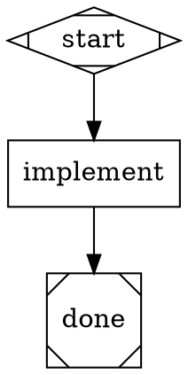

# Spawn E2E Test Implementation Plan

> **Execution:** Use the subagent-driven-development workflow to implement this plan.

**Goal:** Create an end-to-end test that exercises the full "sessions all the way down" path: pipeline -> AmplifierBackend -> session.spawn -> child loop-agent session -> real provider -> tool execution -> result propagated back to pipeline outcome.

**Architecture:** The E2E test uses `amplifier run` with the pipeline E2E profile (`attractor-e2e-pipeline-anthropic.yaml`) pointed at the `simple_file_creation.dot` fixture. This DOT graph has a single `implement` node that asks the agent to create `hello.py`. The test verifies: (1) `amplifier run` exits successfully, (2) the child session actually ran (hello.py was created), (3) the pipeline outcome JSON reports SUCCESS. A separate mock-based test validates the spawn path without requiring API keys.

**Tech Stack:** Bash (E2E script), `amplifier run` CLI, Python (mock integration test), `simple_file_creation.dot` fixture

---

## Problem Statement

There is currently zero E2E test coverage of the session.spawn path (C-3). The existing `tests/e2e/run_e2e.sh` only tests the direct loop-agent (non-pipeline) path. We need tests that verify:

1. The pipeline orchestrator correctly invokes `session.spawn`
2. The child session runs with the correct agent profile
3. Tools execute in the child session (file creation)
4. The result propagates back through the pipeline as a SUCCESS outcome

Without E2E coverage, regressions in the spawn path go undetected and the three C-1/C-2/C-3 bugs can recur.

## Root Cause

The E2E test infrastructure was built for direct agent testing only. Pipeline spawn testing was deferred until the spawn integration was complete.

## Dependencies

- **Depends on:** Track2-2a1 (SubagentManager spawn fix), Track2-2a2 (profile routing), Track2-2a3 (agent bundles)
- **Depended on by:** Nothing -- this is the validation layer
- **Requires:** `ANTHROPIC_API_KEY` environment variable for the live E2E test; mock test has no external deps

---

### Task 1: Create the pipeline E2E test script

**Files:**
- Create: `tests/e2e/run_pipeline_e2e.sh`

**Step 1: Write the pipeline E2E test script**

This script runs `amplifier run` with the pipeline profile and verifies the child session created the expected file.

```bash
#!/bin/bash
set -e

# Resolve bundle root relative to this script's location
SCRIPT_DIR="$(cd "$(dirname "${BASH_SOURCE[0]}")" && pwd)"
BUNDLE_ROOT="$(cd "$SCRIPT_DIR/../.." && pwd)"
WORK_DIR="/tmp/attractor-pipeline-e2e-$$"
mkdir -p "$WORK_DIR"
cd "$WORK_DIR"

echo "========================================="
echo "Attractor Pipeline E2E Tests"
echo "Working directory: $WORK_DIR"
echo "Bundle root: $BUNDLE_ROOT"
echo "========================================="

PASS=0
FAIL=0

run_pipeline_test() {
    local name="$1"
    local profile="$2"
    local prompt="$3"
    local check="$4"

    echo ""
    echo "--- TEST: $name ---"
    local test_dir="$WORK_DIR/$name"
    mkdir -p "$test_dir"
    cd "$test_dir"

    # Run the pipeline via amplifier CLI
    if amplifier run \
        -B "file://$profile" \
        --mode single \
        "$prompt" \
        2>&1 | tee "$test_dir/output.log"; then

        # Check for pipeline success in output
        if grep -q '"status"' "$test_dir/output.log"; then
            echo "  Pipeline returned structured output"
        fi

        # Run the verification check
        if eval "$check"; then
            echo "PASS: $name"
            PASS=$((PASS + 1))
        else
            echo "FAIL: $name (verification check failed)"
            echo "  Check: $check"
            FAIL=$((FAIL + 1))
        fi
    else
        echo "FAIL: $name (amplifier run failed)"
        FAIL=$((FAIL + 1))
    fi
    cd "$WORK_DIR"
}

# -----------------------------------------------
# Test 1: Simple file creation via pipeline spawn
# -----------------------------------------------
# Uses simple_file_creation.dot which has one implement node
# that asks the agent to create hello.py.
#
# Resolution chain:
#   DOT node (llm_provider=anthropic) -> profiles -> attractor-anthropic
#   -> session.spawn -> child loop-agent session -> tools -> hello.py
#
run_pipeline_test "pipeline_spawn_file_creation" \
    "$BUNDLE_ROOT/profiles/attractor-e2e-pipeline-anthropic.yaml" \
    "Create a hello world Python script" \
    "test -f hello.py && python hello.py | grep -qi hello"

# -----------------------------------------------
# Test 2: Pipeline outcome propagation
# -----------------------------------------------
# Verify that the pipeline outcome JSON is returned and contains
# a success status. The output.log should have the JSON result.
#
run_pipeline_test "pipeline_outcome_propagation" \
    "$BUNDLE_ROOT/profiles/attractor-e2e-pipeline-anthropic.yaml" \
    "Create a file called greet.py that prints 'Greetings from pipeline'" \
    "test -f greet.py && grep -q 'success' output.log"

echo ""
echo "========================================="
echo "Results: $PASS passed, $FAIL failed"
echo "========================================="

# Clean up on success
if [ "$FAIL" -eq 0 ]; then
    echo "Cleaning up $WORK_DIR"
    rm -rf "$WORK_DIR"
fi

exit "$FAIL"
```

**Step 2: Make the script executable**

Run:
```bash
chmod +x tests/e2e/run_pipeline_e2e.sh
```

**Step 3: Commit**
```
test(e2e): add pipeline spawn E2E test script

Tests the full sessions-all-the-way-down path:
pipeline -> AmplifierBackend -> session.spawn -> child loop-agent
-> provider -> tool execution -> file created -> outcome back.

Requires ANTHROPIC_API_KEY. Uses simple_file_creation.dot fixture.

Addresses C-3: zero E2E coverage of the spawn path.
```

---

### Task 2: Create a mock integration test for the spawn path

**Files:**
- Create: `modules/loop-pipeline/tests/test_spawn_integration.py`

**Step 1: Write the mock integration test**

This test exercises the `AmplifierBackend` spawn path without requiring API keys by mocking the spawn function.

```python
"""Integration test for AmplifierBackend spawn path.

Exercises the full flow: node -> AmplifierBackend.run() -> session.spawn
without requiring actual API keys. Mocks the spawn function to return
structured results matching the real session.spawn signature.
"""

import json
import pytest
from unittest.mock import AsyncMock, MagicMock

from amplifier_module_loop_pipeline.backend import AmplifierBackend
from amplifier_module_loop_pipeline.context import PipelineContext
from amplifier_module_loop_pipeline.graph import Node
from amplifier_module_loop_pipeline.outcome import StageStatus


def _make_node(node_id="implement", provider="anthropic", prompt=None, **attrs):
    """Create a mock pipeline Node."""
    node_attrs = {"llm_provider": provider}
    if prompt:
        node_attrs["prompt"] = prompt
    node_attrs.update(attrs)

    node = MagicMock(spec=Node)
    node.id = node_id
    node.attrs = node_attrs
    return node


def _make_coordinator(spawn_result=None, agents=None, session_obj=None):
    """Create a mock coordinator with session.spawn capability."""
    coordinator = MagicMock()
    coordinator.session = session_obj or "parent-session-001"
    coordinator.config = {"agents": agents or {}}

    spawn_fn = AsyncMock(return_value=spawn_result or {
        "output": json.dumps({
            "status": "success",
            "notes": "File created successfully",
        }),
        "session_id": "child-session-abc",
    })
    coordinator.get_capability = MagicMock(return_value=spawn_fn)

    return coordinator, spawn_fn


@pytest.mark.asyncio
async def test_spawn_path_success():
    """AmplifierBackend should spawn a child session and parse the outcome."""
    coordinator, spawn_fn = _make_coordinator(
        agents={
            "attractor-anthropic": {
                "session": {"orchestrator": {"module": "loop-agent"}}
            }
        }
    )

    backend = AmplifierBackend(
        coordinator,
        profiles={"anthropic": "attractor-anthropic"},
    )

    node = _make_node(provider="anthropic")
    context = PipelineContext()

    outcome = await backend.run(node, "Create hello.py", context)

    # Verify outcome parsed correctly
    assert outcome.status == StageStatus.SUCCESS
    assert "File created" in (outcome.notes or "")

    # Verify spawn was called with correct kwargs
    spawn_fn.assert_called_once()
    call_kwargs = spawn_fn.call_args[1]
    assert call_kwargs["agent_name"] == "attractor-anthropic"
    assert "Create hello.py" in call_kwargs["instruction"]
    assert call_kwargs["parent_session"] == "parent-session-001"
    assert "attractor-anthropic" in call_kwargs["agent_configs"]


@pytest.mark.asyncio
async def test_spawn_path_with_profile_resolution():
    """Backend should resolve llm_provider to the correct agent name."""
    coordinator, spawn_fn = _make_coordinator()

    backend = AmplifierBackend(
        coordinator,
        profiles={
            "anthropic": "attractor-anthropic",
            "openai": "attractor-openai",
        },
    )

    # Test anthropic resolution
    node_anthropic = _make_node(provider="anthropic")
    await backend.run(node_anthropic, "Task A", PipelineContext())
    assert spawn_fn.call_args[1]["agent_name"] == "attractor-anthropic"

    # Reset for next call
    spawn_fn.reset_mock()
    backend._spawn_checked = False
    backend._spawn_fn = None

    # Re-resolve spawn fn
    await backend.run(
        _make_node(provider="openai"), "Task B", PipelineContext()
    )
    assert spawn_fn.call_args[1]["agent_name"] == "attractor-openai"


@pytest.mark.asyncio
async def test_spawn_path_failure_returns_fail_outcome():
    """When spawn raises an exception, outcome should be FAIL."""
    coordinator = MagicMock()
    coordinator.session = "parent"
    coordinator.config = {"agents": {}}

    spawn_fn = AsyncMock(side_effect=RuntimeError("Spawn failed: no such agent"))
    coordinator.get_capability = MagicMock(return_value=spawn_fn)

    backend = AmplifierBackend(
        coordinator,
        profiles={"anthropic": "nonexistent-agent"},
    )

    node = _make_node()
    outcome = await backend.run(node, "Do something", PipelineContext())

    assert outcome.status == StageStatus.FAIL
    assert "Spawn failed" in (outcome.failure_reason or "")


@pytest.mark.asyncio
async def test_spawn_result_session_id_tracked():
    """Backend should track child session IDs from spawn results."""
    coordinator, spawn_fn = _make_coordinator(
        spawn_result={
            "output": json.dumps({"status": "success", "notes": "Done"}),
            "session_id": "child-session-xyz",
        }
    )

    backend = AmplifierBackend(
        coordinator,
        profiles={"anthropic": "attractor-anthropic"},
    )

    node = _make_node()
    outcome = await backend.run(node, "Create file", PipelineContext())

    assert outcome.status == StageStatus.SUCCESS
    # The session_id should be accessible for full-fidelity reuse
    # (internal pool, not directly on outcome)


@pytest.mark.asyncio
async def test_spawn_plain_text_result_parsed_as_success():
    """When spawn returns plain text (not JSON), treat as SUCCESS."""
    coordinator, _ = _make_coordinator(
        spawn_result={
            "output": "I created hello.py with the requested content.",
            "session_id": "child-session-text",
        }
    )

    backend = AmplifierBackend(
        coordinator,
        profiles={"anthropic": "attractor-anthropic"},
    )

    node = _make_node()
    outcome = await backend.run(node, "Create hello.py", PipelineContext())

    # Plain text should be wrapped as SUCCESS
    assert outcome.status == StageStatus.SUCCESS
```

**Step 2: Run the mock integration tests**

Run:
```bash
cd modules/loop-pipeline && python -m pytest tests/test_spawn_integration.py -v
```
Expected: All 5 tests pass.

**Step 3: Commit**
```
test(loop-pipeline): add mock integration tests for spawn path

Tests the AmplifierBackend spawn path without API keys:
- Spawn success with JSON outcome parsing
- Profile resolution (anthropic -> attractor-anthropic)
- Spawn failure returns FAIL outcome
- Session ID tracking from spawn results
- Plain text results parsed as SUCCESS

Addresses C-3: spawn path coverage.
```

---

### Task 3: Update the existing run_e2e.sh to reference pipeline test

**Files:**
- Modify: `tests/e2e/run_e2e.sh`

**Step 1: Add a reference to the pipeline E2E test at the end**

Append a note and optional pipeline test invocation to the existing `run_e2e.sh`, before the final `exit` line. This keeps the scripts separate but discoverable.

After the existing test cases (after the `agent_shell_exec` test block, before the results summary), add:

```bash
# -----------------------------------------------
# Pipeline E2E Tests (separate script)
# -----------------------------------------------
# The pipeline spawn path has its own E2E test:
#   ./run_pipeline_e2e.sh
#
# Run it separately as it tests the sessions-all-the-way-down flow
# (pipeline -> session.spawn -> child agent session -> tool execution)
#
# Optionally include it here:
if [ "${RUN_PIPELINE_TESTS:-0}" = "1" ]; then
    echo ""
    echo "--- Running pipeline E2E tests ---"
    if "$SCRIPT_DIR/run_pipeline_e2e.sh"; then
        PASS=$((PASS + 1))
    else
        FAIL=$((FAIL + 1))
    fi
fi
```

Also add `SCRIPT_DIR` resolution near the top of the file (after `set -e`, before `BUNDLE_ROOT`):

```bash
SCRIPT_DIR="$(cd "$(dirname "${BASH_SOURCE[0]}")" && pwd)"
```

And update the `BUNDLE_ROOT` to use relative path from script:
```bash
BUNDLE_ROOT="$(cd "$SCRIPT_DIR/../.." && pwd)"
```

**Step 2: Verify syntax**

Run:
```bash
bash -n tests/e2e/run_e2e.sh && echo "OK"
```
Expected: `OK`.

**Step 3: Commit**
```
test(e2e): link pipeline E2E test from main E2E runner

Adds optional pipeline test invocation to run_e2e.sh via
RUN_PIPELINE_TESTS=1 flag. Pipeline tests are in their own
script (run_pipeline_e2e.sh) for independent execution.

Also fixes BUNDLE_ROOT to use relative path from script location.
```

---

### Task 4: Add a DOT fixture for spawn-specific testing

**Files:**
- Create: `tests/e2e/fixtures/spawn_test.dot`

**Step 1: Create a minimal DOT fixture designed for spawn testing**

This fixture is simpler than `simple_file_creation.dot` -- it explicitly sets `llm_provider` to make the test deterministic and adds a verification-friendly prompt.



**Step 2: Validate the DOT file parses correctly**

Run:
```bash
cd modules/loop-pipeline && python -c "
from amplifier_module_loop_pipeline.dot_parser import parse_dot
g = parse_dot(open('../../tests/e2e/fixtures/spawn_test.dot').read())
print(f'Nodes: {[n.id for n in g.nodes.values()]}')
print(f'Implement attrs: {g.nodes[\"implement\"].attrs}')
print('OK')
"
```
Expected: Nodes listed, implement node has `llm_provider=anthropic` and prompt attrs, `OK`.

**Step 3: Commit**
```
test(fixtures): add spawn_test.dot for spawn-specific E2E testing

Minimal DOT fixture that explicitly sets llm_provider="anthropic"
and asks the agent to create a deterministic file (spawn_proof.txt
with "SPAWN_OK") for easy verification.
```

---

### Task 5: Create a pipeline profile variant for spawn testing

**Files:**
- Create: `profiles/attractor-e2e-pipeline-spawn-test.yaml`

**Step 1: Create a test-specific pipeline profile using spawn_test.dot**

```yaml
bundle:
  name: attractor-e2e-pipeline-spawn-test
  version: 0.1.0
  description: >
    Spawn-specific E2E test profile. Uses spawn_test.dot which creates
    a deterministic file for easy verification of the spawn path.

includes:
  - bundle: attractor:behaviors/attractor-core

agents:
  attractor-anthropic:
    description: Anthropic coding agent (Claude) for pipeline nodes
    session:
      orchestrator:
        module: loop-agent
        source: git+https://github.com/microsoft/amplifier-bundle-attractor@main#subdirectory=modules/loop-agent
        config: {max_tool_rounds_per_input: 50, default_command_timeout_ms: 120000}

providers:
  - module: provider-anthropic
    source: git+https://github.com/microsoft/amplifier-module-provider-anthropic@main
    config:
      default_model: claude-sonnet-4-20250514

session:
  orchestrator:
    module: loop-pipeline
    source: ./modules/loop-pipeline
    config:
      dot_file: ./tests/e2e/fixtures/spawn_test.dot
      profiles:
        anthropic: attractor-anthropic

tools:
  - module: tool-filesystem
    source: git+https://github.com/microsoft/amplifier-module-tool-filesystem@main
  - module: tool-bash
    source: git+https://github.com/microsoft/amplifier-module-tool-bash@main
    config:
      timeout: 120
  - module: tool-search
    source: git+https://github.com/microsoft/amplifier-module-tool-search@main

context:
  - path: context/system-anthropic.md
    role: system
```

**Step 2: Validate YAML**

Run:
```bash
python -c "
import yaml
data = yaml.safe_load(open('profiles/attractor-e2e-pipeline-spawn-test.yaml'))
assert data['session']['orchestrator']['config']['profiles']['anthropic'] == 'attractor-anthropic'
assert 'spawn_test.dot' in data['session']['orchestrator']['config']['dot_file']
assert 'attractor-anthropic' in data.get('agents', {})
print('OK')
"
```
Expected: `OK`.

**Step 3: Commit**
```
test(profiles): add spawn-test pipeline profile

Dedicated E2E test profile using spawn_test.dot fixture.
Creates a deterministic spawn_proof.txt file for easy
verification of the full spawn path.
```

---

## Summary

| Task | What | Est. Time |
|------|------|-----------|
| 1 | Create pipeline E2E test script (run_pipeline_e2e.sh) | 5 min |
| 2 | Create mock integration tests for spawn path | 5 min |
| 3 | Update run_e2e.sh to reference pipeline test | 3 min |
| 4 | Add spawn_test.dot fixture | 2 min |
| 5 | Create spawn-test pipeline profile | 3 min |

**Total: ~18 minutes, 5 atomic commits**

## PR Details

**Title:** `test: add E2E and integration tests for pipeline spawn path`
**Branch:** `track2/2b1-spawn-e2e-test`
**Labels:** `track2`, `testing`, `sessions-all-the-way-down`
**Description:** Addresses C-3 -- zero E2E coverage of the spawn path. Adds:
- `run_pipeline_e2e.sh`: Live E2E test using `amplifier run` with the pipeline profile (requires `ANTHROPIC_API_KEY`)
- `test_spawn_integration.py`: Mock integration tests for `AmplifierBackend` spawn path (no API keys needed)
- `spawn_test.dot`: Deterministic DOT fixture for spawn testing
- `attractor-e2e-pipeline-spawn-test.yaml`: Dedicated spawn test profile
- Updated `run_e2e.sh` to optionally include pipeline tests
